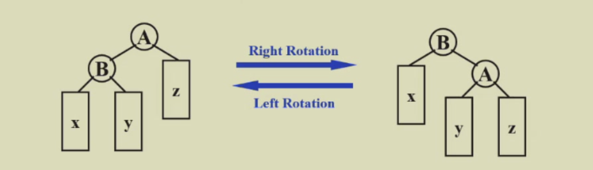
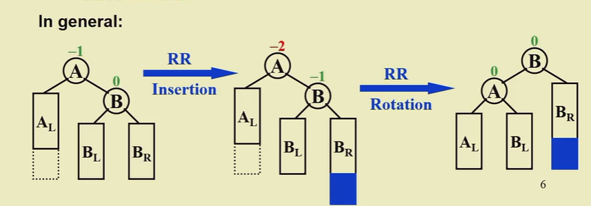
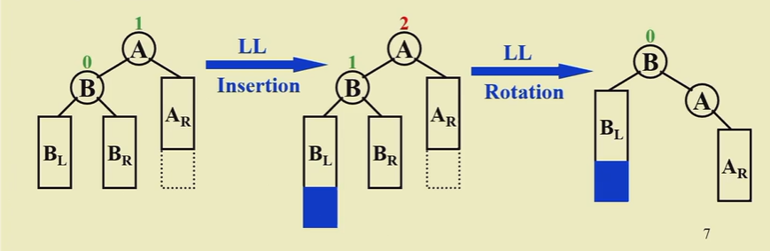
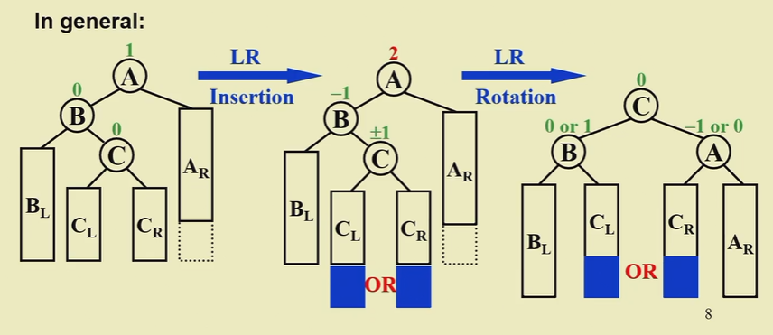
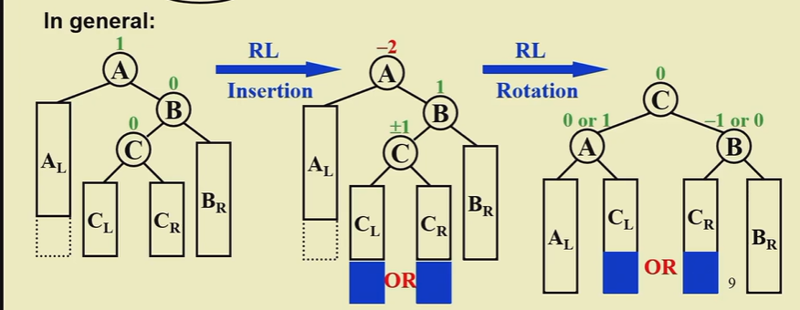
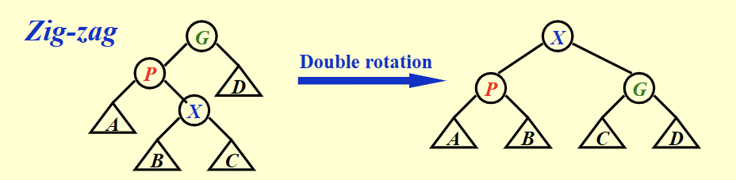
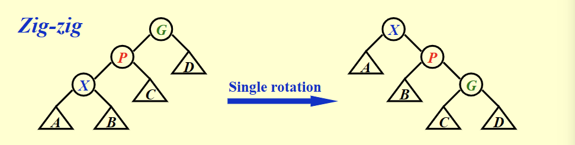
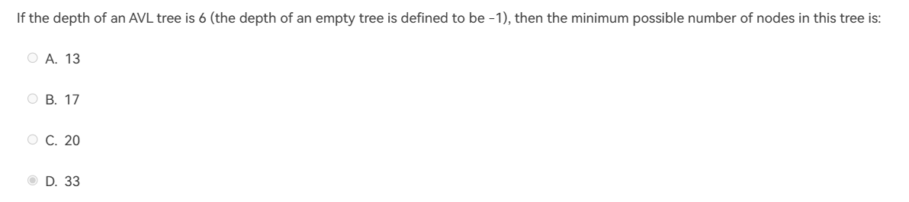

### AVL Tree
- #### 基本概念
  - 是一种二叉搜索树
  - **注意：空树高度为-1 单个节点高度为0**
  - **【Definition】**：高度平衡(height balanced)
    - 左右子树都是高度平衡
    - 左右子树高度差小于等于1
  - **平衡因子(balance factor)** BF(node)=h~L~-h~R~
    - 对于AVLtree 所有点的平衡因子应当为-1，0，1
- #### 树的旋转(Tree rotation)
  - 
  - 右旋能将左边高度减一，右边高度加一
  - 左旋将右边高度减一，左边高度加一
  - trouble maker : 新添加的点
  - **trouble finder ：自下而上第一个出现问题的点**(主要找的点)
  - **一下操作均为三个点：出现问题的点、出现问题的子节点、出现问题的孙子节点**
  - ##### RR rotation
    - 插入的节点在出问题的点的**右**子树的**右**子树中
    - 对中间节点(出现问题的子节点)进行**左**旋操作
    - 
  - ##### LL rotation
    - 插入的节点在出问题的点的**左**子树的**左**子树中
    - 对中间节点(出现问题的子节点)进行右旋操作
    - 
  - ##### LR rotation
    - 插入的节点在出现问题的节点的**左**子树的**右**子树中
    - 先对最后一个节点(出现问题的孙子节点)进行**左**旋
    - 再对该点进行**右**旋操作
    - 旋转顺序也是LR
    - 
  - ##### RL rotation
    - 插入的节点在出现问题的节点的**右**子树的**左**子树中
    - 先对最后一个节点(出现问题的孙子节点)进行**右**旋
    - 再对该点进行**左**旋操作
    - 旋转顺序也是RL
    - 
- #### 树的高度
  - n~h~ 是高度为h的树存在的最小点数量
  - n~h~=n~h-1~+n~h-2~+1
  - 解得 **h=O(ln n)** AVL树的高度存在一个理论上界
  - 当点数n固定之后，$h\leq\ln(n)$

### Splay tree
- 当找寻一个元素之后将该元素旋转到根的位置
- 从空树开始进行任意M次操作，时间复杂度是O(MlogN)
- #### 旋转方式
  - 任意一个点x 父节点p 祖父节点G
    - ##### 1.P是根
      - 直接交换X和P
    - ##### 2.P不是根
      - Zig-Zag
        - 
        - 与AVL Tree旋转相同 先转左旋X再右旋X 到根节点
      - Zig-Zig
        - 与AVL不同 先旋转P再旋转x
        - 
        - 目的是能够尽可能减少树的高度
- #### 删除节点
  - 先找到X X会被推到根的位置
  - 删除x
  - 找到左子树中最大的 推到根节点
- #### 插入节点
  - 类似于普通二叉树，直接插入节点
  - 再通过Splaytree的旋转方式将该点旋转到根节点
- #### 摊还复杂度
  - Splay 树的搜索插入删除操作的均摊复杂度是$O(\log n)$

### Amortized Analysis均摊分析
- 连续执行M次操作，所花费的时间(理解为多次操作将所用时间分摊/多次操作总的最坏时间上界)
- **worst-case bound >= amortized bound >= average-case bound**
  - 最坏情况是就单次操作而言，但是连续M次操作可能无法实现每一次都是最坏的操作，于是就有了均摊界小于最坏情况。
  - 对于连续的M次操作，是有限的取样，不能保证取样的平均性，同时均摊所保证的是多次连续的最坏情况，所以说一定是大于等于平均时间复杂度的。
- #### 分析方法
  - Aggregate analysis(聚合法)
    - 直接分析M次操作总的时间，最后再除以M就行。
  - Accounting method
    - amortized cost(实际的花费)
    - actual cost(真实的花费)
    - credit(积分)：实际的花费-正式的花费 **要保证积分一定是正数**
    - 对于n次的操作，需要保证 **实际的总的花费 >= 真实总的价值**
      - 
    - 均摊界就是实际的总花费/n
    - 提前用(amortized cost)为之后的操作付费(提前额外的代价 存为积分)，之后无论是否使用都能保证所使用的代价是大于实际的代价的
  - Potential method(势能法)
    - Credit = i次操作之后的势能 - i-1次操作的是势能
    - 势能函数：表达一个数据结构的基本信息，**在初始时要取到最小值//最终值要大于最初值**
    - 实际操作花销 = 真实的花销 + 第i次操作的势能 - 第i-1次操作的势能 (来实际计算每一种操作，不需要单独定义每一个credit)
    - 判断合适的势能函数：
      - 1.最终值需要大于最初值 (好的势能函数能保证初始值为最小值)
      - 2.势能差需要变化合适

$$
n_0=1,n_1=2 \\
n_2=n_0+n_1+1=4 \\
n_3=n_2+n_1+1=7 \\
n_4=n_3+n_2+1=12 \\
n_5=n_4+n_3+1=20 \\
n_6=n_5+n_4+1=33
$$