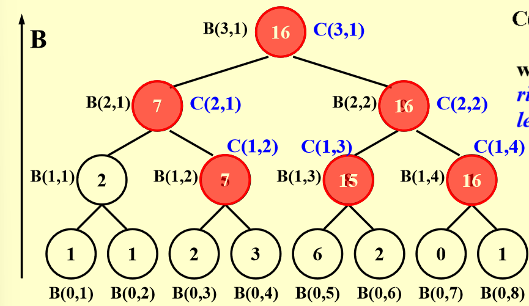

# **Parallel Algorithm**

## 0 basic

### 0.1 两个模型

- PRAM（Parallel Random Access Machine）
- WD（Work-Depth）

### 0.2 PRAM

- 解决冲突方法

  - EREW 不能同时读写
  - CREW：可以同时读 不能同时写
  - CRCW：可以同时读写
    - Arbitrary rule：随意取一个写入的值
    - Priority rule：优先级，根据优先级来判定
    - Common rule：一般，只有不冲突的时候才写入，都写入相同数值时

- **数组求和**

  

  - 缺陷：

    - 处理器数量变化迁移性差（处理器基本数量不变）
    - 不需要使用的处理器 任然时stay idle 占用资源

    **T(n)=O(logn) W(n)=O(n)**

### 0.3 WD

每个时期的操作数是可以控制的 操作数可变，不需要stay idle

#### 0.3.1 measure

- work: W(n):总的操作数，也就是数的节点数* 单个节点的时间  串行的时间复杂度 工作量

- worst-case running time（也叫 wedth）：T（n）或者（D（n））也就是树高*一层所需要的时间  并行时间复杂度 时间

  > **进程数估计：对于PRAM**：
  >
  > - $P(n)=\frac{w(n)}{T(n)}$ 刚好这么多层解决这些操作，所以时间刚好是T(N)
  > - $P(n)\leq\frac{w(n)}{T(n)}$  层数太少了 进程数不足，于是需要 $\frac{w(n)}{P}$时间
  > - 总的来说需要 $\frac{w(n)}{P}+T(n)$时间
  >   - 对于冗余的情况:T(N)
  >   - 刚好也是T（N）
  >   - 少了 每一层的操作数设为k 每一层时间是 $\lceil \frac{k}{p}\rceil$ 故此时每一层最多是 $\frac{k}{p}+1$ 一共$T(N)$层

- :star2:对于p个进程 取值范围就是在$[\frac{w(n)}{P},\frac{w(n)}{P}+T(n)]$

## 1 prefix sums 算两趟

- 先算B值 就是之前所计算的结果 **从下向上计算**
- 第二遍计算C值 ：**从上向下计算**
  - 如果 i  是偶数 （右边路径） 和父亲保持一致 `c(h,i)=c(h+1,i/2)`
  - 如果 i 是 1 （B即是前序和）：`c(i,j)=B(i,j)`
  - 如果 i 是其他奇数 (尴尬局面)： `c(h,i)=B(h,i)+c(h+1,(i-1)/2)` **注意这里使用C=B+C 而不是 C=B+B 是由于如果他的左上方点不是左路径节点 就不能代表前序和**

- **T(n)=O(logn) W(n)=O(n)**

### 2 Merging

**只需要创建一个ranking 只需要知道A的每个元素在B中的排名 B的元素在A中的排名即可**

- 排名记录时 B[j]在 A[i]和A[i+1]之间时 排名是i

在完成ranking之后 merge所需要 的是 **T(N)=O(1) W(N)=(M+N)**

#### 2.1 Binary Search

直接并行二分搜索去寻找

**T(N)=O(logN) W(N)=O(NlogN)**

#### 2.2 Serial Search

线性搜索

**T(N)=O(m+n) W(N)=O(m+n)**

#### 2.3 parallel ranking

- 先选出$p= \frac{n}{logn}$个 select 先计算所有的select的rank 用二分
  - $T（n）=O(log(n))=O(logn)$
  - $W(n)=p*log(n)=O(n)$
- 之后分成2p个part 用线性搜索查找
  - $T(n)=(n/(\frac{n}{logn}))=O(logn)$
  - $W(n)=O(n)$​
  
  **ALL W(n)=N T(N)=N**

### 3 Finding Max

#### 3.1 算法1

把求和的+改成求最大值 ：**W=O（N），T=O（logN）**

#### 3.2 算法2

任意两个数字pk，小的数就做一个标记：

同时并行：**T(n)=1 W(n)=O(n^2)** 时间开销很低 但是工作量很大

#### 3.3 算法3 切割问题

用$\sqrt{n}$去切割 分成$\sqrt{n}$个子问题，再对于子问题进行划分，分别找出的答案使用算法二进行合并：

$$
T(n)\leq T(\sqrt{n})+c1 :\\全部的时间=并行完成一个子问题时间+合并\\
W(n)\leq \sqrt{n}W(\sqrt{n})+c_2n:\\
全部的工作量=每一个工作量*总的数量+合并的工作量\\
合并：\\
T(\sqrt{n})=1\\
W(\sqrt{n})=n\\
T(n)=O(loglogn) W(n)=(nloglogn)
$$

#### 3.4 算法4 再切割

按照 loglogn 来切分

对于每一个子问题都通过线性算法计算

于是子问题的$T(n)=w(n)=O(log log n)$

最后的合并是 通过算法三来合并

$$
T(n)=O(h)+O(loglog(\frac{n}{loglogn}))=O(loglogn)\\
W(n)=O(n)
$$

#### 3.5 Random Sampling

T(n)=O(1) W(n)=O(n)

1. 先并行出来 $n^{\frac{7}{8}}$个元素存在B中
2. 再把B按照$n^{\frac{1}{8}}$分成$n^{\frac{3}{4}}$个block
3. 再分
4. 之后将剩下的元素用线性合并
5. 最后检查剩下的元素 是否有比这个最大的大，如果有随机放在B的位置
6. 再重新来一把

**失败概率很低 是O(1/n^c)**

