### Red-Black Tree
- 红黑树需要满足**五条性质**：
  1. 每个节点不是红色就是黑色
  2. 根节点是黑色
  3. 每一个叶子(哨兵NIL)是黑色
    - 哨兵称为外部节点，有键值的节点称为内部节点
  4. 如果一个节点是红色，那么他的孩子节点都是黑色
  5. 对于每一个节点开始到叶子的简单路径包含相同数量的黑色节点
-**补充说明NIL**
  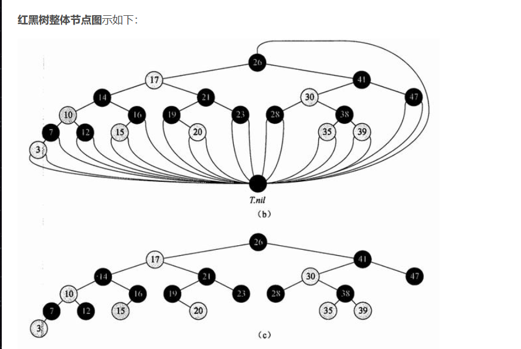
- **黑高(black-height)**：从某一结点 $x$ (但是不包括 $x$) 到叶子节点(不包括哨兵)的简单路径上黑色节点的数量，$bh(x)$
- **引理**：一棵有 $n$ 个内部结点的红黑树的高度至多为 $2\log(n+ 1)$
  - 简单理解：当一个红黑树去掉所有红色结点之后。剩下的节点个数一定是大于等于高度为 $bh(root)$ 完全平衡二叉树的节点个数 (因为此时除了叶子节点之外的所有黑色节点都连接至少两个节点，并且每一个叶子节点的深度是相同的) 于是 $sizeofblack(root) \geq x^{bh(x)}-1$ 所以 $sizeof(root) \geq x^{bh(x)}-1$ 于是 $bh(x) \leq \log(n+1)$ ，又知道 $h \leq 2bh(x)$ 所以 $h \leq 2\log(n+ 1)$
- #### 红黑树的插入insert
  - **插入红色节点**
  - 如果连接新插入的点是黑色的话，不出现矛盾直接满足
  - 矛盾出现在红色连接红色的点，性质4被破坏。或者是根节点是红色，直接把根节点染黑即可，破坏性质2.
  - 只会出现一下三种情况(判断要素是判断**插入节点的叔叔节点**)
  - **三种情况都是先将父亲和叔叔染成黑色，再将祖父染成红色**
    - case 1 ：叔叔节点也是红色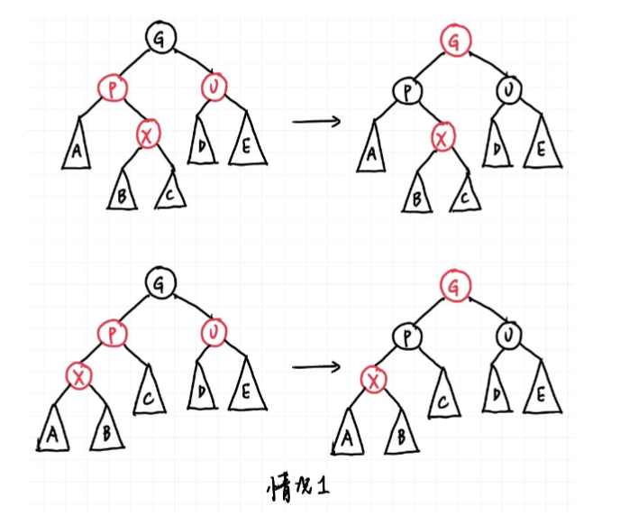
      - 这种情况，将矛盾从插入的点转化到了祖父节点，多次迭代。迭代结束的条件是：祖父节点的父节点是黑色，或者是祖父节点直接是根节点。
    - case 2：叔叔节点是黑色，此时矛盾节点和叔叔节点临近，应当先旋转成case 3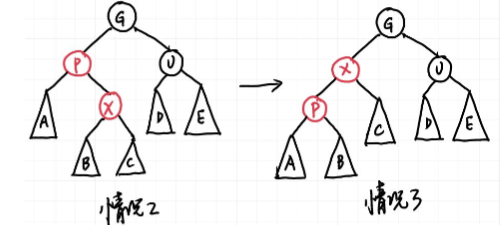
      - 2.3思路相同，将p点染黑G染红，此时一枝不变另一支少一，再进行一次旋转。先将2变成3是需要防止旋转之后再次出现红色连接红色的情况。于是case可以理解为AVL中的LR和RL
    - case 3：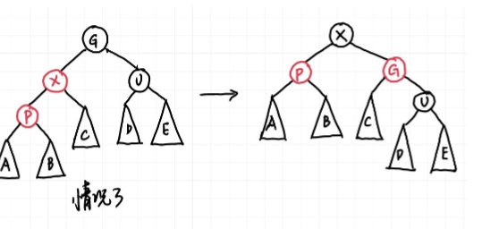
      - 相当于LL和RR
  - 插入一个节点的时间复杂度是 $O(\log n)$
    - 2,3都是常数级别操作。1最多能够迭代树高次。
  - 思考顺序：
    - 先判断插入的上一个节点颜色，黑色则直接插入，红色就要进行之后的判断
    - 判断叔叔节点的颜色 如果为红色直接case 1 修改颜色，如果为黑色需要后续判断
    - 判断是近侄点还是远侄点，近侄点进行LR或者RL 远侄点进行RR或者LL
- #### 红黑树的删除Delete
  - 由于二叉搜索树的删除操作，可以发现无论删除哪一个点，最后等价于都是对于叶子节点的删除。
    - 若需要删除的叶子节点是红色的，则可以直接删除不影响整个树的性质
    - 若需要删除的叶子节点是黑色的，思路是将该叶子的分支增加一个黑色的节点(红色转黑或者简单旋转)使得左右两个分支出现一个黑高的差为1。如果没有合适的节点去接收这个改变，则两个分支都减少一个黑的量，传给父亲节点进行迭代。所以需要判断的就是**兄弟节点的颜色**。
  - 于是就有了以下几种情况：(先判断兄弟的颜色，再考虑兄弟孩子的颜色)
    - case 1 兄弟节点是红色 将兄弟节点转化为黑色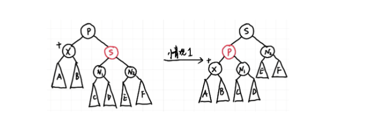
    - 之后的情况都是兄弟节点为黑色 就需要关注侄子节点
    - case 2 兄弟的两个孩子（侄子）都是黑色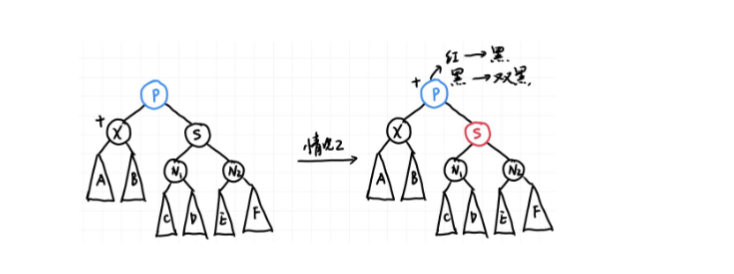
      - 就是将黑色向上推 自己本身是特黑变成黑色，兄弟的孩子都是黑色就可以满足把兄弟节点变成红色，此时父节点为红色直接改成黑色完成，如果为黑色变成特黑继续向上迭代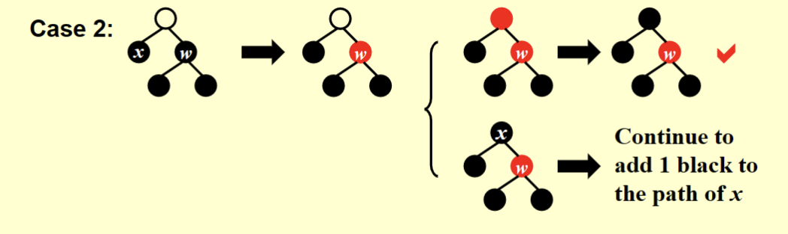
    - 之后想法是把需要删除的分支的黑色加重，通过旋转的方式加重黑色，删除后达到平衡
    - case 3 近侄子是红色的，远侄子是黑色的，需要把远侄子换成红色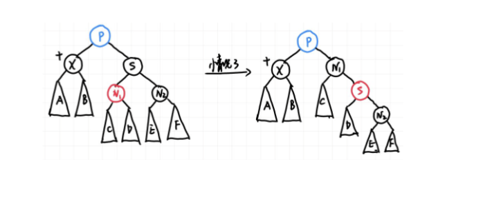
      - 相当于考虑红色侄子的位置进行一次LR或者是RL，注意颜色改变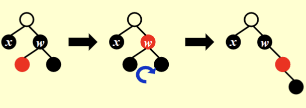
    - case 4 远侄子是红色 近侄子无所谓颜色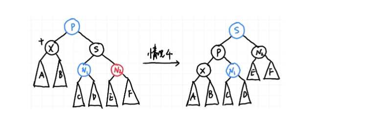
      - 相当于是做RR或者LL 把颜色加重给删除的那一边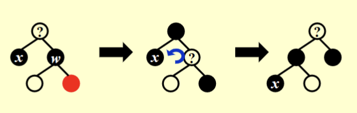
  - 思考顺序：
    - 先判断删除什么颜色的节点，红色直接，黑色继续后续操作
    - 再判断兄弟节点，是红色则使用case 1转变为黑色，是黑色继续操作
    - 在判断侄子节点，全黑case 2
    - 判断远侄子节点，红色直接case 4，黑色的话通过case 3转化为case 4.

### B+ tree
- #### 满足三个性质：
  1. 根节点的子节点数量是从2到M
  2. 所有非叶子节点（除了根节点外）有 $\lceil \frac{M}{2} \rceil$ 到 M 个孩子
  3. 所有叶子的深度都是一样的
- B+树的阶(order)就是M，；例如4阶B+树又称为2-3-4 tree
  - 真实数据保存在叶子节点，叶子中存 $\lceil \frac{M}{2} \rceil$ 到 M 个键值
  - 非叶子节点存 $\lceil \frac{M}{2} \rceil$ 到 M 个指针，存M-1个键值，第k个键值描述第k+1棵子树的最小的值。