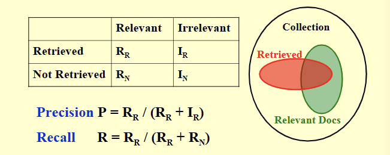
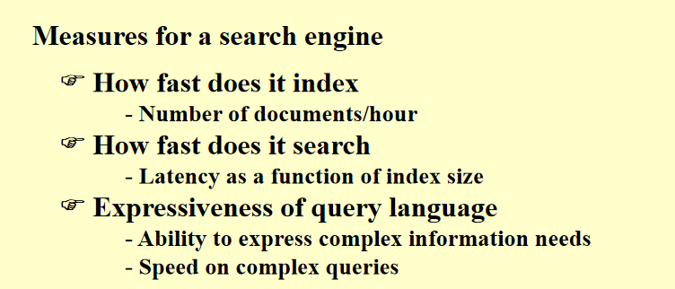

### Inverted File Index 倒排索引
- #### 基本概念
  - 用一个指针表储存每一个单词在文本中出现的位置(docunment)，并记录总的出现次数，**建立一个反向的从单词指向文件名的映射关系(Term（词语） -> Text)**
    - **记录次数**：搜索时从出现次数升序的方向开始搜素会加快搜索效率
- #### 记录单词(term)
  - #### Word stemming
    - 只记录单词原型
  - #### Stop Word
    - 不记录某些高频词汇，如a,of等
- #### 查询单词
  - 使用搜索树
  - 使用哈希表
- #### 储存
  - 当内存不够时，就需要使用磁盘进行存储
  - 数据量过于庞大时，需要使用分布式存储
    - Term-partitioned index 按照单词首字母顺序分布在不同计算机上
    - Document-partitioned index 按照单词存储的标号顺序进行存储
- #### Dynamic indexing
  - 添加一个临时存储空间，当需要添加新的单词时，先添加到临时存储空间中去，在统一添加到主要的存储空间。
  - 当删除时，只是修改该数据前的状态编号，并不是实际的删除
- #### Compression
  - 用连续的字符串存储在内存中，节约空间，在存储时通常存与前一个单词的相对差值，在寻找时通常是求和状态
  - 记录两个文档ID的差值
- #### Thresholding 阈值
  - 显示时只显示按照相关度排序前n个文档
  - Query(需要查询的单词)：按照出现频率的升序排列，查询起来从频率最低的此开始查询，设置一个阈值，只查询小于阈值的。
- #### Data Retrieval Performance
  - Response time
  - Index Space
- #### Information Retrieval Performance\
  - How relevant is the answer set？
- #### 结果相关性评估(relevance)
  - 分成两个种类：Relevant 和 Irrelevant
  - 标记成一个表的形式
  - 精准度：$Precision P = \frac{R_R}{R_R+I_R}$
  - 召回率：$Recall R=\frac{R_R}{R_R+R_N}$

- 本节比较简单主要是需要记忆多个词汇的意思\
  - posting list :某词出现的文章列表
  - word stemming
  - stop word
  - term-partitioned index
  - document-partitioned index
  - dynamic index
  - compress
  - thresholding
    - document
    - query
  - relevance
    - precison
    - recall

**1. In distributed indexing, document-partitioned strategy is to store on each node all the documents that contain the terms in a certain range.**
- F dps 是按照文档的序号存储的，并不是更具terms分类存储的

**2. When evaluating the performance of data retrieval, it is important to measure the relevancy of the answer set.**
- data retrieval:measure index space and responce time
- information retrieval :measure relevancy of answer set 

**7.Which of the following is NOT concerned for measuring a search engine?**
A.How fast does it index

B.How fast does it search

C.How friendly is the interface

D.How relevant is the answer set

- 

注意以下俩个的区别：
使用B树相比起按照索引顺序搜索来比较是更加昂贵了
哈希表相比起b树来看更昂贵了(几乎是全部遍历了)
**4.While accessing a term by hashing in an inverted file index, range searches are expensive.**
这个是和B+树比的，对

**5.While accessing a term stored in a B+ tree in an inverted file index, range searchings are expensive.**
这个是和顺序查找比的，对

