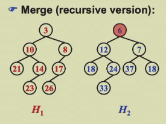
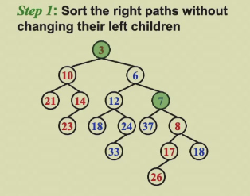
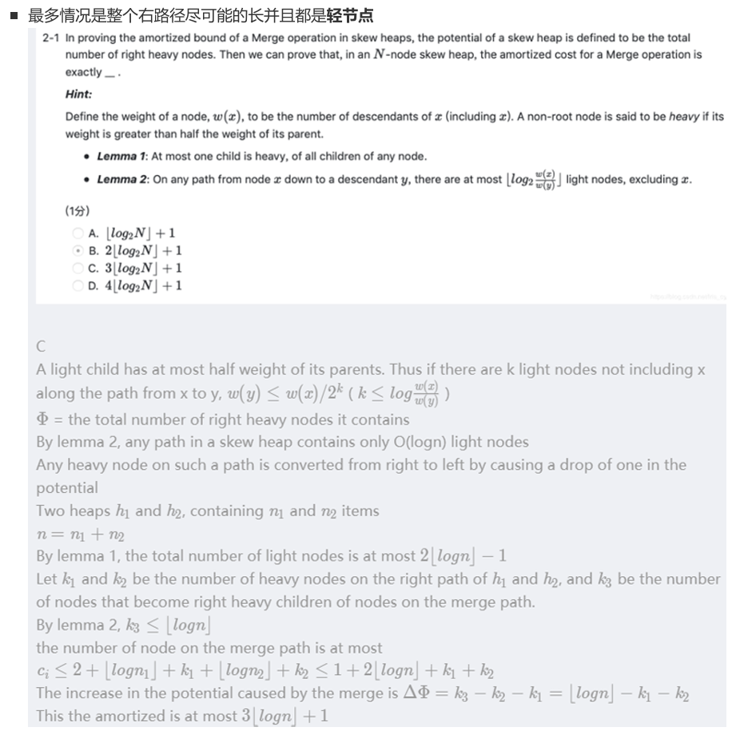
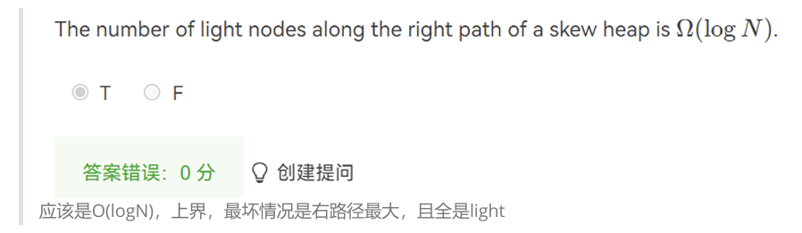
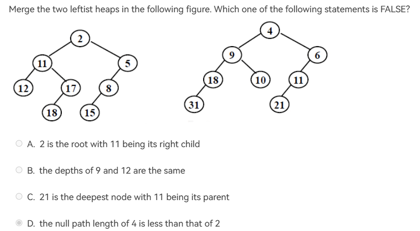

### Leftist Heap
- #### 基本性质
- **null path length(NPL)**:任意一个节点到一个没有两个孩子节点的最短路径。NPL(null)=-1
  - 或者说是：任意一个节点到外部节点的最短路径。
  - 内部节点：有两个孩子的节点。外部节点：有小于两个孩子的节点，Npl(外部节点)=0。
    $Npl(x)=\min\{Npl(c)+1\}$ c是所有的孩子。
- **左偏树**：$Npl(left~child)\geq NPl(right~child)$
  - 判断时从叶子到根来判断，要注意空节点
- **左偏树性质**：左偏树右路径长度为r时，整个树至少有 $2^r-1$ 个节点
  - **右路径**：从某个节点到最右边的节点的路长.
  - 一个点的NPL一定是等于该点的右路径长度：
    >**proof**：从最右边一个点来看，该点Npl一定为0，该点的父节点Npl一定为1(一定有左儿子，不然不构成左偏树)，以此类推向上叠加。

   **proof**:由数学归纳法可证
   - $N\geq2^r-1~~~r\leq\log(N+1)$

- #### 基本操作
- **Merge(recursive version)**:
  - **step 1**:比较两棵树根节点的大小,保留小的根节点和左子树.
    
  - **step 2** 运用递归 Merge 右子树和另一个树.
  - **step 3** 合并结果如果Npl(left)大于Npl(right),则左右交换.
  - **递归结束条件**,当一棵树传入为空时返回另一颗树.
  ```c
  merge(h1,h2){
    if(h1==null)return h2;
    if(h2==null)return h1;
    if(h1->element<h2->element)return merge2(h1,h2);
    else return merge2(h2,h1);
  }
  merge2(h1,h2){
    if(h1->left==null) h1->left=h2;
    else{
      h1->right=merge(h1->right,h2);
      if(h1->left->npl<h2->right->npl)
      swap(h1->left,h1->right);
      h1->npl=h1->right->npl+1;
    }
    return h1;
  }
  ```
- **Merge(iterative version)**：
  - 把每一个右路径节点以及其左孩子连带拆分
    
  - 排序(不需要完全偏序)，连接
  - 检查新树的所有右路的Npl
- **DeletMin**
  - 删除根节点
  - 连接左右两棵树
  
### Skew Heaps
- **Merge**：和左偏树一样，但是不用考虑Npl，无论Npl多大，都进行左右交换 **(除了右路径中最大的元素，就是最右边的元素)**。
- 先对于右分支进行排序，再从低到高进行交换

### Amortized Analysis for Skew Heaps
- **好的势能函数是有起有伏的**
- **斜堆中一定没有只有右儿子的节点**
- **重节点**：右子树节点个数大于左子树节点个数。
- 只有右边路径上的节点的轻重节点个数会发生改变(只有左右交换会改变，参与交换的点都是在右路径上的)
- 一次操作之后右路上的重节点一定会变成轻节点(一定会进行一次交换)但是轻节点不一定变化。
- 右子树的轻节点上界，logN。左右节点数越是对称轻节点更多。
- 均摊分析：
$$
H_i=l_i+h_i(i=1,2) \\
T_{worst}=l_1+h_1+l_2+h_2 \\
\phi_i=h_1+h_2+h (h是左边树中不变的节点)\\
\phi_{i+1}\leq l_1+l_2+h\\
T_{amortized}=T_{worst}+\phi_{i+1}-\phi_{i}\leq 2(l_1+l_2)\\
l=O(logN)\\
T_{amortized}=O(logN)
$$




**O表示上界**




- D选项含义是,节点4 和节点2 的NPL 而不是NPL为4