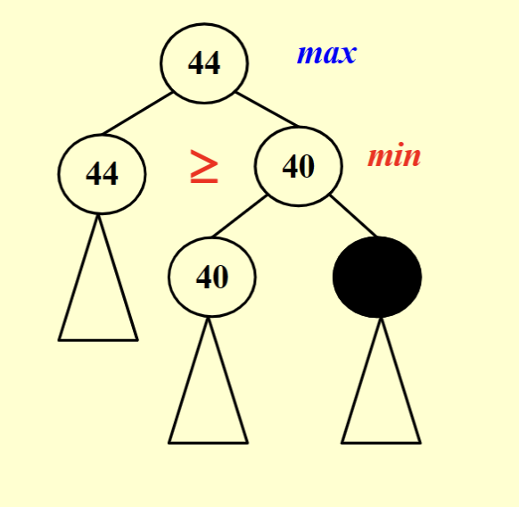
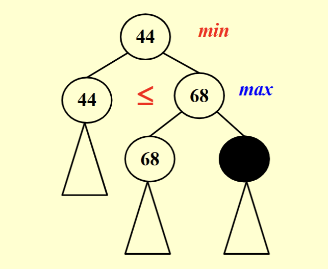

## 回溯问题
算法原理比较容易
### 模板
```c
bool Backtracking ( int i )
{   
    // 标记是否找到一个解
    Found = false;
    // 如果当前搜索到的解的长度大于N，说明已经找到一个解，返回true
    if ( i > N )
    return true; /* solved with (x1, ..., xN)*/
    // 遍历当前解的最后一个xi可能取的值
    for ( each xi in Si ) 
    { 
        /* check if satisfies the restriction R*/
        OK = Check((x1, ..., xi) , R ); /* pruning */
        // 如果满足约束R，则继续搜索
        if ( OK )
        {
            // 记录当前解
            Count xi in;
            // 递归搜索
            Found = Backtracking( i+1 );
            // 如果没有找到解，则恢复到上一个状态
            if ( !Found )
            Undo( i ); /* recover to (x1, ..., xi-1) */
        }
        // 如果已经找到解，则不再搜索
        if ( Found ) 
        break; /* break the search*/
    }
    return Found;
}
```

## Tic-tac-toe
重点关注减枝 从左向右左，从下向上 优先减大的
- α pruning 找最大， 已知只要大于一个未知就行
 
- β pruning 找最小  已知只要雄安与一个未知就行
 