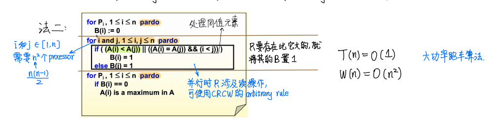

# ADS Review 提纲

## 数据结构

## Lecture 1

**树高**：从根到叶子，边的最大数量，空树-1，单节点0。

### AVL Tree

**二叉搜索树**

- complete binary tree：堆的结构
- perfect binary tree：所有都是满排

**高度平衡(height balanced)**：左右子树  **高度差 $\leq$ 1**

**定义**：所有点都满足**高度平衡**

:star:**平衡因子(Balance Factor, BF)**：$BF(T_p)=h(T_l)-h(T_r)$ **（左-右）​**

- AVL树只能取 **-1，0，1**

:star:**AVL树高**：$O(\log n)$​​ 用来估计上界 计算使用斐波那契数列计算准确值 

**注意：题目中对于高度定义可能不同，特别情况特别分析**
$$
n_h 高度为~h~最小点数\\
h=0~n_h=1\\
h=1~n_h=2\\
h>1 ~n_h=n_{h-1}+n_{h-2}+1
$$
**Trouble Finder**：不满足高度平衡的点（**自下而上**第一个出现问题的点）

**Trouble Maker**: 新添加的点

**树的旋转**（关注笔记中的图像）

:star2:**关注 Finder和Maker的相对位置 分为以下情况：**

- RR/LL

- RL/LR

**删除操作旋转次数$\log(n)$​**

> 理解插入只需要旋转不超过2次但是删除需要旋转O(log N)次
>
> 插入：找到 trouble finder之后，需要进行旋转，也就是高的子树高度减一，矮的子树高度加一，与未插入相比trouble finder这个点的高度其实是不发生变化的，所以就不需要考虑再上面的点了，也就是说只用维护一个trouble finder足够
>
> 删除：删除一个点之后 会导致一个trouble finder出现不平衡状态，此时进行旋转，但是旋转完之后这个点的高度是减一的（原本的高度由高的子树决定，把低的子树删除一个点之后，高的子树向低的旋转，高度下降，此时总高度减一），这里trouble finder平衡了，但是其父亲节点就由需要面临可能出现的不平衡情况，所以最坏情况是需要旋转树高次O(logN)

### Splay Tree

摊还之后每一个操作代价是$O(\log n)$,**不能保证每一个代价都不超过这个**

**核心思想**：每当我们访问一个节点（比如查询某个点、插入某个点，甚至是删除某个点），我们就通过一系列操作将目标点转移到根部

**旋转方式**：

:star:每一次旋转只考虑**三个点**:自己、父亲、祖父

- 父亲是根节点 直接旋转 **Zig**
- 父亲不是根节点 
  - **Zig-zag** ：类似LR RL
  - **Zig-Zig**：先转父亲 再转自己

**Splaying not only moves the accessed node to the root, but also roughly halves the depth of most nodes on the path.**


（这个Splaying应当是指Zig-Zag Zig-Zig）

摊还计算省略 :

- 势能函数：子树的秩(Rank) =$\log S(i)$ S代表子树中孩子的个数

### Amortized Analysis

 $worst-case~bound≥amortized ~bound≥average-case ~bound$

**Aggregate Analysis 聚合法**:$T_{amortized}=\frac{\Sigma_iT_i}{n}$找到所有可行组合中最差的情况

**Accounting Method 核算法**：降低高消耗操作的代价
$$
\hat{c_i}=c_i+\Delta_i\\
\Sigma_{i=1}^{n}\hat{c_i} \geq \Sigma_{i=1}^{n}c_i\\
$$
**Potential Method势能法**：不纠结于如何均摊 使用势能函数解决**让消耗大的那一步操作势能大大的降！** **好的势能函数能保证最开始是最小的，降低要求只需要最后一个比开始大即可**
$$
\hat{c_i}=c_i+(\Phi(Di)-\Phi(D{i-1}))\\
\Sigma_{i=1}^n{\hat{c_i}}=\Sigma_{i=1}^n+\Phi(D_n)-\Phi(D_0)\\
\Phi(D_n) \geq \Phi(D_0)
$$

## Lecture 2

### Red Black Tree

**平衡二叉搜索树**

:star2:**五条性质**

- Every node is either red or black.
- The root is black.
- Every leaf (`NIL`) is black.(External node)
- If a node is red, then both its children are black.
- For each node, all simple paths from the node to descendant leaves contain the same number of black nodes.

**NIL理解**：


**Black-Height 黑高：**该节点（**不包括自生**）到叶节点简单路径中，黑色节点数量 $bh(x)$

**高度性质**：一个有 $𝑁$ 个内部节点（不包括叶子结点）的红黑树，其高度最大为 $2\log⁡_2(𝑁+1)$​。

$2bh(tree)\geq h(tree)$

:star:**插入操作**（关注笔记中的详细操作）

**直接按照二叉树插入一个红色节点，出现红红连接**:red_circle::red_circle:

- 叔叔**红色**：向上传递红色
- 叔叔**黑色**：LR/LL RL/RR旋转 染色：**黑—红—黑**

:star: **删除操作**（关注笔记）

**删除两种情况，删除黑色叶子节点直接把这个点变成黑+，删除度为1的黑色节点，其孩子是红色直接染黑，孩子是黑色变成黑+，代替这个点**

- 兄弟**红色**：向删除节点方向旋转 兄父换色
- 兄弟**黑色**：
  - 侄子**全黑**：向上传递黑色
  - 远侄子**红色**：向删除节点方向旋转 兄父换色 远侄子变黑
  - 远侄子**黑色**：把近侄子转走 兄侄换色

### B+ Tree

**性质**

- The root is either a **leaf** or has between **2 and *M*** children.
- All nonleaf nodes (except the root) have between $⌈\frac{M}{2}⌉$ and $M$​ children.
- All leaves are at the same depth.
- Assume each **nonroot leaf** also has between $⌈\frac{M}{2}⌉$ and $𝑀$ children.

**操作只考虑插入和查找**（插入满了就分裂）

**2-3 tree order is 3**

最大高度：$h=\lceil\log_{\lceil\frac{M}{2}\rceil}N\rceil$ M最好的选择是3或者4

## Tree Summary

| Tree       | 特点                                           | 插入      | 删除      | 查找      |
| ---------- | ---------------------------------------------- | --------- | --------- | --------- |
| AVL Tree   | 通过维护两端高度查 维护平衡属性 balance factor | O(logN)   | O(log N)  | O(logN)   |
| Splay Tree | 简化版AVL tree                                 | A:O(logN) | A:O(logN) | A:O(logN) |
| RB Tree    | 通过黑高相等 black height                      | O(logN)   | O(logN)   | O(logN)   |
| B+ Tree    | 不是二叉搜索树了                               | O(Mh)     | O(Mh)     | O(log N)  |

| Tree     | 插入旋转 | 删除旋转    |
| -------- | -------- | ----------- |
| AVL Tree | $\leq 2$ | $O(\log N)$ |
| RB Tree  | $\leq 2$ | $\leq 3$    |

## Lecture 3 Inverted File Index

储存每一个单词在文本中出现的**位置(docunment)**，记录总的**出现次数**，**建立一个反向的从单词指向文件名的映射关系(Term（词语） -> Text)**

**Stop Word** :不记录某些高频词汇，如a,of等.

**Word stemming**:记录单词原型

**Term-partitioned index**：按照字母顺序排列，容易单点故障

**Document-partitioned index**：按照文档编号划分

**dynamic index**:main index(主存编号)+auxiliary index（类似于cathe编号）

**compression**:存储与前一个单词插值

**Thresholding**：

​	**document**：只检索前面 **x** 个按权重排序的文档 显示相关度高的文档 对于布尔查询无效

​	**query**：把带查询的 **terms** 按照出现的频率升序排序 从低频率查询

八股记忆

**Measures for a search engine**

- How fast does it index
- How fast does it search
- Expressiveness of query language

**Data Retrieval Performance 数据返回评估**：Response time、Index space

**Information Retrieval Performance**：How relevant is the answer set？

**:star:Relevance measurement**

精准度：$Precision ~P = \frac{R_R}{R_R+I_R}$

召回率：$Recall~ R=\frac{R_R}{R_R+R_N}$

## Lecture 4 

### Leftlist Heap

**根节点维护最大或者最小元素，但是不是完全二叉树了，方便实现Merge操作**

**NPL （null path length）**：任何一个节点到**外部节点**（没有两个孩子的节点）的最短路径。

**NPL（null）= -1**

>:star2:**NPL(x)=min{NPL(c)+1,c is the child of x}**
>
>NPL应当是从下向上维护的 **注意空节点**

**定义**：左偏树维护节点左偏：$Npl(left\_child)\geq Npl(right\_child)$​ **注意这里是大于等于**

>**拓展性质**：
>
>**右路径** NPL（x）= NPL(right child)+1
>
>如果右路径上节点个数为 r 故 Npl（x）= r-1 ，则至少有 $2^r-1$​ 节点
>
>直观理解：右路径r个节点 每个节点左孩子应当是比右孩子大的，最小的情况是一样，这就构成了一棵r层完美二叉树。

**合并Merge操作**

```c
struct tree
{
    int element;
    tree * left;
    tree* right;
    int npl;
}
```

递归方法：递归merge再交换 如果做题推荐用之后的方法，写程序递归简单

```c
tree* recursive_merge(tree * t1,tree* t2)
{
    //空树直接返回
    if(t1==null)return t2;
    if(t2==null)return t1;
    //保证t1是小数
    if(t1->element > t2->element)
        swap(t1,t2);
    //t1 是否单个节点 如果有函数去维护npl(null)可以不用判断
	if(t1->left==null)
        t1->left=t2;
    else{
        t1->right=mrecursive_merge(t1->right,t2);
        if(t1->left->npl<t1->right->npl){
            swap(t1->left,t->right);
         t1->npl=t1->right->npl+1;
        }
    }
    return t1;
}
```

直接法合并：把每一棵树右路径上的点连带其左子树拆分下来，归并排序连接，最后从下向上维护npl

**合并操作全部是log（n）复杂度**

**Delete min**：删除根节点，Merge两棵子树，**O（log n）**

### Skew Heap

**类似于Splay tree 摊还下来O(log n)的 merge复杂度**

**Merge操作**：和左偏树一致，只是**无条件交换左右子树**，除了右路径上最大的节点即 最右边的元素

**先排好序 再从低到高进行一次交换**

:star2: **均摊分析**

**heavy node**：如果它的右子树结点个数至少是P的所有后代的一半（后代包括P自身）：右子树的节点个数 **大于** 左子树节点个数

**引理**：对于右路径上右 $l$ 个轻结点的斜堆，整个斜堆至少有$2^l−1$个结点，这意味着一个 $n$ 个结点的斜堆右路径上的轻结点个数为$O(\log n)$。
$$
H_i=l_i+h_i(i=1,2) \\

T_{worst}=l_1+h_1+l_2+h_2 \\

\phi_i=h_1+h_2+h (h是左边树中不变的节点)\\

\phi_{i+1}\leq l_1+l_2+h\\

T_{amortized}=T_{worst}+\phi_{i+1}-\phi_{i}\leq 2(l_1+l_2)\\

l=O(logN)\\

T_{amortized}=O(logN)
$$

## Lecture 5 Binomial Queue

**结构**：是由**二项树**构成的森林（**阶数不能重复**）

**二项树**（**不是二叉树 维护堆性质**）：

- k 阶二项树是由两个 k-1 阶二项树合并得到的
- 0 阶二项树 只有一个节点
- **阶数 等于 树高** 表示为 $B_k$
- $B_k$ 根有 k 个 child ，一共有 $2^k$ 个节点，第 d 层有 $C_k^d$​个节点（**二项式展开**）

**FindMin**：遍历所有树顶点$\lceil \log N \rceil$​ (计算二进制数位数),如果有min去记录则可以降到O(1)

```c
typedef struct BinNode *Position;
typedef struct Collection *BinQueue;
typedef struct BinNode *BinTree;  
struct BinNode { 
    ElementType    Element;
    Position    LeftChild;
    Position     NextSibling;
};
struct Collection { 
    intCurrentSize;
    BinTreeTheTrees[ MaxTrees ];
};
```


**Merge**:**类似于二进制加法全加器**

- 连接操作 **注意**
  - 需要维护堆性质，选出最小元素
  - 树的结构是按照 阶树降序排列 为了方便合并 直接连接在最左边即可

```c
CombineTree(BinTree T1,BinTree T2)
{
	if(T1->Element>T2->Elemet)
	return CombineTree(T2,T1);
	T2->NextSibling=T1->LeftChild;
	T1->LeftChild=T2;
	return T1
}
```

- Merge操作 **注意**：
  - 同时有进位T1 T2时是将T1 T2合并再次进位

```c
BinQueue Merge(BinQueue H1,BinQueue H2)
{
    BinTree T1,T2,Carry=Null;
    H1->CurrentSize+=H2->CurrentSize;
    for(i=0,j=1;j<=H1->CurrentSize;i++,j*=2){
        T1=H1->TheTrees[i],T2=H2->TheTrees[i];
        switch(4*!!Carry+2*!!T2+!!T1){
            case 0://000
            case 1:break;//001
            case 2:H1->TheTree[i]=H2->TheTree[i];
                H2->TheTree[i]=NULL;
                break; //010
            case 4:H1->TheTree[i]=Carry;
                Carry=NULL;
                break; //100
            case 3:Carry=CombineTrees(T1,T2);
                H1->TheTrees[i] = H2->TheTrees[i] = NULL; 
                break;//011
            case 5:Carry=CombineTrees(Carry,T1);
                H1->TheTrees[i] = NULL; 
                break; //101
            case 6:Carry=CombineTrees(Carry,T2);
                H2->TheTrees[i] = NULL; 
                break; //110
            case 7:H1->TheTrees[i] = Carry; 
                Carry = CombineTrees( T1, T2 ); 
                H2->TheTrees[i] = NULL; 
                break;//111
 
        }
    }
    return H1;
}
```

**DeleteMin **

删除最小元素之后 会获得两个森林，一个是删除原来的树剩下的树，另一个是删除顶点新产生的树，直接Merge即可,**注意**：

- 在独立新二项队列时，需要注意维护大小
- 计算大小时使用位运算 也可以使用2的次方

```c
ElementType  DeleteMin( BinQueue H )
{
    BinQueue DeletedQueue; 
    Position DeletedTree, OldRoot;
    ElementType MinItem = Infinity;
    int i, j, MinTree;
    
    if ( IsEmpty( H ) )  {  PrintErrorMessage();  return –Infinity; }
    for(int i=0;i<MaxTrees;i++)
    {
        if( H->TheTrees[i] && H->TheTrees[i]->Element < MinItem ) 
        { 
            MinItem = H->TheTrees[i]->Element;  
            MinTree = i;    
        } 
        DeletedTree=H->TheTree[MinTree];
        H->TheTree[MinTree]=NILL;
        OldRoot=DeletedTree;
        Deletedtree=DeletedTree->LeftChild;
        DeleterQueue->CurrentSize=(1<<MinTree)-1;
        for(j=MinTree-1;j>=0;j--){
            DeletedQueue->TheTrees[j] = DeletedTree;
            DeletedTree = DeletedTree->NextSibling;
            DeletedQueue->TheTrees[j]->NextSibling = NULL;
        }
        H->CurrentSize  – = DeletedQueue->CurrentSize + 1;
        H = Merge( H, DeletedQueue ); /* Step 4: merge H’ and H” */ 
	return MinItem;
    }
}
```

**Insert**：均摊分析下来时**O（1）**

连续插入N个数据 最差的时间开销时O(N)

一次插入：最差 $O(logN)$

## Heap Summary

这里堆没有平衡这个说法

| Heap           | FindMin       | Merge     | Deletemin |
| -------------- | ------------- | --------- | --------- |
| LeftHeap       | O(1)          | O(logn)   | O(logN)   |
| SkewHeap       | O(1)          | A:O(logn) | A:O(logN) |
| Binomial Queue | O(logN)orO(1) | O(logN)   | O(logN)   |

## 算法分析

## Lecture 6 Backtracking

**Eight Queens** purning:

- $x_i \not= x_j ~if~i\not=j$
- $\frac{x_i-x_j}{i-j}\not=\pm 1$

**The Turnpike Reconstruction Problem**收费公路

>一条公路有n个点，$0=x_1<x_2....<x_n$ 于是总共有$\frac{n(n-1)}{2}$​段距离，现在给出所有的距离，构建出点的位置。

距离从大到小考虑，考虑距离是距离左边还是有右边，分情况讨论。

模板：

```c
bool Backtracking ( int i )
{   
    // 标记是否找到一个解
    Found = false;
    // 如果当前搜索到的解的长度大于N，说明已经找到一个解，返回true
    if ( i > N )
    return true; /* solved with (x1, ..., xN)*/
    // 遍历当前解的最后一个xi可能取的值
    for ( each xi in Si ) 
    { 
        /* check if satisfies the restriction R*/
        OK = Check((x1, ..., xi) , R ); /* pruning */
        // 如果满足约束R，则继续搜索
        if ( OK )
        {
            // 记录当前解
            Count xi in;
            // 递归搜索
            Found = Backtracking( i+1 );
            // 如果没有找到解，则恢复到上一个状态
            if ( !Found )
            Undo( i ); /* recover to (x1, ..., xi-1) */
        }
        // 如果已经找到解，则不再搜索
        if ( Found ) 
        break; /* break the search*/
    }
    return Found;
}
```

**purning时应当选择情况从少到多的情况，这样排除的更多**

**Tic-tac-toe**

$f(P)=W_{computer}-W_{human}$

**人类尽可能减少这个evaluation function，机器希望最大**

**pruning**

- $\alpha$​ pruning max-min max>min
- $\beta  ~pruning$​ min-max  min<max

限制到只搜索$O(\sqrt N)$个点

**顺序：左子树>根>右子树**

## Lecture 7  Divide & Conquer

**Closest Points Problem**

- 划分成三个子问题 左右边和跨线问题
- 主要解决的是跨线问题
  - 先找到左右边的最短距离 于是只用研究中线加减左右两边问题
- **需要将点按照x或y轴排序 否则可能达不到O（nlogn)复杂度**

**:star:分析求解复杂度 T(N)=aT(N/b)+f(N)**

**代换法(substitution method)**:猜出答案数学归纳证明，选择题可以用，**注意：要保证数学归纳和最后结果完全一致 差个参数也不行**

 **递归树法**：画出树 分别求叶子的消耗，和每一层合并的消耗，比较麻烦

**不平衡问题的解决**：

T(N)=T(N/3)+T(2N/3)+cN

> N
>
> $(\frac{1}{3}+\frac{2}{3})N$
>
> $(\frac{1}{3})^2+2(\frac{1}{3})(\frac{2}{3})+(\frac{2}{3})^2=(\frac{1}{3}+\frac{2}{3})^2N$
>
> ....

**:star2:主方法(master method) 记公式**

**Form 1：**

1. $f(N)=O(N^{\log_ba-\epsilon}) ~\epsilon>0~~T(N)=\theta(N^{\log_ba})$ 

2. $f(N)=O(N^{\log_ba+\epsilon}) ~\epsilon>0~~~af(N/b)<cf(N)~~T(N)=\theta(f(N))$ 

3. $f(N)=O(N^{\log_b^a})~~T(N)=\theta(N^{\log_ba}\log N)$

**Form 2**：

1. $af(N/b)=kf(N)~~k<1 ~~T(N)=\theta(f(N))$

2. $af(N/b)=kf(N)~~k>1 ~~T(N)=\theta(N^{\log_ba})$

3. $af(N/b)=f(N)~~T(N)=\theta(N^{\log_ba}\log N)=\theta(f(n)log_b(n))$

**Form3 记这个就行**

$T(N) = a T(N / b) + \theta(N^klog^pN )$

1. $a>b^k~~T(N)=O(N^{\log_ba})$

2. $a=b^k~~T(N)=O(N^k\log_b^{p+1}N)$ 比较强

3. $a<b^k~~T(N)=O(f(N))$	

## Lecture 8 Dynamic Programming

**主要考察编程题和程序填空**

**Fibonacci Numbers**：最简单的DP问题

**F(N)=F(N-1)+F(N-2)** 

只需要存前两个的值就好


**Ordering Matrix Multiplications**
$$
m_{ij}=min({m_{il}+m_{l+1j}+r_{i-1}r_{l}r_{j}}) ,j>i
$$
$T(N)=O(N^3)$

**Optimal Binary Search Tree**

分成左右两棵子树
$$
c_{ij}=p_k+c_{i,k-1}c_{k,k-1}+w_{k+1,j}+w_{i,k-1}\\
c_{ij}=min(w_{ij}+c_{i,k-1}+c_{k+1,j})
$$
**All-Paors Shortest Path**

​	考虑一个点k，如果k在i,j的最短路径上，那么$D_{ij}=D{jk}+D{ik}$​ 如果不在就不影响。

​	现在顺序向其中添加点
$$
D^k[i][j] ，i到j的最短距离能经过前k个点\\
D^k[i][j]=min(D_{k-1}[i][j],D^{k-1}[i][j]+D^{k-1}[i][j])
$$
**:star:背包问题**

总遍历顺序还是根据n遍历
$$
p_{i,c}=max(p_{i-1,c-v_i}+s_i,p_{i-1,c});
$$


**最长公共子列问题**
$$
p_{i,j}=p_{i-1,j-1}+1 x_i=y_j\\
p_{i,j}=max(p_{i-1}{j},p_{i}{j-1}) x_i\not=y_j
$$
**编辑距离问题 两个字母对应 或者 DNA 匹配**

以下是 给你两个单词 `word1` 和 `word2`， *请返回将 `word1` 转换成 `word2` 所使用的最少操作数* ：
$$
p_{ij}=min(p_{i-1j-1},p_{i-1j}+1,p_{ij-1}+1)  x_i=y_i\\
p_{ij}=min(p_{i-1j-1}+1,p_{i-1j}+1p_{ij-1}+1) x_i\not=y_i
$$
[300. 最长递增子序列 - 力扣（LeetCode）](https://leetcode.cn/problems/longest-increasing-subsequence/description/)

```c
int lengthOfLIS(int* nums, int numsSize) {
    int p[numsSize];
    for(int i=0;i<numsSize;i++){
        p[i]=0;
    }
    p[0]=1;
    int allmax=1;
    for(int i=0;i<numsSize;i++){
        int max=0;
        for(int j=0;j<i;j++){
            if(nums[j]<nums[i]&&p[j]>max)
                max=p[j];
        }
        p[i]=max+1;
        if(p[i]>allmax)
        allmax=p[i];
    }
    return allmax;
}
```

## Lecture 9 Greedy Algorithm

**重点在于思想 考试应当也是判断居多**

1. 将问题转化为选择，选择之后获得一个要解决的子问题
2. 贪心算法不一定能找到最优解
3. 贪心选择之后，**证明**原问题问题总是存在最优解

> To prove the correctness of a greedy algorithm, we must prove that an optimal solution to the original problem always makes the greedy choice, so that the greedy choice is always safe. (F)  不是always 

1. 要**证明**最优解和贪心选择组合之后能得到原问题最优解
2. 最优子结构：贪心选择+子问题最优解
3. 贪心算法只有在子问题最优等价于总问题最优时才有用


**activity selection problem**

**GA**:

**选择结束最早的** 

局部最优解不一定是全局最优解：

结束最早的只能说一定出现在某些最优解中，**但是不是全部**

加权就无法解决

**DP**:
$$
c_i=max(c_{i-1},c_{k(i)}+1)
$$
仍然可以解决加权问题

**Huffman code**

Prefix Tree：最优的一定是满的二叉树 高度范围在[1,n-1]

算法顺序重要：

1. 建立一个堆
2. 取出两个最小元素合并 更新权重
3. 插入堆
4. 反复插入

## Lecture 10 NP completeness

**P**:确定性图灵机在多项式时间内解决的问题

**NP**：非确定性图灵机在多项式时间内解决问题，确定性图灵机在多项式时间内验证的问题。

**NPH**：问题可能不是NP问题，但是NP可以在多项式时间规约成NPH

NPH中是NP的部分就是NPC

**polynomial reduce** : 在多项式时间把A转化为B **难度保持升级**

**NPC**: NP 问题规约得到。 一个NPC解决所有NPC和NP都解决

**证明NPC**：1. NP 2. 一个已知的NPC规约得到这个问题 *最早NPC SAT问题*

**NPC问题**：

- Hamiltonian cycle problem ：过所有点
- TSP 
- Clique  判断子图能否是完全图
- vertex cover 找到一堆点，每个边都有至少一个点在期中

**CO-NP**：一个问题 和他的补集都是NP问题


## Lecture  11 Approximation

**Approximation Ratio 近似率**：$max(\frac{c}{c^*},\frac{c^*}{c})\leq \rho(n)$​

**tight approximation ratio**：算法的最优近似比，这个算法已经不能再优化了，可以换算法

 **Approximation scheme**:

- PTAS ：和n成多项式关系

- FPTAS ：和n， $\frac{1}{\epsilon}$ 成多项式关系

**Approximate Bin Packing** 不存在小于1.5的近似比

- **Next Fit**：最好情况为M个箱子时，结果不会超过2M-1，于是近似比为2. 存在使用2M-1的情况
- **First Fit**：结果不超过 1.7M 于是近似比为1.7，存在使用$\frac{17(M-1)}{10}$的情况
- **Best Fit**：同上（找到一个剩余空间最小的）
- **Online**包括以上三种的在线算法，只要是在线算法使用的数量一定是至少是 $\frac{5}{3}M$​
- **offline**:降序排列之后再使用BF或者FF，结果不超过$\frac{11}{9}M+\frac{6}{9}$个，存在使用$\frac{11}{9}M+\frac{6}{9}$情况。

**The Knapsack Problem**

- **fractional version**：选择最高性价比 准确解
- **0-1 Version**：贪心取利润最大或者性价比最高的（profit density），近似比为2

**The K-center Problem** 不存在小于2近似比算法

The K-center problem can be solved optimally in polynomial time if K is a given constant.

在平面上画k个圆，能将所有的site全部覆盖，问半径的最小值

- **2r Greedy**：如果已知最优解，那么在任意一个圆中，任意选取一个点作为圆心只需要2r就可以包围所有点。
  - 任意选择一个点，将距离这个点小于2r的点全部删除
  - 再找下一个点，统计最后需要多少个点
  - 如果用的点数小于k则 半径太大
  - 如果点数大于k 则半径太小
- 通过二分法来寻找，于是近似比2

- **smater greedy**：直接找距离已有圆心距离最大的点作为新圆心。找到k个之后算半径。**近似比也是2**

**summary**

1. 最优性(optimality)：即能求准确解；
2. 高效性(efficiency)：即算法是否高效；
3. 普遍性(all instances)：即算法是否普遍适用于所有的情况；

倘若一个解法：

1. 同时满足最优性和高效性，那么这个算法对特殊情况能高效求准确解；
2. 同时满足最优性和普遍性，那么这个算法对所有情况都能求准确解；
3. 同时满足高效性和普遍性，那么这个算法可能是个近似算法；

就算 N=NP 成立，我们仍然无法保证三个愿望一次满足。

## Lecture 12 Local Search

**neighborhood**：S是一个可行解，对于S做一个小的修改之后得到的解就称为 neighborhood（*N(S):{s' :s~s ' }*）

S~S':small modification of S

中心思路：

```c
SolutionType Gradient_descent()
{   
    Start from a feasible solution S FS ;
    MinCost = cost(S);
    while (1) 
    {
        S’ = Search( N(S) ); /* find the best S’ in N(S) */
        CurrentCost = cost(S’);
        if ( CurrentCost < MinCost ) 
        {
            MinCost = CurrentCost;    
            S = S’;
        }else  
            break;
    }
    return S;
}
```

**Vertex Cover Problem**

>- 先选择全部点作为初始的解
>- 选择邻居为删除某一个点
>- 直到无法继续删除则称为局部最优

- Metropolis Algorithm :防止陷入局部最优解无法跳出，增加一个几率跳出这个解 概率函数：$e^{-\frac{\Delta cost}{kT}}$

- Simulated Annealing 模拟退火，T是一个主键下降的常数，也就是说越来越难跳出。

**Hopfield Neural Networks**

​	给定一个图像，其中每一条边都有一个权重（可以为正数也可以为负数），当权重小于0时，这条边的两个端点需要在同一个stage，当权重大于0时，这条边的端点需要在不同的stage中。（完全符合的情况很少于是问题进一步改变）

- **good**：当一条边满足$S_uS_vW_e\textless 0$ 称为好边
- **satisfied**：当一个点所连接的好边的权重**大于等于**坏边的权重时，即

$$
\Sigma w_eS_uS_v \leq 0
$$

- **stable**: 当所有点都是satisfied的 此时称为stable

> **算法**:
>
> - 先任意选择出一种情况
> - 找出其中坏的点，反制这个点
> - 当不在存在坏点时停止

证明这个算法一定能终止： **这个算法能保证在 **$\Sigma |W_e|$​ **的循环次数内找到解**


**Maximun Cut Problem**

给定一个无向图，但是每条边的权重都是正数，把所有的点分成两个部分使得，两个部分AB之间的边的权重和最大：
$$
w(A,B):=\Sigma_{u\in A,v\in B}W_{uv} 
$$

- 问题就类似于HopfieldNN的特例子，即全部变都为正数的情况，于是可以使用同样的算法计算出一个局部最优解

- $W(A,B)\geq \frac{1}{2}W(A^*,B^*)$ 容易证明 **近似比为2**：

  

为了加快算法 如果没有大的提升了就停止

定义这个大的提升：**Big-impovement-flip**：只有当每一次循环的优化$\geq \frac{2\epsilon}{|V|}W(A,B)$​循环才继续

- 将近似比$(2+\epsilon)$ :$(2+\epsilon)W(A,B)\geq W(A*,B*)$​
- 于是最多只需要$O(\frac{n}{\epsilon}\log W)$​ 次循环

> 混个眼熟
>
> The neighborhood of a solution should **be rich enough** that we do not tend to get stuck in bad local optim
>
> the neighborhood of a solution should **not be too large**, since we want to be able to efficiently search the set of neighbors for possible local moves.
>


## Lecture 13 Randomized Algorithms

>randomized algorithms that are always correct,  and run efficiently **in expectation**

**Hiring Problem 雇佣问题**

每天面试一个人一共需要录取M个人，有N个人参与面试
$$
cost=N\times C_i+M\times C_h
$$


- **Naive Solution**:最简单的思路，只要比之前的最好的好就录用！
  -  但是最坏情况比较差 $O(N*C_h)$​
  - 能找到最好的解
- **随机算法：随机排序所有人**

> Randomness assumption: any of first i candidates is equally likely to be best-qualified so far.

$$
E[x]=\Sigma_{i=1}^{N}E[x_i]=\Sigma_{i=1}^{N}\frac{1}{i}=\ln N\\
E[x_i]:第i个是前i个中best的概率：\frac{1}{i}\\
cost=O(c_k\ln N+NC_i)
$$

**随机排序算法：**

```c++
void PermuteBySorting ( ElemType A[ ], int N )
{
	for ( i=1; i<=N; i++ )
	A[i].P = 1 + rand()%(N^3);
	/* makes it more likely that all priorities are 	unique */
	Sort A, using P as the sort keys;
}
```

随机生成一个数组p（为A数组加随机权重），根据随机权重来排列A

- **Online Hiring Algorithm – hire only once**

​	前k个人不雇佣，从k个中选出一个best的，从k+1开始雇佣第一个比best好的人.
$$
Pr[S_i]=Pr[A\and B]=Pr[A]\times Pr[B]\\
Pr[A]:i恰好是best=\frac{1}{N}\\
Pr[B]:在[k+1,i-1]没人被雇佣(i-1中最好的在前K中出现)=\frac{k}{i-1}\\
Pr[S_i]=\frac{k}{N(i-1)}\\
Pr[S]=\frac{k}{N}\Sigma_{i=k}^{N-1}\frac{1}{i}\\
\frac{k}{N}\ln(\frac{N}{k})\leq Pr[S] \leq \frac{k}{N}\ln(\frac{N-1}{k-1})\\
best ~k=\frac{N}{e}
$$
**Quick Sort**

随机找一个基准

- Central splitter中心分割点：使得每一边至少有 n/4 个
- Modified Quicksort：在开始递归之前选择出一个中心分割点

**Claim：在期望上只需要找两次即可找到中心分割点**

worst case:O(NlogN)

## Lecture 14 **Parallel Algorithm**

 **两个模型**

- PRAM（Parallel Random Access Machine）
- WD（Work-Depth）

**PRAM**

- 解决冲突方法

  - EREW 不能同时读写
  - CREW：可以同时读 不能同时写
  - CRCW：可以同时读写
    - Arbitrary rule：随意取一个写入的值
    - Priority rule：优先级，根据优先级来判定
    - Common rule：一般，只有不冲突的时候才写入，都写入相同数值时

- **数组求和**

  

  - 缺陷：

    - 处理器数量变化迁移性差（处理器基本数量不变）
    - 不需要使用的处理器 任然时stay idle 占用资源

    **T(n)=O(logn) W(n)=O(n)**

**WD**

每个时期的操作数是可以控制的 操作数可变，不需要stay idle


**measure**

- work: W(n):总的操作数，也就是数的节点数* 单个节点的时间  串行的时间复杂度 工作量

- worst-case running time（也叫 wedth）：T（n）或者（D（n））也就是树高*一层所需要的时间  并行时间复杂度 时间

  > **进程数估计：对于PRAM**：
  >
  > - $P(n)=\frac{w(n)}{T(n)}$ 刚好这么多层解决这些操作，所以时间刚好是T(N)
  > - $P(n)\leq\frac{w(n)}{T(n)}$  层数太少了 进程数不足，于是需要 $\frac{w(n)}{P}$时间
  > - 总的来说需要 $\frac{w(n)}{P}+T(n)$时间
  >   - 对于冗余的情况:T(N)
  >   - 刚好也是T（N）
  >   - 少了 每一层的操作数设为k 每一层时间是 $\lceil \frac{k}{p}\rceil$ 故此时每一层最多是 $\frac{k}{p}+1$ 一共$T(N)$层

- :star2:对于p个进程 取值范围就是在$[\frac{w(n)}{P},\frac{w(n)}{P}+T(n)]$

**prefix sums 算两趟**

- 先算B值 就是之前所计算的结果 **从下向上计算**
- 第二遍计算C值 ：**从上向下计算**
  - 如果 i  是偶数 （右边路径） 和父亲保持一致 `c(h,i)=c(h+1,i/2)`
  - 如果 i 是 1 （B即是前序和）：`c(i,j)=B(i,j)`
  - 如果 i 是其他奇数 (尴尬局面)： `c(h,i)=B(h,i)+c(h+1,(i-1)/2)` **注意这里使用C=B+C 而不是 C=B+B 是由于如果他的左上方点不是左路径节点 就不能代表前序和**


- **T(n)=O(logn) W(n)=O(n)**

**Merging**

**只需要创建一个ranking 只需要知道A的每个元素在B中的排名 B的元素在A中的排名即可**

- 排名记录时 B[j]在 A[i]和A[i+1]之间时 排名是i

在完成ranking之后 merge所需要 的是 **T(N)=O(1) W(N)=(M+N)**

- **Binary Search**
  - 直接并行二分搜索去寻找
  - **T(N)=O(logN) W(N)=O(NlogN)**


- **Serial Search****线性搜索
  - T(N)=O(m+n) W(N)=O(m+n)**


- **parallel ranking**

  - 先选出$p= \frac{n}{logn}$个 select 先计算所有的select的rank 用二分
    - $T（n）=O(log(n))=O(logn)$
    - $W(n)=p*log(n)=O(n)$

  - 之后分成2p个part 用线性搜索查找
    - $T(n)=(n/(\frac{n}{logn}))=O(logn)$
    - $W(n)=O(n)$​


  **ALL W(n)=N T(N)=N**

**Finding Max**

- 算法1
  - 把求和的+改成求最大值 ：**W=O（N），T=O（logN）**

- 算法2
  - 任意两个数字pk，小的数就做一个标记：



 	同时并行：**T(n)=1 W(n)=O(n^2)** 时间开销很低 但是工作量很大

- **切割问题**
  - 用$\sqrt{n}$去切割 分成$\sqrt{n}$个子问题，再对于子问题进行划分，分别找出的答案使用算法二进行合并：


$$
T(n)\leq T(\sqrt{n})+c1 :\\全部的时间=并行完成一个子问题时间+合并\\
W(n)\leq \sqrt{n}W(\sqrt{n})+c_2n:\\
全部的工作量=每一个工作量*总的数量+合并的工作量\\
合并：\\
T(\sqrt{n})=1\\
W(\sqrt{n})=n\\
T(n)=O(loglogn) W(n)=(nloglogn)
$$

- **再切割**

  - 按照 loglogn 来切分

  - 对于每一个子问题都通过线性算法计算

  - 于是子问题的$T(n)=w(n)=O(log log n)$

  - 最后的合并是 通过算法三来合并


$$
T(n)=O(h)+O(loglog(\frac{n}{loglogn}))=O(loglogn)\\
W(n)=O(n)
$$

- **Random Sampling**
  - T(n)=O(1) W(n)=O(n)


1. 先并行出来 $n^{\frac{7}{8}}$个元素存在B中
2. 再把B按照$n^{\frac{1}{8}}$分成$n^{\frac{3}{4}}$个block
3. 再分
4. 之后将剩下的元素用线性合并
5. 最后检查剩下的元素 是否有比这个最大的大，如果有随机放在B的位置
6. 再重新来一把

**失败概率很低 是O(1/n^c)**


## Lecture 15 External Sorting

**Basic**

- **tape**:数据存储在tape上，但是只能顺序查找
  - 至少使用3个tapes


- **recoed**：一次能读入到内存中的组 ：$M=\frac{B:内存大小}{单个数据大小}$

- **run**：再memory中排好序的段 交替放在tape中 归并段

- **pass**：遍历所有数据的次数：$1+\lceil\log_2{\frac{N}{M}}\rceil$（二路归并）

- **I/O次数**：$\frac{N}{B:内存大小}\times pass$

- **四种优化方式**

  - pass降低

  - merge加快

  - buffer并行

  - run更长


**Pass 减少：多路归并（k-way merge）**

​	**pass**:降低到$1+\lceil\log_k{\frac{N}{M}}\rceil$

- **需要2k个tapes：理解多路顺序**

  - 先有分成k个tapes，进行merge

  - 按顺序将结果分别存在k个tapes

  - 再次进行merge


- **将tapes降低为k+1**
  - 直接将合并的结果写入一个Tape，不分开写了，在完成一轮之后，再通过这一个tape进行划分。
  - **不均匀分会减少copy的次数，推荐使用斐波那契数列能忽略copy的消耗**:除了第一次不需要额外的copy

$$
F_{0-(k-2)}^{(k)}=0,F_{k-1}^{(k)}=1 ,F_N^{(k)}=F^{(k)}_{N-1}+....F^{(k)}_{N-k}
$$

 		不是斐波那契数 则补充空run来补充成斐波那契数

**Handle buffers to Parallel**

- 之前所完成的是：一次输入、排序、结果输出（再次输入）....，这里的并行是指将输入和排序并行化。

- 每一次读入buffer的是一个block，与之前不同的是，不是一次读入一个数据，而是一次能读入一个block，block中有多个数据

- 需要把CPU的计算和IO并行起来
- 把buffer划分成小的buf，部分buf在moerge时其他buf就读取数据
- k路归并需要2k个buf进行输入，2个buf进行输出
- :star:**k越大并不是越好**：k越大，每一个buf的size就越小，一次读入的block越小，block数量就越大，所以访问磁盘的次数就变大，导致结果并不好
- 注意一次只能读入一个block 意思就是一个buf

**更长的run**

**流程**：

- 建立一个k个节点的minheap，每次归并就是向里面插入元素，再delete min 插入到output run中
- 如果插入的元素大于上一次delete 就继续正常操作
- 如果小于，还是插入 但是这个点称为死点，不能参与堆的deletemin
- 直到所有点都是死点，这个run就完成了，再把所有点复活进行下一个run

**平均Run长度：2M**：原来长度的两倍

**minimize merge**

处理不同长度run的合并问题，**先合并小的再合并大的**

使用huffman Tree


2024/6/22 第一遍完成


## Algorithms Summary

- backtracking

  - 8 queue 
  - the turnpick reconstruction problem
  - tic-tac-toe

- Divide Conquer

  - cloest point
  - master method

- dynamic programming

  - Ordering Matrix Multiplications
  - Optimal Binary Search Tree
  - All-Pairs Shortest Path

- greedy problem

  - basic
  - actives select problem GP DP
  - Huffman Tree profix graph

- NP

  - P NP NPC NPH
  - reduction

- Approximation

  - PTAS FPTAS
  - Bin packing 1.5
    - NF 2M-1 2
    - FF 1.7(M-1) 1.7
    - BF 1.7
    - offline 11/9M+6/9
  - Knapsack 2
  - k-center 2\
  - optimality efficency all instanse

- Local search

  - Vertax cover

    - Metropolis Algorithm
    - Simulated Annealing

  - Hopfield Neural Networks

    - We

  - Maxinum cut

    - 2 <1/2 op
    - Big inpovement flip
      - $\frac{2\epsilon}{v}w(A,B)$
      - $2+\epsilon$
      - $\frac{n}{\epsilon}log W$

  - Randomized

    - hiring problem
      - randomized ln n
      - online
        - $p\in[\frac{k}{n}\ln {\frac{N}{K}},\frac{k}{N}\ln(\frac{N-1}{k-1})]$
        - best:$\frac{N}{e}$​

    - quick sort 1/4 
      - 2 times 
      - worst case O(nlogn) 

  - parallel

    - PRAM WD
    - Sum logn n
    - presum logn n B C
    - merge 1 n
    - ranking
      - logn nlogn
      - n n
      - logn n
    - maximun
      - log n n
      - 1 n^2
      - sqrt n  loglogn nloglogn
      - loglogn lognlogn n
      - Random simpling 1 n 1/n^e

  - external sorting

    - less pass k  2k k+1 Fib
    - buffer parallal 2k 2 
    - longer run 2M
    - merge huffmantree
