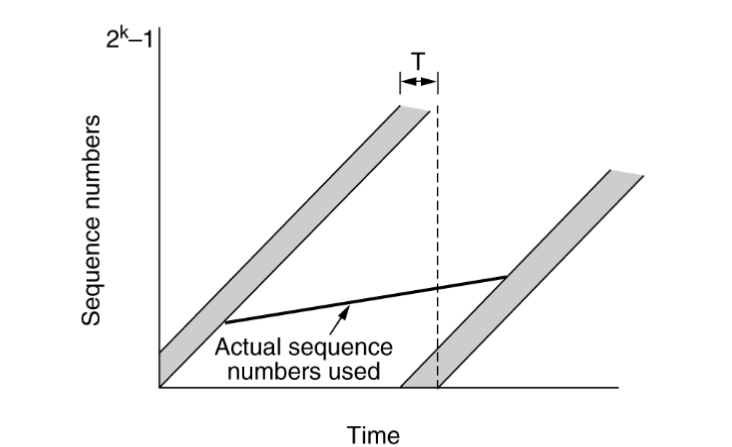
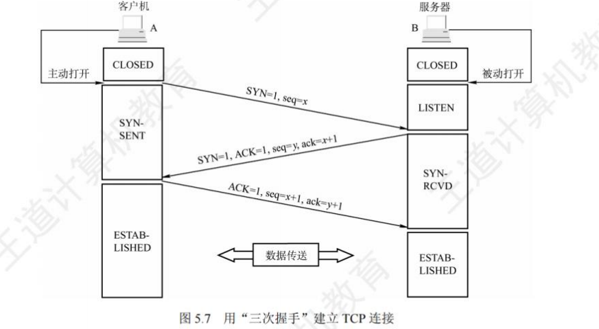

# 计算机网络

## Chapter 1 Introduction

**网络分类**：个域网PAN、局域网LAN、城域网MAN、广域网WAN

### 互联网构成

**网络边缘Network Edge** ：

- 端系统End ：位于互联网边缘与互联网相连的计算机和其他设备
- 端系统由各类主机(host)构成：桌面计算机、移动计算机、服务器、其他智能终端设备

**网络核心 Network Core**：将海量的端系统互联起来，optical transmission system由交换机和链路连接而成（Switches and Links）

- 路由Route : 确定数据分组从源到目标所使用的路径 (**控制**)
- 转发Forward : 路由器或交换机将接收到的数据分组转发出去 查找本地路由表（**实际**）

**接入网 Access Network**：接入网的目标是将**主机Host**连接到**边缘路由器 Router**上

> **边缘路由器Edge Router：接入远端系统路径上的第一台路由器**

> [!IMPORTANT]
>
> 在**存储**时通常使用Byte 
>
> K / M / G 之间通常是 $2^{10}$为进制来换算
>
> 在**传输**时通常使用 Bit
>
> K / M / G 之间通常是 $10^3$为进制来换算


### 网络交换技术

**电路交换 circuit switching**

- 面向连接方式 connection-oriented service :先建立连接，预留资源，独占物理通路。
- 频分多路复用FDM、时分多路复用 TDM 难以实现灵活复用
- 通信时延小、有序传输、没有冲突
- 建立连接时间长，线路利用率低、**难实现差错控制**

以下均是**Connectionless service 无连接服务**

**报文交换 Message switching**

- 路由器接受到**完整数据**报文之后才能向下一跳发送 store - and -forward switching 
- 会带来延迟

**分组交换 packet switching**

- 拆成小的 packet ，支持统计多路复用（statistical multiplexing）并行传递

  > Statistical Multiplexing：根据包数据量，动态分配带宽
- 每一个包独立，单独路由
- 增加了传递数据量


【store and forward】：存在存储转发时延 。L位数据报文，用 R bps速率传递，需要$\frac{L}{R}$秒

***

### 网络协议 network protocol

三要素：语法、语义、时序 Syntax, semantics, timing

**结构**：

- 层次栈 （stack of layers）
- 对等实体 （**peers**）：相同层次的实体
- 接口 （interface）SAP(service access point)：  下层向上层提供**服务原语Service Primitive**
  - 接口是下层给上层提供服务的一个调用接口
  - 服务是下一层能提供给上层的功能，需要通过接口调用（服务原语调用）

- 网络体系结构 （network architecture）= Layers + Protocol


**分层结构**


#### 服务原语(Service Primitives)

服务由一组可用于用户进程以访问服务的原语（操作）形式指定

- 面向连接 Connection-Oriented Service
- 无连接 Connectionless Service


**:star:协议是 水平的 ，服务是 垂直的**

- Protocol 是 peer 之间规定的 packet 的格式以及含义
- Service 是下一层向上一层提供的接口 k层 k-1 个service


### 参考模型

#### OSI 参考模型

- 物理层 （physical layer）： 传输 0、1 ，比特流 **bits on the wire**

- 数据链路层 （data link layer） ： 相邻网络实体数据传输 **Neighboring**

  - 成帧 （Framing） ，纠正错误与检测的最小单位、物理地址（Mac address）
  - avoid overwhelming 淹没，防止快速发送导致，接收端缓存溢出
  - 共享信道的访问控制 MAC：同一个信道，同时传输信号。

- 网络层 Network Layer：数据包从原设备发送到目的设备 host to host

  - 路由 Routing ：选择转发路径

  > MAC 地址标记设备 、标识设备。IP地址在全球范围内寻址，与实际地址相关。

- 传输层 Transport Layer ：将数据从原端口发送到目的端口 （进程到进程）

  - reliable transmission：对通信质量有要求的传输

  - unreliable transmission：使用于对通信质量要求不高，但是相应速度要求高的场景。

- 会话层 session Layer ：应用程序维持会话

- 表示层 Presentation Layer ：关注所传递信息的语法和语义，管理数据的表示方法，传输的数据结构

- 应用层 Application Layer ：应用程序的网络调用

|    Layer     |                           Function                           |                            Other                             |
| :----------: | :----------------------------------------------------------: | :----------------------------------------------------------: |
|   Physical   |                         bits on wire                         |                 物理介质并不是物理层的一部分                 |
|  Data Link   | **Framing**<br>**Error Detection**<br>**相邻节点 Flow Control** |                     MAC共享信道访问控制                      |
|   Network    | Segment<br> 整个网路 主机间Flow Control<br>Congestion Control<br>Error Detection<br>**Routing** |                                                              |
|  Transport   | 端到端 Flow Control<br/>Error Detection<br/>Congestion Control<br/> | 端到端的数据传输 TCP UDP<br>提供可靠和不可靠，对应协议<br>只提供面向连接的传输 |
|   Session    |              建立同步SYN<br>Creating a Session               |                                                              |
| Presentation |                  语义编码加密解密，数据压缩                  |                                                              |
| Application  |                           用户接口                           |                                                              |

#### TCP/IP参考协议

- host-to-network  layer $\rightarrow$ Internet Layer $\rightarrow$ Transport Layer $\rightarrow$ Application Layer  


- OSI 网络层支持无连接和面向连接通信
- TCP/IP 网络层只能支持无连接通信 (IP)

#### 分层模型


**PDU Protocol data unit** ：不同层对应协议数据单元（frame、packet、segment、message）

### 网络度量单位

- **比特率 bit rate** 数字信道的传输速率 bit/s b/s bps
- **带宽bandwidth** 某通道传输数据的能力,单位时间内某信道能通过的最大数据量 b/s
- **包转发率** Packet Per Second (包/秒)
  - **线速转发 Wire-speed Forwarding**：交换机端口在满负载的情况下，对帧进行转发时能够达到该端口线路的最高速度 （小包更容易实现）
- **时延**
  - 传输（发送）时延（transmission delay）发送到传输媒介的时间 
  - 传播时延 ( propagation delay ) 电磁波在信道种传播花费的时间
  - 处理时延 ( processing delay ) 主机或路由器在收到分组时，为处理分组
  - 排队时延 ( queueing delay ) 分组在路由器输入输出队列中排队等待处理所经历的时延
  - 往返时延 RTT Round-Trip Time： 从发送方发送数据开始，到发送方收到来自接收方的确认，经历的总时间
- **时延带宽积**：$时延带宽积=传播时延\times带宽$，即按比特计数的链路长度


- **吞吐量 Throughput**：单位时间内通过某个网络的数据量 b/s
- **有效吞吐量(goodput)**：单位时间内，目的地正确接收到的有用信息的数目（以 bit 为单位）
- **利用率**：信道利用率指出某信道有百分之几的时间是被利用的，网络利用率则是全网络的信道利用率的加权平均值
- **丢包率packet loss rate**：所丢失数据包的数量占所发送数据包的比率
- **时延抖动**：变化的时延称为抖动（Jitter）,类似于方差，衡量稳定性
- **延迟丢包**在多媒体应用中，由于数据包延迟到达，在接收端需要丢弃失去使用价值的包

***

王道补充内容：

- 按照工作方式 分成 边缘网络 和 核心网络
- 按照组成看：分为通信子网和资源子网：
  - 通信子网各种传输截至、通信设备、网络协议
  - 资源子网：共享软件硬件数据资源
- **差错控制：分组>报文>电路**
- 分组的直接结果是：**降低了 transmission delay**
- 关于传播速度最大值：两个主机的网卡速率和链路的带宽的最小值（要考虑接收方的网卡速率的）
- OSI和TCP/IP模型对比补充：
  - OSI区分了接口interface（上下层数据交换接口）、服务、协议
  - OSI现有模型，TCP先有协议栈才生成模型
  - OSI网络层支持面向连接和无连接通信，TCP在网络层只是一个无连接
  - OSI在传输层，只是面向连接，但是TCP在传输层支持无连接和有连接模式

- 物理层和应用层并不参与数据的封装
- **TCP/IP的流量控制 可靠性保证 错误校正是在传输层实现**
- Hub 工作在物理层

***


## Chapter 2 Physical Layer

### 物理层基本概念

- **位置**：物理层是网络体系结构中的最低层。
  - 不是一个具体的物理媒体、也不是连接电脑设备的具体物理设备
- **功能**：如何在连接各计算机的传输媒体上传输数据**比特流**
- **作用**：尽可能地屏蔽掉不同传输媒体和通信手段的差异

### 通信数据基础

#### 傅里叶分析 

任何一个周期为T的函数$g(t)$都可以分解成若干项正弦和余弦函数之和：
$$
g(t) = c+\sum_{n=1}^\infin   a_n\sin(2\pi nft) +\sum_{n=1}^\infin b_n(2\pi nft)\\
c=\frac{2}{T}\int_0^Tg(t)dt\\
a_n=\frac{2}{T}\int_0^Tg(t)\sin(2\pi nft)dt\\
b_n=\frac{2}{T}\int_0^Tg(t)\cos(2\pi nft)dt\\
$$

- 频率 frequency ：$f=\frac{1}{T}$​
- n代表谐波数量（harmonics） : 谐波频率是基波（Fundamental Frequency）频率的n倍

**信号传递**

- 物理层通常传递二进制比特流，但是传递依托于电磁波（弦波传递）。需要利用傅里叶分析，使用大量不同频率的弦波去拟合二进制信号。

- harmonics 数量越多，信号越精准。
- **频谱 spectrum**：信号所包含的频率范围
- 信号绝对带宽（signal absolute bandwidth）: `spectrum` 频谱的宽度。
- channel bandwidth ： 信道所能容纳的最大频率区间，带宽越大，信息的承载能力就越强。
- baseband：信道频率区间是从0开始。
- passband：信道频率区间不从0开始。

**计算最高次数的谐波数量Number of harmonics of the highest degree**

已知比特率（Bit rate）B bps ，发送八位为一个周期 
$$
f_1 =\frac{B}{8}\\
N = \frac{f_c}{f_1}\\
N=\frac{24000}{B}
$$
**结论**：即使对于完善的信道，有限的带宽限制了数据的传输速率

- 传输速率越快，信息缺失越大

> [!NOTE]
>
> #### 区分带宽 bandwidth
>
> - 在这里物理层模拟信号中：最高频率和最低频率的差$f_n-f_1(Hz)$
> - 在之前提到计算机网络之中：通信线路所传输数据的能力，最高的数据速率（bps）

#### 信道的最大数据传输速率

**奈奎斯特定理Nyquist**：(without noise)

- 最大数据传输率=$2H\log_2V (bps)$​
- V为信号电平分级 （discrete voltage levels），即一个电型号能包含多少个等级。$\log_2V$为一个信号能包含的二进制位数。

**区分 symbol rate 和 data rate**

- symbol rate is baud rate

$$
data~rate = symbol~rate \times bits~per~symbol
$$

- 标志速率是指：传递信号波形的速率。其中整个信号可能分V级（一个信号携带$\log_2 V$ bits data）

*eg. we use 8 discrete voltage levels to represent bits*

*data rate = $3 \times $symbol rate*

*we use 1-0 (high-to-low) transition to represent 1 and 0-1 (low-to-high) transition to represent 0, i.e. Manchester encoding*

*data rate = $\frac{1}{2} \times symbol~rate$*

**香农定理Shannon**：(with noise)

- 信噪比(SNR Signal-to-Noise Ratio)（信号功率S与噪声功率N之比）= $\frac{S}{N}$ 为了方便定义对数   $10\log_{10}{\frac{S}{N}}(db)$
- 带宽为H，信噪比为 $\frac{S}{N}$ ,最大数据传输率为：

$$
H\log_2(1+\frac{S}{N})  (bps)
$$

**信息量 amount of information**

- 信息量的大小与消息所描述事件的出现概率有关,a表示进制

$$
I=\log_a{\frac{1}{p}}=-\log_a{p}
$$

*eg. 计算信息量：8灯泡一个坏买，测几次消除不确定度：*

*$p(x)=\frac{1}{8}~~~I=\log_28=3~bits$ 测三次*

*27个球一个重，称几次找出重球：*

*$p(x)=\frac{1}{27} I=-\log_3{27}=3$ 测三次*

### 通信系统模型

- 通信communication：是在源点与终点之间传递消息message或者信息information

- 消息message：是指能向人们表达客观物质运动和主观思维活动的文字、符号、数据、语音和图像等
- 信息information：是指包含在消息中对通信者**有意义的那部分内容**
- 数据 data：传递information实体
- signal信号：数据的电气或者电磁的表现形式


#### 传输方式

- serial transmission 长距离

- parallel Transmission 近距离


单双工：

- 单工simplex：只能沿着一个方向传送信号
- 半双工helf-duplex：可以在两个方向传输信号，但是不能同时进行
- 全双工duplex，在两个方向上同时传送数据信号

**基带与频带**

Digital Modulation 数字调制

- 基带传输baseband transmission：不搬移频谱的方式传递。
- 频带传输passband transmission：使用调制解调器搬移信号频谱传输，需要适应信道的频率特性。

#### 数据编码技术 数据转化为数字信号

归零编码：从高电频到0电频视为 1，从低电平到0电频视为0

不归零编码：NRZ ：Non-Return to Zero

- 低电平 0 高电频 1
- 难以区分一位结束和另一位开始

曼彻斯特码（Manchester），也称相位编码：

- 每一位中间都有一个跳变，低跳高表示0，高跳低表示1

差分曼彻斯特码（Differential Manchester）

- 每一位中间都有一个跳变，每位开始时有跳变表示“0”，无跳变表示“1”


#### 频带传输 数字数据调制为模拟信号

三种调制方法Modulation：

- 幅移键控法（调幅）Amplitude-shift keying (ASK)

  - 幅移就是把频率、相位作为常量，而把振幅作为变量

- 频移键控法（调频）Frequency-shift keying (FSK)

  - 频移就是把振幅、相位作为常量，而把频率作为变量
- 相移键控法（调相）Phase-shift keying (PSK) 
  -   相移就是把振幅、频率作为常量，而把相位作为变量

Amplitude：点到原点的距离

Phase：与x轴的夹角


### 传输介质 transmission media

#### Guided transmission medium 引导型传输介质

**Magnetic tape 磁介质**

**twisted pair 双绞线**

**coaxial cable同轴电缆**：寿命长、容量大、传输稳定、**外界干扰小**、维护方便，常用于广播电视。

**fiber 光纤**：

- 包层折射率低：入射角足够大时，就会引起全反射，光线重新折回纤芯，从而不断向前传播

多模是多条不同光线在同一根光纤传播

- 多模突变光纤 Multimode mutation fiber（又称阶跃光纤）： 纤芯和包层的折射率沿光纤的径向分布是均匀的。小容量短距离通信
- 多模渐变光纤 ：折射率逐渐变化，中容量中距离通信
- 单模光纤 single mode fiber：单模光纤的带宽极宽，适用于大容量远距离通信

光纤收发端：

- 发送端：发光二极管，激光二级管
- 接收端：光敏二极管

**电力载波power line carrier**：电力线传播

#### 非导引型传输介质Non-guided transmission medium

**短波传输（无线电波）Short-wave transmission**：电磁波向个方向传递

- multipath propagation 路径不同导致到达终点波的不同

**微波 microwave** 视距通信，通常使用中继。

**光波传输light wave**：可见光、红外线、激光

### 无线与卫星通信

**无线：**自由传输（环境复杂、收到环境噪声污染）$\lambda f=c$

**卫星通信**：卫星作为中继站，传播无线电波。（空间站地球通信）


### 多路复用技术

复用multiplexing：共享通信信道，避免干扰

#### 频分复用 FMD Frequency-division multiplexing 

所有用户在相同时间内，占用不同的带宽资源：


#### 时分复用 TMD Time Division Multiplexing

把时间划分为登场的时分复用帧（TMD frame），TMD也称为 isochronous 等时信号。


- 存在的不足：信道利用率并不高
- **统计时分复用**statistical time division multiplexing，STDM：动态按照需求分配信道，提高信道利用率。

#### 波分复用 WDM  Wavelength Division Multiplexing

是利用多个激光器在单条光纤上同时发送多束不同波长激光的技术


#### 码分复用 CDMA Code Division Multiple Access

- **码片chip**：每一个时间划分m个间隔。
- **码片序列 chip sequence**：每一个站点有唯一的 m bit 码片序列
  - 发送比特1，则发送m bits的码片序列
  - 发送比特 0  发送二进制反码

- 码片序列性质：
  - 码片序列向量表示 1代表1 -1 代表 0
  - 每个站点的码片必须正交 orthogonal
  - 两个不同站点的码片序列内积为0 inner product：$S·T = \frac{1}{m}\sum_{i=1}{m}S_iT_i=0$
  - 每一个码片和自己的内积都是1 和自己反码内积都是-1
- 解码方式：
  - 使用接收到的信号的码片序列，和每一个站点的码片序列做内积，结果为1则本站发送1，结果为-1则本站发送-1，结果为0则没有发送。
- 码片序列实现了扩频：实际数据率为b，转化为mbit 则实际数据率为mb bits

***

- **Manchester** :信号跳变 既能作为数据也能作为时钟信号（**标准以太网使用这个编码**）

- **RZ** ：跳变到0作为时钟信号

- **NRZ**：不提供时钟信号

- **Diff Manchester**：中部跳变作为时钟信号，开始的跳变与否作为数据

- 波特率：表示**数字信号**每一秒跳转的次数，在数值上等于

  - 也表示为 模拟信号的电压分级

- 如果给出码元和比特数之间的关系，则需要同时考虑两个公式选一个最小的。

  - 

- 对于给出频率范围的情况，需要自行计算带宽：

  

- **关于采样频率 sampling ：需要大于 2倍的带宽。**

  

补充一些关于传输介质的知识点

- twisted pair：Twisted绞合作用是减少电磁干扰
- coaxial cable ：同轴电缆抗干扰性强
- fiber：损耗小、抗雷电和电磁干扰、体积小、难以被窃取

物理层会定义传输介质的接口特性：

- 机械特性Mechanical properties ：接线器的形状和尺寸，引脚数目和排列等
- 电气特性Electrical Characteristics：电压范围、传输速率距离限制等
- 功能特性：只要关于电平电压的意义，以及每条线的功能
- 过程特性：各种事件出现的顺序

***


## 数据链路层 data and link

### 数据链路层的设计

#### 基本功能：

- 成帧 Framing 
- 差错控制 Error Control
- 流量控制 Flow Control ：确保发送方速率 不大于 接收方处理速率

#### 提供的服务

- 无确认 无连接 服务 Unacknowledged connection less
- 有确认 无连接 服务 Acknowledged connectionless
- 有确认有连接服务 Acknowledged connection-oriented

#### Framing 成帧

**effective load**: 有效载荷

- 区分帧的开始和结束通常使用定界符 FLAG：

  - **Byte count  字节计数**：

    - 第一个位置存放一帧的字节数，但是字节差错会导致混乱

    

  - **Flag bytes with bytes tuffing 字节填充的定界符法**：

    
  
    - 使用定界符FLAG，区分前后两个不同帧。
    - 转义字符：ESC （escape character）
    - 发送方：对有效载荷进行检查，出现特殊字符FLAG，在前面添加转义字节
    - 接收方：处理每一个字节，如果接收到 ESC则之后一个字节视为有效载荷，收到 FLAG 则视为边界
    - 添加这样的字符是 overhead
  
  - **带比特填充的定界符法 Flag bits with bitstuffing**:
  
    - 把之前的定界符 FLAG 换成 ：`01111110` （两个 0 六个1）
    - 发送方：如果再有效载荷中出现连续五个1，则直接插入一个0。
    - 接收方：连续出现五个1
      - 下一个如果是0，则视为efficient load，丢弃0
      - 下一个是1，连同之后的0，视为FLAG
  

#### 差错控制

**出现的差错：**

- incorrect 数据发生错误
- lost ： 接收方未收到
- out of order ： 先发后到 后发先到
- repeatedly delivery：发送一次多次接受

**解决方案**：差错检测与纠正、确认重传

- **确认Acknowledge**：接收方校验数据
- **Timer计时器**：发送方启动定时器，防止丢失
- **顺序号 serial number**：接收方检查序号，防止乱序

#### 流量控制

- feedback-based flow control: 根据接收方反馈，调整发送速率
- rate-based ：发送方根据内建机制，自行减速。

### 差错检测与纠正

#### 基础概念

***code word 码字：** 一个包含 m 个数据位（Data） 和 r 校验位 (Parity bit)描述：$(n,m): n = m+r$*

***code rate 码率**：码字中不含冗余部分的比例 $\frac{m}{n}$*

***Hamming distance**：*

- ***code word hamming distance** : code word 之间不同 bit 个数*

- ***code hamming distance** : 任意两个码字之间**最小**海明距离*

  > [!NOTE]
  >
  > Ablut code hamming distance : consider a coding scheme:
  >
  > *00 => 00000 00000*
  >
  > *01 => 00000 11111*
  >
  > *10 => 11111 00000*
  >
  > *11 => 11111 11111*
  >
  > The hamming distance is 5. (**Attention: min hamming distance**)

***Theorem** : The error-detection and error-correcting properties of a code depend on its Hamming distance.*

- To detect `d` errors : you need `d+1` Hamming distance code. 
  - 【理解：d个错误，至少需要d+1个海明编码距离，如果小于，会出现恰好转变为另一个合法编码 ：There no way to change a valid code into another valid code word】

- To correct `d` errors :  you need `2d+1` Hamming distance code.
  - 【理解：需要保证距离正确的code word的海明距离最短为 d，那么其他的距离至少为 d+1，所以至少需要2d+1的海明距离编码】
  - **correct 的实质：找到距离最近的 valid code word**


#### 检错码 error-detecting code

- 能判断出错，但是不能判断哪个位置出错
- 用在可靠高的信道 如光纤
- 发生的差错，通过重传解决

##### 奇偶校验 parity check

- 偶校验 ： 1 的个数为偶数时 校验位为 0
- 奇校验： 1的个数为奇数时 校验位为0
- 【记忆：1的个数为偶数个，偶检验位是0（偶数），奇检验位是1（奇数）】

##### 校验和 checksum

- 发送方：将数据拆成16位一组，进行二进制补码运算（正常相加，结果取反，如果遇到溢出，反卷到最低位）

  > [!NOTE]
  >
  > Data : 11100110011100110 1101010101010101
  >
  > Complement summ operation:
  > $$
  > 1110011001100110\\
  > 1101010101010101\\
  > ———————————————\\
  > 1~~1011101110111011\\
  > ~~~~0000000000000001\\
  > ———————————————\\
  > 1011101110111100\\
  > 0100010001000011
  > $$

- 

- 接收方：将收到的所有数据也按照16bits一组分，也进行二进制补码求和运算（**Attention：也要添加校验位**）
- **结果如果为 `0xffff`**则代表没有出现错误。

##### 循环冗余校验 Cyclic Redundancy check CRC

**常用于 Data and link layer ，能检测 n+1 位**

- D : 原始数据k位二进制
- G：**产生 n 位CRC校验码**，**需要 n+1 位的生成多项式**（Generator polynomial），最高项为1

操作流程：

1. 将 D 乘 $2^n$ (在末尾添加 n 个 0)，产生 k+n 位。

2. 用G对位模式做**模二除法** 得到余数 R（n位 不足用n补齐），此时R就是CRC校验码

   > [!NOTE]
   >
   > **模二除法**：
   >
   > 加法不进位，减法不借位。简单来理解就是，减法直接做**异或**

3. 检测时，直接使用传来的 D+R 除以 G，如果余数为0，则没有错误。

> [!IMPORTANT]
>
> 计算的例子：
>
> D = 101001 G=1101 n=3
>
> 
>
> 发送端传输的数据为：101001 001
>
> 接受端用：101001 001 与 G 再做除法 即可验证。

#### 纠错码 error-correcting code

- **能定位出错的位置**
- 常用物理层
- 纠错码技术称为 *前向纠错 （FEC,Forward Error Correction）*

##### 设计纠错码

纠正单比特错误，最少校验位条件：

设置code word (n,m) , r  parity code:

- 一共有 $2^m$ 个有效信息，此时任意一个有效信息包含校验位修改一位，需要保证不是一个有效码字。即一个有效信息需要占用`n+1` 个位模式，也就是正确一个 n个非法码字。

- 所以一共需要 $(n+1)2^m$ 个不同的码字 要保证$(n+1)2^m\leq2^n$

- **换一个理解：一个码可以有 n+m 种单比特错误，1 个正确的，校验码需要能够表达 （n+1）种不同状态，于是需要满足$(m+r+1)\leq 2^r$**

##### Hamming code 单bit校验

以奇偶校验（parity check）为基础，但是能找到错误位置。

校验位（parity bit）：放在2的幂次的位置 `1,2,4,8,16....`

校验位检测：

-  P1(0001)：检测所有二进制末尾位为1的

- P2 (0010) :检测所有二进制第二位为1的
- 以此类推

> [!NOTE]
>
> 以 （15，11）为例：
>
> 
>
> 
>
> **:star:出错位置 = 出错校验位的位置编号之和**

**纠正突发性错误**

把 k 码字（n = m + r）组成 kn矩阵，并按列发送，接收方恢复成 k ×n 矩阵

可纠正最多 k 个突发性错误。（连续出错出现在列传输中）

##### Convolutional Code 卷积码

以一个例子来理解：


输入数据：`u=[1 1 0 1 1]` ，初始数据： `00`

1. 根据流程图来完成异或操作，输出`y1= 1 xor 0 xor 0 = 1,y2 = 1 xor 0 = 1`,结果为`00`
2. 修改Internal state ：`10`, 再读入下一个数据 `1`,异或结果为 `01`
3. 之后同理 得到编码结果为`V=[11 01 01 00 01]`

### 基本数据链路层协议

#### Utopia 乌托邦单工协议

> [!TIP]
>
> **假设内容**：
>
> - Simplex 单项传输
> - 完美chennel 帧不损失
> - 始终就绪：发送与接受方始终处于就绪状态
> - 瞬间完成：能够处理生成无穷多数据
>
> **类似于 Unacknowledged connection less ，不出错，也不需要flew control**


#### Error-free channels Stop and wait 停等式协议（无错信道）

> [!TIP]
>
> **不假设**：
>
> - 处理告诉进来的数据
> - 发送方用高于接受方的速度发送数据 会导致 overwhelming
>
> **假设：**
>
> - 信道仍然不会出错 Error - Free
> - 数据传输保持反向 需要双向链路，（半双工物理信道）
>
> **还是不会出现错误，但是需要流量控制，所以需要确认**

**Stop and wait**

- 发送方发送之后，需要等待确认（Acknowldgement）
- 接收方完成接受之后，回复确认 ACK
- 确认帧内容不重要称为 dummy frame


#### Simplex Stop and wait （有错信道或者称为单工停等协议）

> [!TIP]
>
> **假设：**
>
> - 信道出错导致：帧在传输中损坏（能检测）、帧丢失（不到达接受方）
>
> **接近真实情况，有错误，需要流量控制**

**发送方增加一个 timer 当时超时没接收到确认，将重新发送帧。**

*:question:【出现问题】：如果ACK丢失，发送方重新发送，接受方就会收到两遍，需要解决。*

**序号（SEQ：sequence number）**

- 区分到达的帧是第一次发送来的新帧。

- 在每一个帧头部放置一个序号,判断是否需要丢弃重复帧。（连续接受两次相同SEQ，第二次直接丢弃）

- 由于是 stop and wait ：那么只需要使用 1 bits 即可：

- 这里的ACK(k) k代表期望的下一个接受的SEQ

  

  

**效率估计：**

- F = frame size (bits)
- R = channel capacity(Bandwidth /bps)
- I = progagation delay + processor service time (s)
- Time to transmit a single frame  =$\frac{F}{R}$
- Total Delay = D =2I
- Line utilization  $=U=\frac{F}{F+R*D}$  ,when $F<D,LU < 50%$​
- $U=\frac{T_D}{T_D+RTT+T_A}$ 

**问题：**

- 长肥网络LFB 处理不好，发送很快，但是时延很长，于是导致信道占用率就会很低。

提高效率：使用更大帧，但是会导致出错几率提升，导致更多重传。

### sliding window protocol

**Stop and wait 导致Line Utilization**很低，希望通过在没收到ACK时多发送帧。

**吃个饭！**

#### 协议基本思想

- **目的**：对可以线序发出的最多帧做限制

- **序号使用：**循环使用有限的序号。

- **:star:流量控制**：receiver 驱动 sender 窗口转动

  - Sending window ：发出一帧后 窗口下限移动一格 ，收到确认后 上限前移

  - Receiving window：接收到一帧 窗口下限前移一格 发出ACK之后上限前移

    

    

    

- 累计确认：不需要逐个确认，只需要确认最后一个即可。

#### Goback N

**出错全部重新发送：** 接收端收到一个出错帧和乱序帧，丢弃所有的后续帧，不确认这些帧，等超时重新发送。

**对应于 接收窗口为1 的情况 只能顺序接收**

**基本原理：** 发送 N 帧 **，N帧中的某一个出错，发送方重新发送出错以及之后的N个帧。**

**ACK 丢失**：如果 N 中非最后一个帧的ACK丢失，但是只要其之后有ACK 就视为正常返回，不重新发送。

> [!WARNING]
>
> 这里的窗口滑动机制和之前并不完全一样需要注意！

**发送方**：

- **窗口大小**： $1<w_T\leq 2^n-1$​ （这里的 n 是指帧编号的比特数）
- 窗口滑动：收到ACK(K)之后，窗口底部启动到PDU(K)，窗口顶部也向前移动
- 超时：重发窗口中的 PDU

**接收方：**

- **窗口大小** :  1
- 按序接受：乱序出错都会丢弃
- **确认含义**：支持逐帧确认，也同样支持 ACK(K) 代表对于前 k-1 个PDU 确认，同时期望接受 K 号 PDU （处理 ACK丢失情况）

#### 选择重传协议 Selective Repeat

**设计思想：**在某一个帧出错之后（计时器超时），不需要重传之后的所有帧（把之后的帧保存在缓存中），只传出错帧和超时帧。 

- 接收方认为出错之后向发送方发送一个NAK 需要重传指定的数据

- 收到包的顺序和发送端发送顺序不同，不视为错误，使用一个顺序编号来排序。
- **注意此时就不能使用累计确认**

**滑动窗口尺寸**：$W_T\leq 2^{n-1}$ 小于需要序号空间的一半：

> [!NOTE]
>
> 窗口移动之后不能覆盖到上一次覆盖的编号：
>
> 比如 n=3 一共有0~7 的编号，要求窗口大小需要小于4个，假设5个窗口：
>
> 初始是 0 1 2 3 4 ，返回ACK之后 0的出现丢失，现在接收端是 5 6 7 0 1 ，此时再次发送的0的数据会被识别为新数据

### 数据链路层协议

#### PPP   Point-to-Point Protocol

**功能 需记忆：**

- 实现 framing 功能
- 使用字节填充和零比特填充的技术
- 只能实现差错检查 但是不能实现纠错

没实现的功能：

- 纠错功能
- 流量控制
- 可靠传输（PPP不使用帧序号）
- 不支持多点线路，只支持**点对点**
- 没实现单工和半双工链路，只实现了全双工链路

**协议构成**：

- 封装（支持不同的网络层协议）、链路控制协议LCP（协商选项）、网络控制协议NCP

**PPP优点**：原理简单，安全性高点对点通信，提供**认证机制**，提供访问控制和计费功能。**简单、灵活**

**PPP 帧格式**：

- **字节填充**  ：使用异步传输时
  - 首尾都使用一个 01111110 0x7E 作为标志字段 ，转义字符是 01111101 0x7D

- **比特填充**：使用同步传输（一连串的比特传输，硬件实现）
  - 标志字段同上，使用零比特填充


#### PPPoE

**Ethernet**:链路层协议，原理简单应用广泛，但是安全性低 **无认证功能**

**PPPoE**：实现了身份验证、加密、以及压缩、访问控制、计费、也分类型分类支持。

***


需要注意：这里的窗口大小 n = $2^k$ k bit 编号位置

- SR 没有累计确认机制：
- 
- 
  - 计算最短帧长即可
  - 
- 所有计算利用率的题目都只需要：
- 

***


## **介质访问子层 Media Access Control**

数据链路层分成两个子层：MAC在下层，控制介质访问

### 静态分配 Static Allocation

**考虑在一个信道的分配问题(多用户访问同一个信道)**

**静态分配**：

- TDM、FDM

- 排队理论 MM1 基本参数：
  - 信道容量 ： C bps
  - 平均到达帧率 $\lambda$ 帧/s
  - 平均帧长 1/u 位/帧

**结论：当把信道划分N分之后，平均等待时间变成之前的N倍**

> [!NOTE]
>
> 关于计算推导 辅助理解：
> $$
> 每秒处理的帧数 = CU\\
> 每秒内等待的帧数 = CU -\lambda
> 平均一帧的等待时间 = \frac{1}{UC-\lambda}\\
> $$
> 划分之后 输入输出均变成N分 于是变成了 NT

问题：资源分配不合理，资源浪费，**延迟时间增加**

适用于：用户数量少 数目固定 流量稳定。不适用于突发性业务

### 多路访问协议 Multiple access protocol

#### 随机访问协议 Random access protocol

##### ALOHA 协议

原理 ：**想发就发**

特点：随时可能发生冲突，冲突导致帧**完全破坏**，破坏之后只能重新发送

**数学描述【要求应该不高】**

- **帧时frame time**：发送一个标准长的帧所需的时间

对于用户而言：

- 一个帧时内用户产生的新帧：N （$0<N<1$）
- 一个帧时内信道中产生的帧（包括重传）：G $(G\geq N )$​
- 一个帧时内产生k帧的概率 $Pr[k] = \frac{G^ke^{-G}}{k!}$
- 一个帧时不产生帧的概率 $Pr[0]=e^{-G}$​

对于信道而言：

- **吞吐量Throughout **：S 在发送时间内T发送成功的平均帧数

- 运载负载(Carried load)G：T时间内所有通信站发送的帧的平均值 $G\geq S$ 

- $P_0$是发送成功的帧的概率：$P_0 = \frac{S}{G}$，计算$P_0$

  - 冲突危险区 2D（D 是单项传播时延 也就是两个帧时）：要保证前D时间内冲突别的帧，后D不被别的冲突：

    

  - 要保证在这两个帧时不产生其他帧：$P_0=e^{-2G}$

- 带入上式 $S=Ge^{-2G},G=0.5,S=0.184$​​ 

**结论**：最高的信道利用率时 18.4%

##### 分隙ALOHA 工作原理 （Slotted ALOHA）

- 设置时间槽time slot
- Time slot 到校等于 Frame Time，只能在Time Slot的起点发送消息。
- 于是冲突只能发生在起点，冲突危险期降低到 D。

**计算过程**：

- $P_0=e^{-G}$
- $S=Ge^{-G}$

**结论**：最高信道利用率是 35.8% 

##### CSMA Carrier Sense Multiple Access

特点：先听后发

 **非持续式 non-continuous CSMA**

- **过程**：Monitor侦听，如果介质空闲，开始发送，介质繁忙，等待**随机**时间，重复。
- 好处：随机等待减少冲突的可能性
- 缺点：等待时间介质上没有数据传输，会导致时间浪费

**1持续式 1 - continuous CSMA**

- **过程：**
  - 侦听，空闲则发送，繁忙则持续侦听，空闲立即发送

- 好处：延迟时间少
- 但是两个以上站等待发送，一旦空闲就会发生冲突（冲突发生概率高）

**p 持续式CSMA**

- **过程：**
  - 侦听，如果空闲以概率p发送，（1-p）延迟一个时间单元发送
  - 繁忙持续侦听，直到空闲，发送之后再次侦听。

**1-CSMA 是 P-CSMA的特例**

> [!NOTE]
>
> **虽然是监听之后才发送，但是还是会出现冲突，以下两种情况引起了冲突：**
>
> - 同时传输（在空闲时刻积压了大量任务）
>
> - 传播时延：
>
>   

**冲突窗口Conflict window**

- 发送站发送之后到能检测到冲突的最长时间
- 数值等于，最远两站的传播时间的两倍 2D=RTT

**1- CSMA/CD (CSMA with collision Detection)**

​	**与之前CSMA区别在于增加了冲突检测**

- 原理：先听后发 边听边发
- 过程：
  - 侦听，空闲则发送
  - 繁忙则持续侦听，一旦空闲立即发送
  - 如果发生冲突，等待一个随机时间重复
- 冲突检测：
  - 只检测前64帧（或者说时在2D时间内能发送的帧的数量）
  - 当检测到冲突之后发送一个加强信号 JAM
  - 要求发送帧时间不能太短，至少一个冲突窗口的时间 2D（在2D时间内一定能检测出冲突存在）
  
- 二进制指数后退算法（Binary Exponential backoff）的CSMA/CD
  - 确定基本的退避时间槽 slot，长度是往返时间（2D），以太网（512bits，64Byte）
  - 定义重传次数 K，$K\leq 10$  K=$min[重传次数，10]$
  - 从$[0,2^k-1]$随机选一个数 为 r
  - 重传时间延迟就是 2rD
  - 重传16次不成功，则丢弃这个帧。
  - 关于信道效率：
    - 带宽越高，导致传输时间越少，导致效率越低


#### 受控访问协议Controlled access protocol

##### 位图协议(预留协议) Bitmap protocol (Reservation protocol）

- 竞争期：在时槽内发送竞争比特，举手示意，资源预留

- 传输期：按序发送 明确使用权 避免冲突

- 比如下图，八个时槽，1号举手，在自己的时槽内先发送一个竞争比特，八个时槽结束之后，按照顺序进行通信。

  

**信道利用率：**

- 低负荷条件中 $\frac{d}{d+N}$  站点越多利用率越低
- 高负荷条件下：$\frac{d}{d+1}$

**缺点**：位图协议无法考虑优先级

##### 令牌传递 TokenPassing

令牌：发送权限，工作站区抓取，获得发送权。

运行：获得令牌的才有发送权，令牌按照环路转递，每个入网设备获得令牌概率相等

缺点：令牌维护需要代价

##### 二进制倒计数协议 binary count down

- 站点：编序号
- 竞争期：从高到低位发送序号，编号大的保留直到找到最大的。
- **高序号站点优先**

信道利用率：低负载$\frac{d}{d+\log_2N}$

**帧头为发送地址，同时竞争和发送，利用率为100%**

结构：编号+帧内容

#### 有限竞争协议

##### 自适应树搜索协议 Adaptive Tree Walk Protocol

- 低负载情况，降低竞争负载，每次减少一半竞争。
- 第一次竞争所有站点一起
- 第二次在一半站点中竞争，之后下一半竞争
- 所有节点构成一棵完全二叉树。

### 以太网

#### 经典以太网

- 最高10Mps ，使用曼彻斯特编码，同轴电缆和中继器（不超过四个）
- 收发器距离不超过2.5KM（为了CSMA/CD中的RTT）
- 主机运行 CSMA/CD
- 两种协议：区别在于类型和长度
  - DIX Ethernet V2 标准（最常用）
  -   IEEE 的802.3 标准


- 八字节前导码和帧定界符

- 物理地址 硬件地址 MAC地址（目的地址和源地址都是MAC地址）6字节

  - 6个两位十六进制数，48个二进制字符，6bytes。

- 类型：上层协议的协议类型

- 数据字段：46~1500字节：最小帧64Bytes

  - 规定最短有效帧长为64Bytes，小于都视为无效帧。
  - **数据要求是 46 MAC带18Bytes**

  > [!NOTE]
  >
  > 为什么是64Bytes？
  >
  > 10Mbps以太网，最大中继长度为2500m，最差情况下往返一次是50us，于是能发送500bits数据，加上安全余量增加到512bits，64Bytes。
  >
  > - CSMA/CD检测冲突，发生冲突之后，接收到冲突发生，发送方会停止数据传输，并发送JAM
  >
  > - 检测需要在前64Bytes时检测完成，如果冲突就一定是在前64Bytes中发生。
  >
  > - 收到冲突就中止代表，发送出去的数据一定是小于64Bytes
  >
  >   ```
  >   A ----->         <---B
  >   A----------><--------B //conflict
  >   A<------------------->B //接收到B的帧，比对发现出现冲突，此时发送的帧还没有到达64Bytes
  >   A------> JAM //发送JAM，留在信道中的数据小于64Bytes。
  >   ```

- 校验和：4Bytes 使用CRC32 计算除了校验和之外的其他字段。

- 检测出无效的帧就直接丢弃，以太网不负责重传。

#### 交换式以太网

集线器HUB

- 使用同一根总线，**本质上还是在一个冲突域中**。
- 使用CSMA/CD协议。

交换式以太网的核心是**交换机switch** ：

- 工作在数据链路层
- 检查MAC帧的目的地址对收到大的帧进行转发（**帧转发**）。
- 每一个端口都有独立的**冲突域**。不需要使用CSMA/CD


#### 快速以太网 fast Ethernet 100Mbps

- 保留原来的工作方式（线缆的最大长度降低到1/10）
- 线缆名称是：100Base-..

#### 千兆以太网 gigabit Ethernet 1000Mbps

- 保留原来的工作方式
- 半双工使用 CSMA/CD ，全双工不需要使用
- 线缆名称是：1000Base-..

#### 万兆以太网 10-Gigabit Ethernet

- 只支持全双工，不再使用CSMA/CD

- 线缆名称是：10GBase-..

### 数据链路层交换

网桥 bridge 和交换机 switch 不做区分

#### 数据链路层交换原理

逆向学习源地址：A发送之后记录A的端口。

- 增加表项：源地址不在表中
- 删除表项：老化时间到
- 更新表项目：源地址在表中，更新时间戳

**入境帧处理**：

- Forwarding 转发（逆向学习源地址，根据表进行转发）
- Filtering 过滤 逆向学习源地址（入境=出境，丢弃）
- Flooding 泛洪 ：找不到匹配表项，向所有端口发送。（浪费网络资源）
  - 广播帧 FF-FF-FF-FF-FF-FF-FF
  - 未知帧：目的地址不再MAC转发表中的帧

**流程总结：**

- 逆向学习，根据源地址查询表，如果存在，则更新到达时间，重置老化时间。如果不在则增加一个新表项。
- 对入境帧的处理：目的地址如果在表中，并且和入境地址不同，则直接转发。如果和入境地址相等，则丢弃。如果不再表中，对入境端口之外所有的端口进行Flooding

#### 链路层交换机

**POE Power Over Ethernet**

- 无需电源，无需专门布线

**传统LAN分段**：

- 交换机端口与集线器相连

**现代LAN分段**：

- 交换机直连PC，无冲突域

**交换模式**：

对称交换：端口带宽相等。非对称交换：端口带宽不同。

- 存储转发模式（Store and Forward）
  - 接受整个帧，进行CRC校验，延迟大，不转发错帧，支持非对称交换
- 直通交换（Cut-through）
  - 收到帧的地址就开始转发，
  - 可能出现错误帧，不支持非对称交换
  - 延迟小，可以边入边出
- 无碎片交换（Fragment-free）
  - 收到前64帧，开始转发，不支持非对称交换
  - 过滤重读碎片，但是仍然可能出现错误帧。

#### 生成树协议

可靠传输 导致物理环路 **出现的问题**：

- 广播风暴：在物理环路上无休止地泛洪广播流量，无限循环，迅速消耗网络资源。
- 重复帧：X发送到环路的单播帧，造成目的设备Y收到重复的帧。
- 
  MAC地址表不稳定：交换机会不断修改同一MAC地址对应的端口。

**获得一棵无环的生成树**：

- 收发 BPDU 数据单元：
  - Root ID 根桥ID，被选为根的桥的ID(2字节priority和6字节MAC地址组成)
  - Root Path Cost根路径开销：到根桥的最小路径开销。
  - Designated Bridge ID 指定桥ID ： 生成和转发BPDU的桥ID
  - Designated Port ID 指定端口ID： 发送 BPDU 的端口ID
- 选举产生根桥、根端口、指定端口，形成生成树。
- **选举根桥 Root Bridge**：
  - 同一个广播域都参与选举
  - ID最小的交换机作为根：先比较优先级 再比较MAC地址（数值越小越优先）
  - 只有一个根桥
  - 根桥的所有端口都在转发状态（可以收发）

- **为每个非根桥选出一个根端口（Root Port）**

  - 比较每个端口到根路径的开销大小，选最小为根端口。

  - 开销相同，端口ID最小选为端口

  - 非根桥只有一个根端口，处于转发状态。

    > [!NOTE]
    >
    > **根路径开销** Root path cost
    >
    > - 根桥的根路径开销为0
    > - 非根桥的根路径开销为到根桥的路径上所有端（链路）开销之和
    > - 链路速度越快，开销越小。
    >
    > 

- **为每个网段确定一个指定端口（Designated Port）**

  - 选一个具有最小根路径的端口，作为指定端口
  - 处于转发状态
  - 其他端口 不是指定端口，也不是根端口，则阻塞。


**端口状态的迁移**：从blocking到forwarding的过程中，需要经过多个过程：Blocking 、Listening、Learning、Forwarding

- Listening到Learining 、Learning到Forwarding过程中需要经过一个Forwarding Delay =15 s

**树的某 “枝” 断了**：重新构造生成树，启用阻塞端口。需要至少30s

快速生成树协议（Rapid Spanning Tree Protocol, RSTP） 加快构建

#### 虚拟局域网 Virtual LAN

**广播域（Broadcasting Domain）**：广播域是广播帧能够到达的范围

- 通过虚拟局域网来划分广播域

**不同的VLAN不能进行二层通信，但是能在网络层通信需要经过三层设备**


**VLAN**

- 基于端口的VLAN 通过绑定端口：

  

- 基于MAC地址的VLAN

  

- 基于协议的VLAN：

  

- 基于子网的VLAN ：

- 

通过标记来区分WLAN帧

- 带VLAN标记的帧称为标记帧（Tagged Frame）：添加4Byte的VLAN标记
- 不携带VLAN标记的普通以太网帧称为无标记帧（Untagged Frame）

**Access 链路类型端口**：采用基于端口的VLAN划分

**Trunk链路** 用于交换机之间连接，允许多个VLAN通过

### 无线局域网WLAN

以无线信道作为传输介质的计算机局域网。

不能直接使用 CSMA/CD：

- 冲突检测困难：接受发送功率相差太大，无法同时检测和发送。
- 不是所有站点都能互相感知到对方发送的信号

- **隐藏终端问题**
  - 距离太远无法检测到竞争对手的存在。

​	

- **暴露终端问题**

  - 由于侦听到其他站点的发送而误以为信道忙导致不能发送

  

#### **使用CSMA/CA协议**

- 信道空闲时间大于IFS（时间间隙），立即传输
- 当检测到信道繁忙，延迟直到传输结束+IFS时间
- 开始执行随机退后算法，计时器减少到0时们就发送。
- 随机退后过程：
  - 随机数作为 退后计数器（backoff counter）
  - 侦听确定时间槽是否活动，没有活动则减少退后时间。
  - 如果有活动，则挂起 计数器值不变。
  - 活动结束之后，恢复退后过程。


IFS ： 帧间隙，帧发送完成之后需要延迟这样一段时间才能进行之后的操作：


**使用退后过程延迟发送的目的：避免多个站点同时传输引起的冲突**

#### 差错检测与确认重传

- 差错检测：32位CRC检验
- 用停等机制：发送数据，等待确认，超时重传（重传定时器）
- 如果达到最大重传限制，该帧被丢弃，并告知上层协议
- 帧间隙控制优先级：SIFS(short IFS短) > PIFS(PCF IFS中) >DIFS（长DCF IFS）

#### RTS-CTS 机制

发送端发送 RTS（request to send），接收端回送CTS（clear to send），两帧很短，信道浪费少。两个帧之间需要指出传输所需时间：

- RTS：发送完毕到发送完ACK的持续时间
- CTS：发送完毕，到发送ACK的只需时间

发送过程：发送方等待DIFS之后发送RTS，接收到RTS等待SIFS之后发送一个CTS，接受到CTS之后等待再发送data，之后等待时间之后接收方发送ACK。


CTS两个作用：

- 给发送方许可
- 指示其他站点再预约期内不要发送。

应对较高出错率：使用更小的帧，前一帧中包含下一帧的传输所需时间。

#### 无线局域网构建与管理

基础架构：使用AP接入网络：

- 被动扫描：AP周期发送Beacon帧，可在通道上扫描Beacon帧。
- 主动扫描：发送Probe Request 帧，AP返回Probe Response帧。
- 认证过程：站点在相同SSID的AP中选择一个最强的。
- 关联过程：认证通过之后，站点向AP发送（Association Request），之后AP向站点发送（Association Respones）。AP维护关联表，记录站点的能力。

## 网络层

### 网络层

网络层实现端系统的**多跳传输**，关键需要实现**路由**和**转发**功能

#### 无连接服务实现

无连接服务：不需要提前建立连接。

**数据报服务**：把数据分成若干数据包，进行无连接传输（**尽力最大交付**），数据独立转发（路由可能不同）**网络层不提供服务质量承诺**

这里需要区别于链路层：链路层的传输时点到点的单跳传输，而网络层传输是多跳的，两个节点之间也是需要9经过多个链路层的点到点传输。

#### 面向连接服务实现 虚电路实现

先建立**逻辑连接 (虚电路) **，使用**存储转发方式**传递。

**虚电路（virtual circuit）**:面向连接的方法也不一定能保证数据的可靠传输。

- 虚电路的每一个节点维护一个虚电路表，记录虚电路号和上下节点。（输入：端口号、虚电路号。输出：端口号、虚电路号）
- 转发策略基于分组标签，也就是虚电路号。
- 发送数据包：数据+目的地址+源地址+虚电路号

#### 无连接的数据报datagram

转发策略：基于分组的目的地址

> [!IMPORTANT]
>
> 虽然数据发送到每一个转发节点之后只做一个短暂的停留就会被转发出去，但是主机之间还是使用存储转发策略。
>
> 满足A主机向B主机发送信息，同时B主机能向其他主机发送信息。

#### 虚电路与数据报的比较

| 对比内容           | 虚电路virtual circuit    | 数据报datagram     |
| ------------------ | ------------------------ | ------------------ |
| 可靠传输的保证     | 网络保证                 | 主机保证           |
| 连接建立           | 必须                     | 不需要             |
| 地址               | 每一个分组有一个虚电路号 | 源地址和目的地址   |
| 状态信息           | 虚电路需要占用子网表空间 | 不需要存储状态信息 |
| 路由选择           | 使用建立好的路由         | 独立选择路由       |
| 分组顺序           | 按照顺序到达             | 可能出现乱序       |
| 路由器失效         | 虚电路需要中止           | 可能会丢失分组     |
| 差错处理和流量控制 | 网络或者主机             | 主机               |
| 拥塞情况           | 容易控制                 | 难控制             |

**从性能比较**

- 对于恒定流量来看：使用虚电路

- 对于突发流量来看：使用虚电路会导致数据丢失，此时使用数据报更好

**效率比较**：相同数据量的数据虚电路需要一个额外的建立时间。

### 互联网协议

#### IPv4

##### IPv4数据报格式

**数据报 = header + data**


- 版本 version：4bits ,IP协议版本
- **首部长度IHL**：4 bits，IP数据报首部的长度（一般是五行，每一行32bits 4Bytes，总共20Bytes）
- 区分服务：8bits 一般不使用
- **总长度 Total Length**：16bits 整个IP报文的总长度（最大存储字节为 2^16-1=65535 Bytes）
- **标识Identification**：16bits，每产生1个数据报计数器加1；在IP分片以后，用来标识同一片分片。
- **标志Flags**：3bits 两位有意义；
  - MF：1标识之后还有分片，0标识是最后一个。
  - DF：不能分片，0代表允许分片

- **片偏移 Fragment Offset**：13bits，分片之后，相应的IP片在**总的IP片**的相对位置
- 生存时间TTL：8bits，生命周期，经过一个路由器减一
- 协议：8bits标识上层协议
- 首部校验和：16bits对首部进行校验
- **源地址 Source Address**：32bits，发送源IP地址 （**第4行 12-16Bytes**）
- **目的地址 destination Address**：32bits。标识片的目的IP地址（**第五行 16-20Bytes**）

##### **数据报分片**

链路层发送时，链路存在最大的传输上限，不能超过这个上限。于是需要将网络层的数据包分成多个片发送。

MTU（Max transmission Unit）最大传输单元：

- 链路 Link MTU
- 路径 Path MTU  = 路径上所有链路的MTU之和

分片策略：允许途中分片，不允许途中分片

**分片的偏移量**：偏移的单位是8字节。 1偏移代表8bytes

> [!NOTE]
>
> 在分片中，往往会遇到分片的头部偏移位和标志位的计算:
>
> 1. 原数据报的 DF Flag = 0 允许分片
> 2. 分片结果的 MF Flag = 1 代表后续还有片，MF Flag = 0 代表这个是最后一片
> 3. Fragmentation Offset = 在IP数据报的相对位置 / 8Bytes
> 4. Identifcation 需要保持一致
>
> 

#### **IP地址**

网络上的每一台主机（或路由器）的每一个接口都会分配一个全球唯一的32位的标识符：

- `前缀（网络号）Network Prefix  +   主机号 Host number`

> [!NOTE]
>
> 一些特殊的IP地址：
>
> 

**子网划分subnetting**：内部将网络块进行划分，将原本两级的IP（网络号+主机号）转变为三级存储（网络号+子网号+主机号）

- 子网subnet：将网络进行子网划分之后的一系列结果

- 子网掩码 subnet mask：1表示网络位，0表示主机位。

**CIDR无类域间路由**Classless Inter-Domain Routing：IP地址后加上“/”，然后再写上网络前缀所占位数。

- 不设置子网号，但是可以设置子网

**最长前缀匹配Longest prefix match**：多个匹配选子网掩码最长的。

CIDR之前使用分类IP地址 ：A：0，B：10，C:110,D:1110,E:1111

#### DHCP 动态获取IP

基于UDP 工作，服务器运行在67 号端口，客户端运行在68 号端口

| 阶段     | 源MAC                     | 目标MAC         | 源IP                     | 目标IP          | 传输形式 |
| -------- | ------------------------- | --------------- | ------------------------ | --------------- | -------- |
| Discover | PC机MAC                   | 全FF            | 0.0.0.0                  | 255.255.255.255 | 广播     |
| Offer    | DHCP服务器或者中继器的MAC | DHCP客户机的MAC | DHCP服务器或者中继器的IP | 准备分配的IP1   | 单播     |
| Request  | PC机的MAC                 | 全FF            | 0.0.0.0                  | 255.255.255.255 | 广播     |
| ACK      | DHCP服务器或者中继器的MAC | DHCP客户机的MAC | DHCP服务器或者中继器的IP | 准备分配的IP    | 单播     |

#### IP 与MAC地址转化 APR Address Resolution Protocol

IP数据报在经过不同的链路时，IP数据包中封装的IP地址不发生改变，而MAC硬件地址需要改变。

需要获取IP地址对应的MAC地址，这里使用APR协议：

- 如果A的ARP表中缓存有B的IP地址与MAC地址的映射关系，则直接从ARP表获取
- 如果A的ARP表中未缓存有B的IP地址与MAC地址的映射关系，则A**广播**包含B的IP地址的ARP query分组
- B接收到ARP query分组后，将自己的MAC地址发送给A
- A把映射关系存在ARP表中

#### 网络地址转换 NAT

解决IPv4不足的情况，将**私有地址**转化为**共有地址**。

固定的私有地址：

- A类地址：10.0.0.0 -- 10.255.255.255 
- B类地址：172.16.0.0 -- 172.31.255.555
- C类地址：192.168.0.0 -- 192.168.255.255

**工作机制**：

- 所有从本地网络发出的报文 有相同的单一的IP地址
- 通过不同的源端口号区分内网主机的应用（NAT转化时IP+端口决定唯一的一个应用）
- 同一主机不同应用，或者不同主机的同一端口，使用不同的IP+**端口**
- **出数据报Outgoing Datagram：**外出数据用新IP和port代替原有IP和port
- **NAT转化表：**转化的映射项
- **入数据报：** 新入的数据通过转化表来转化

**NAT 优势**：

- 节省合法地址，减少地址冲突
- 保护局域网的**私密性**

**问题**：

- 路由器处理传输层协议（**port是传输层**）
- 违反端到端的原则

#### ICMP 协议 互联网控制报文协议

报告差错报文和询问报文：

- 差错 ：终点不可达、不可达网络、无效端口、协议
- 回送请求、回答 Ping（测试两个主机之间的连通性、使用ICMP回送请求与回答报文）

**Traceroute**：获取整个路径上的路由器地址：

- 向目的端发送一系列UDP段：TTL=1、TTL=2......(丢失之后会向源发送一个ICMP报文)
- 但是并不精确，数据报路径不同

### 路由算法

#### **优化原则：** 

**Sink Tree：**所有源节点到一个指定目标节点的最优路径的集合构成一棵以目标节点为根的树。（不唯一）

**最短路径算法**：使用Dijkstra算法计算最短路径

#### 距离向量路由

**Bellman - Ford 方程：** $D_x(y) = min{c(x,m)+D_m(y)}$​ m为x邻居，$D_x(y)$是从x到y的最小代价路径的代价值。

**Distance Vector 算法基本思想**：

- 每一个节点周期性地向邻居发送自己到某些节点的距离向量
- 接收到新DV估计，则用方程更新自己的DV

**:star2: 每一个节点维护的变量**：

- 从x到每个直接相连邻居v的链路费用c(x,v)。
- 结点x的距离向量，即x到网络中其他结点的费用。这是一组距离，因此称为距离向量。
- 它收到的每个邻居的距离向量，即x的每个邻居到网络中其他结点的费用。（所以运行时，是将所有邻居的距离向量遍历，找到最小的一个）

**Drawback of DV**:

- It reacts rapidly to good news, but leisurely to bad news.
- 对于新产生的点，实现很快
- 但是有节点消失，需要复杂过程才能消除

**Poisoned reverse （Count to infinity）**

- 如果C通过B到A，则此时C向B发送到A的距离是 infinite。
- 但是并不能完全解决问题

> [!NOTE]
>
> 对毒性逆转做一个补充：
>
> 
>
> C 通过B到达 A 则此时 C向B发送距离为 INF，其他点都是同理 所以只需要一轮更新就能做到全部知晓A的停机。
>
> 考虑下图情况：
>
> 
>
> 如果 A出现停机 ，只考虑到A 第一轮：
>
> | Point |  From1  | From2 |
> | :---: | :-----: | :---: |
> | B:INF |  C:INF  | D:INF |
> |  C:5  | **B**:2 |  D:3  |
> |  D:3  | **B**:2 |  C:5  |
>
> 第二轮：
>
> | Point | From1 |  From2  |
> | :---: | :---: | :-----: |
> | B:INF | C:INF |  D:INF  |
> |  C:6  | B:INF | **D**:3 |
> |  D:8  | B:INF | **C**:5 |
>
> 第三轮：
>
> | Point | From1 | From2 |
> | :---: | :---: | :---: |
> |  B:9  |  C:6  |  D:8  |
> | C:INF | B:INF | D:INF |
> | D:INF | B:INF | C:INF |
>
> 第四轮
>
> | Point | From1 | From2 |
> | :---: | :---: | :---: |
> | B:INF | C:INF | D:INF |
> | C:12  |  B:9  | D:INF |
> | D:10  |  B:9  | C:INF |
>
> 回到了最初第二轮状态 所以没有解决问题

#### 链路状态路由 Link State

路由分五个部分：

1. 发现邻居，了解网络地址
2. 设置到每一个邻居的成本度量
3. 构造一个分组，分组中包含刚收到的所有信息（每一个节点到邻居的距离）
4. 将此分组发送给其他路由器（所以每一个节点都知道整个图是什么样的）
5. 计算到其他路由器的最短距离 Dijkstra

#### 距离向量 链路状态算法比较：

| 算法 | 信息交换范围 | 信息可靠性   | 健壮性          | 收敛速度 |
| ---- | ------------ | ------------ | --------------- | -------- |
| DV   | 邻居交换     | 部分道听途说 | 计算结果传递 差 | 慢       |
| LS   | 全网扩散     | 自己测量     | 各自计算 好     | 快       |

#### 层次路由

产生原因：

- 过于庞大的路由表存储，查找困难，路由信息交互开销高。
- 地址分配是随机的，难以进行高效的地址聚合

**AS Autonomous System 自治系统**：顶层路由AS，AS之中有其他的节点路由，不同层之间使用不同的协议/路由算法。

- 自治系统**内部**使用内部网关路由协议IGP
- 自治系统**之间**使用外部网关路由协议EGP


#### 广播路由Broadcasting

**方法一： 每个主机单独发送一个数据包**

**方法二：多目标路由（multi-destination routing）在需要转发的路由器复制一次数据包（也就是说）**

##### 方法三：**泛洪**

**flooding泛洪：**将每个进入数据包发送到除了进入线路外的每条出去线路。

无控制泛洪：环路可能导致广播风暴

**受控制的泛洪**：

- 序号控制泛洪 Sequence-number-controlled flooding：记录来过的广播序号表，当重复来的包直接丢弃。
- 逆向路径转发 Reverse path forwarding ：每一个路由器表中记录了到达各个网络的最优路径：
  - 如果x是从最佳路径发送来的，保留并转发。
  - 如果不是最佳路径发送来的，此时需要丢弃


**方法四：生成树 spanning tree**：按照生成树的路径发送分组

#### 组播路由 multicasting

- 主机给一部分的目标用户发送数据包。
- 转发思想：为每一个分组建立转发树，本组成语收到信号，非本组成员收不到信息，收到信息路径应当是最短路径。

##### 确定组成员 IGMP 路由

新成员通过IGMP加入分组，路由器不定时发送IGMP确认分组成员

常用波段：

##### 生成树 确定路由器与路由器之间协议

- **源点树 source-based-trees** **密集分布**：
  - 链路状态路由算法、距离向量路由算法
  - 问题：大型网络树多工作量大，存储数量多

- **核心树core-based-trees 稀疏分布**：多个组播共享一棵树，每一个路由器只需存储一棵树。
  - 可能无法实现最优算法

#### 选波路由 Anycast

把数据包传给**最近的成员**，多个服务器，快速得到正确的信息，不在乎是从哪个服务器获得。

**组播multicasting、广播boardcasting、单播、选波anycast区别**


### 互联网路由协议 Internet

#### OSPF （Open Shortest Path First）

**key word：LS、自治系统、泛洪**

- 使用**分布式链路状态算法** **Link State**
- 用在**自治系统内部**，向自治系统中所有路由器**泛洪**信息。
  - 发送的信息是相邻路由器的链路状态，只有发生变化才使用泛洪发送。

- 所有路由器都能建立一个链路状态数据库 LSDB，实际就是区域内的拓扑结构图。
- 使用**层次机构的区域划分**，上层的区域叫做主干区域（backbone area），其他区域都必须与主干相连。
  - 非主干区域之间不能直接发布路由信息，也就是Link state建立在每一个区域内。
  - 能够缩小LSDB规模，减少网络流量。


- 路由器角色：
  - 内部 IR、区域边界ABR、自治系统边界 ASBR
- 特点：支持CIDR、无路由自环、收敛速度快、IP组播收发数据、多条等值路由、协议报文认识

#### RIP

**Key ：距离矢量CV、跳数代表距离**

- 基于**距离矢量算法**的协议DV

- 使用**跳数**衡量到达目的网络的距离：距离短代表跳数少。
- 特点：需要交换信息量大、算法简单、收敛慢
- 适用于中小型网络

#### BGP  外部网关路由协议

IGP协议：RIP、OSPF等协议

EGP协议：BGP

**唯一能运行在自治域间的路由协议**

- BGP功能：
  - eBGP：从相邻AS获得可达信息
  - iBGP: 将网络可达传给AS内部路由器
- BGP会话：两个BGP路由器通过TCP连接交换BGP报文 
  - 通告**路径向量协议** ，告知实际传递的完整路径。
  - 通过BGP一个AS学习到了到某一个节点的路径，再使用IGP告知AS内部所有节点。
  - **路由器可能会学到多条到目的网络的路径**
- 特点：
  - 交换信息数量级是**自治系统的量级**
  - 使用TCP协议
  - BGP位每一个AS提供 可达信息（eBGP）、传播给域内所有路由（iBGP）
  - 根据可达信息和策略决定路由

#### 标签交换协议

每一个分组分配一个标签，更具标签进行分组和转发，交换是指标签的交换，报文交换和转发是基于标签的。

### 路由器工作原理

**控制层**：运行各种路由协议，路由表。

- 可以同时运行多个路由协议，也可以是使用静态路由和直连路由

- 多种路由方式，通常使用优先级来选择路由：

  

**数据层**：根据路由表来进行转发。

- 链路层解封装，IP头部校验、获取报文目的IP，基于IP查询转发表，转发或丢弃
- 前后的变化：封装更新、TTL--，checksum更新


### 拥塞控制 congestion control

拥塞：网络中存在太多的数据包导致数据包传输延迟或丢失，从而导致网络吞吐量下降

拥塞控制的基本策略：

- 开环控制：事先对通信流参数进行协商，协商后，不管网络是拥塞还是带宽充足，参数不能动态改变
- 闭环控制根据网络状态进行动态控制，包括两部分：反馈机和控制机制。闭环控制方法分为两个子类：显式反馈与隐式反馈

### VPN原理

VPN通过隧道技术在公共网络上模拟出一条点到点的逻辑专线，从而达到安全数据传输的目的

### IPv6

#### 地址表示

长度位128bits，是IPv4长度4倍，格式是：

`xxxx:xxxx:xxxx:xxxx:xxxx:xxxx:xxxx:xxxx`

每一个x前面的0可以省略，连续的值为0的x表示为::,但是只能出现一次。


不能再传输过程中分片，只能在端源分片

## 传输层

### background

**transport** 遵循端到端的原则，这里的端到端是进程之间的通信连接。（所以应用程序不需要为网络设备编写程序）

不同终端上的进程通过套接字（**socket**），来实现（应用程序和网络之间的API）

有所为有所不为：

- 传输层可以通过**差错恢复**、**重排序**等手段提供可靠、按序的交付服务。

- 但传输层无法提供**延迟保证、带宽保证**等服务

### Socket 编程

网络应用程序体系结构：永久运行的固定地址的服务器，用户之和服务器通信，用户之间不通信。

- 每一个进程需要一个标识：使用**端口号 port number**
- 套接字的发送接收使用**文件读写**调用完成
- 服务器需要使用 `bind()` 将套接字地址和端口进行绑定，但是客户端不需要。

#### UDP 连接


#### TCP 连接

1. 服务器进程在**监听套接字**上等待客户的连接请求
2. 客户进程创建一个本地套接字，与服务器的监听套接字通信
3. 收到连接请求后，服务器进程创建一个**临时套接字（称连接套接字）**和一个新的服务器进程，与客户进程通信
4. 服务器进程回到**监听套接字**上继续等待
5. 客户服务结束后，服务器销毁进程，关闭连接套接字


### 传输层的复用和分用

**复用**：传输层从多个socket收集数据交给网络层发布。**发送方**传输层将套接字标识置于报文段中，交给网络层。（所有进程使用同一个协议进行传输数据）

**分用**：接收方传输层将从网络层收到的数据，交付给正确的套接字

#### 套接字标识和端口号

- 端口号是一个 16 bits 的数 0 ~ 65535
  - 熟知端口 ： 0 ~ 1023 （公开服务端口，方便未建立连接的通信）
  - 注册端口：1024～49151
  - 动态和/或私有端口：49152～65535，一般程序使用
- **客户端**自动分配端口号：操作系统自动分配一个端口号
- **服务器**使用指定端口号创建，使用熟知端口号

#### UDP 分用方法

**通过 套接字使用 <IP,Port> 二元组进行标识**

- 检查目的端口号，交付到对应端口的socket
- 二元组相同会交付给同一个socket（**不区分来源，只要目的相同就发送到同一个位置**）
- **服务器使用一个套接字服务所有客户**

#### TCP 分用

**使用四元组 <源IP ，目的IP , 源Port ，目的Port（监听端口）> **

- 监听套接字：服务器平时监听等待客户连接 ，使用熟知端口号
- 连接套接字：
  - 接收到请求之后，创建连接套接字，使用临时分配的port
  - 使用连接套接字来服务用户
  - **每个连接套接字之服务一个用户，保证四元组完全相同**
- 一个监听socket 和多个连接socket，每一个连接套接字只服务一个客户。

### 无连接传输 UDP（best-effort service）

**提供的服务**：报文交付、完整性检查（可选实现）

**实现的功能**：复用和分用、报文检错


**计算UDP校验和**

- 16 bits 整数组成的序列

- 时需要包括：Pseudoheader、Header、Data

- Pseudoheader ：信息来源于IP报头（源IP 目的IP UDP协议号 UDP 报文长度）

- chcksum 字段也可以写0，代表不使用校验。

- 在计算过程时，checksum 字段视为 0

- UDP数据报部分长度如果不是偶数字节，则需要填充一个全 0 字节 ，这个和 pseudo header一样不发送，但是参与计算

  

  

UDP优点：

- 尽可能快的发送报文（无连接连接延迟、不限制发送速率）、报头小、处理简单
- 常用于 对延迟敏感的应用（流媒体）、单次请求和相应为主（DNS），基于UDP进行可靠传输（需要在应用层进行可靠性保证）。

### 面向连接 TCP

TCP 服务模型：可靠字节流管道。点到点通信、全双工、可靠有序**字节流**。

#### 报文结构


- 区别 `ACK` 和 `ackno` ，`ACK`置1，代表 `ackno` 有效。

##### 序号 Number

- 数据流中每一个字节都占用一个序号

- **发送序号 seqno**：数据载荷中第一个字节在字节流中的序号

- **确认序号 ackno** : 期望接收的下一个字节的序号

#### TCP 可靠数据传输

基本机制：

- 发送端：流水线式发送数据、等待确认、超时重传

- 接收端：进行差错检测，采用累积确认机制

乱序段处理：协议没有明确规定

-	接收端不缓存：可以正常工作，处理简单，但效率低

- 接收端缓存：效率高，但处理复杂

##### 高度简化的TCP协议

仅仅考虑可靠传输，数据仅在一个方向上传输

接收方：

- 确认方式：采用**累积确认**，仅在正确、按序收到报文段后，更新确认序号；其余情况，重复前一次的确认序号（与GBN类似）
- 失序报文段处理：缓存失序的报文段

发送方：

- 发送策略：流水线式发送报文段（一直发）
- 定时器的使用：仅对**最早未确认的报文段**使用一个重传定时器
- 重发策略：仅在超时后**重发最早未确认的报文段**

###### 发送方处理流程

1. 收到数据：
   1. 创建一个 TCP 报文段
   2. 如果没有定时器在运行，则运行定时器开始发送
2. 如果出现超时：
   1. 重传最小序号未确认的段
   2. 重启定时器
3. 收到ACK
   1. 如果大于基序号：则继续推进窗口
   2. 此时窗口还有未确认的报文段，启动计时器，否则终止计时器

> [!NOTE]
>
> **只使用一个计时器的原因**：
>
> ​	防止需要大量重复重发，如下面情形2

重传场景：


###### **超时值的设置 Karn 算法**

- SampleRTT：需要**实时测量**从发出某个报文段到收到其确认报文段之间经过的时间
- EstimatedRTT ：计算其平均值
- $EstimatedRTT= (1-α)*EstimatedRTT+ α *SampleRTT ~~\alpha = 0.125$​
- EstimatedRTT和实际可能存在一个偏差，通常将加上这个偏差的时间作为一个超时时间：
  - $DevRTT = (1 - \beta)\times DevRTT + \beta \times|SampleRTT - EstimatedRTT| \beta = 0.25$
  - $TimeoutInterval = EstimatedRTT + 4 DevRTT$​

- 但时TCPack是存在二义性的：先发送一个段、网络延迟ACK还没收到，于是进行重发，此时马上收到了第一次发送的ACK，导致SampleRTT估计出现问题。
  - 解决方法是，只计算第一次发送并收到ACK的RTT更新。

- 但是上面的方法忽略了超时包，会导致估计值偏小：
  - 每次重传直接将**超时值翻倍**


###### **接收端处理**：

只有两种操作：

- 收到期待的报文段，更新序号
- 其他情况：重复发送确认序号

为减小通信量，TCP允许接收端**推迟确认**：接收端可以在收到若干个报文段后，发送一个**累积确认**的报文段。

- 若延迟太大，会导致不必要的重传
- 推迟确认造成 RTT 估计不准确

规定：推迟确认的时间最多为**500ms**、接收方**至少每隔一个报文段**使用**正常方式**进行确认：


######  快速重传

**发送方可利用重复ACK检测报文段丢失**

- 发送方通常连续发送许多报文段、
- 若仅有个别报文段丢失，发送方将收到多个重复序号的ACK
- **发送方**：收到一个失序的报文段 立即发送确认 **重复当前的确认序号**

**TCP协议规定：当发送方收到对同一序号的3次重复确认时，立即重发包含该序号的报文段**

###### GN SR TCP 比较

| Protocol | sender                                                       | receiver                                |
| -------- | ------------------------------------------------------------ | --------------------------------------- |
| GN       | 超时重传所有                                                 | 累计确认、不缓存失序（直接重复发送ACK） |
| TCP      | 超时重传最小序列号未确认报文段（快速重传），只使用一个计时器 | 累计确认、缓存、重复发送、推迟确认      |
| SR       | 每一个分组使用一个计时器                                     | 单独确认每一个分组                      |

###### Crash Recovery

- Network and Router crash : retransmission （重发解决）

- Host crash ：

  - The server might send a **broadcast segments** to all other hosts

  - Each client can be in one of two states: one segment outstanding, S1, or no segments outstanding, S0.

    - S0 ：one segment outstanding 收到回复

    - S1：no segments outstanding 没有收到回复
  
  - 需要考虑写入数据 发送ACK 和 crash 的顺序：
  
    - 三个事件：A发送确认，W写入，C崩溃
  
    
  
- 客户端无法知道crash发生在哪个位置，所以无法根据这个来决定是否重发。如果需要只能需要上一层系统来完成，并存储足够的信息。

#### TCP 流量控制

TCP 接收端存在一个接收缓冲，为了防止发送端包数量过大，导致接收端缓冲超出，导致丢包，所以需要流量控制。

- （TCP会将接收的数据存储这个缓冲区中，内部的数据不一定会被立刻取走，区别于GBN和 SR。）
- UDP  不需要考虑超出缓冲区的问题

接收缓存中的可用空间称为接收窗口：


- 接收方将 RcvWindow放在报头中，向发送方通告接收缓存的可用空间
- 当空间减少为 0 时，发送放必须停止发送。

##### 非零窗口通告

- 发送方：收到 0 窗口，需要停止发送数据
- 接收方：发现窗口非 0 时需要告知发送方增大了接收窗口。（需要通过发送方定时发送零窗口探测包来解决）
  - 当发送端受到一个 零窗口通告 时，启动一个定时器
  - 当计时器超时之后，发送一个零窗口探测包（序号是上一个段的最后一个字节的序号，故是一个无效序列号）
  - 接收端收到这个探测包之后通告此时的窗口大小
  - 如果发送端收到的窗口大小仍然时 0，则继续启动计时器。

**糊涂窗口综合征**：发送包的速度过快，但是消费很慢。会导致接收方不断发送微小窗口、发送方不断发送小的数据分组、大量带宽被浪费。

##### 接收方启发式策略

接收端用于解决糊涂窗口综合征 

只有窗口显著增大之后才发送新的窗口通告，窗口达到缓存空间的一半或者一个MSS。

##### 发送方启发式策略

发送方积累足够多的数据之后再发送，防止发送太多太短的报文段

#### TCP连接管理

##### TCP连接建立

**两次握手建立连接：**包传输延迟变化大，存在重传的报文段，存在报文重排序。

- **Delayed Duplicates Problem**:

  

> [!TIP]
>
> 一下部分个人认为不是很重要，在这里只做一个简单解释：
>
> - 解决以上问题，需要设置一个 seqno ，但是为了防止序号冲突，设置了一个寿命值。
> - 当出现小于 T 事件的相同的序号的包就视为重复发送的包，直接删除。
> - 当出现大于 T 的情况，看作是一个新的包。
> - 设置每一个段的发送初始的seq设置为系统时间
>
> 需要防止如下情况发生，这样会产生一个碰撞：
>
> 
>
> 自然考虑是发送速度减慢，此时会出现如下情况：
>
> 

**三次握手建立连接**



连接过程：

1. 客户端发送一个 SYN 报文段（SYN = 1 ，ACK = 0 ，seq = x）**不包含数据，占用一个序列号**
2. 服务器发送一个SYNACK数据段（SYN = 1，ACK = 1 ，ackno = x+1，seq =y）**不包含数据**
3. 客户端发送ACK报文段（SYN = 0，ACK = 1，seq = x+1,ack = y+1）可以携带数据

TCP 起始的seq选择还是使用：本地计时器的最低 32 位作为起始序号。

**四次挥手结束连接**

Asymmetric release is abrupt and may result in data loss (See the next slide)


- **Symmetric （Two army problem）**：No protocol exists that works since the sender of the final message can never be sure of its arrival, he will not risk attacking.

#### 安全问题

**SYN Flooding**

- 服务器收到 SYN，分配资源，若未收到ACK段，服务器超时后重发SYNACK段。
- 攻击者采用伪造的源IP地址，向服务器发送大量的SYN段，却不发送ACK段。
- 服务器为维护一个巨大的半连接表耗尽资源，导致无法处理正常客户的连接请求，表现为服务器停止服务。

**TCP 端口扫描**

- 原理：扫描程序依次与目标机器的各个端口建立TCP连接，根据获得的响应来收集目标机器信息。
- 发送端向目标端口发送SYN报文段
- FIN扫描试图绕过防火墙，发送端向目标端口发送FIN报文段

### 拥塞控制

区分流量控制与拥塞控制

- 流量控制：限制发送速度，使得不超过接收端的处理能力
- 拥塞控制：限制发送速度，使得不超过网络的处理能力

发送方使用**拥塞窗口cwnd**限制已发送未确认的数据量

#### AIMD 调节策略

- 乘性减（Multiplicative Decrease）：发送方检测到丢包后，将cwnd的大小减半（但不能小于一个MSS）。
- 加性增（Additive Increase）：若无丢包，每经过一个RTT，将cwnd增大一个MSS，直到检测到丢包。

#### TCP 慢启动

- 慢启动的基本思想：在新建连接上指数增大cwnd，直至检测到丢包（此时终止慢启动），希望迅速增大cwnd至可用的发送速度。

- 策略：每经过一个RTT，将cwnd加倍。

- **具体实施：每收到一个ACK段，cwnd增加一个MSS（就是翻倍发送）**

- 区分不同的丢包事件：

  - 超时：说明网络交付能力很差

    - 设置门限 $ssthresh  =cwnd/2$

    - $cwnd=1MSS$

    - 使用**慢启动**增大cwnd至门限

    - CA：达到最大之后使用AIMD调节cwnd（**这里的线性增和之前并不相同**）

      > [!NOTE]
      >
      > 不是在每一个RTT增加一个MSS
      >
      > 而是在每次收到ACK之后增加 一个 $MSS(\frac{MSS}{cwnd})$

  - 收到3个重复的ACK：说明网络仍有一定的交付能力

    - 使用AIMD调节cwnd
    - ssrhresh降低到原来的一半
    - $cwnd = ssthresh  + 3$
    - 之后使用CA控制

  

  #### TCP 公平性

  

### 拥塞控制发展

#### TCP CUBIC

- TCP - BIC ：对满载窗口进行二分查找
  - 如发生丢包时窗口大小是*W*1，为保持满载而不丢包，满载窗口应小于*W*1
  - 如检测到丢包并将窗口乘性减小为*W*2 ，则满载窗口应大于*W*2
  - 每 RTT 时间更新一次窗口上限：把 w2 修改拥塞窗口置为(*W*1 + *W*2)/2
  - 带来不公平问题：RTT较短则会更快更新

- TCP CUBIC ：将BIC算法连续化，用三次函数拟合BIC算法曲线
  - 拥塞窗口成为距上次丢包的时间*t* 的函数，*t* 取值位于两次丢包之间，不再根据RTT间隔来确定调整窗口的时机，避免了RTT不公平问题。

#### Google BBR

- BBR试图测量图中左侧优化点的BtlBw，尽量将cwnd收敛到实际BtlBw，从而避免出现丢包，属于**主动探测**
- $BDP=BtlBw \times RTprop$
- 用过去10秒内的最小RTT（min RTT）和最大投递率（max BW），分别近似RTprop和BtlBw，并依据这两个值估算当前BDP
  - 启动阶段（START_UP）:慢启动 不再增加则已经达到BtlBw
  - 排空阶段（DRAIN）：指数降低发送速率
  - 瓶颈带宽探测（PROBE_BW）：
    - 进入稳定状态后, 先在一个RTT内增加发送速率，探测最大带宽
  - 时延探测（PROBE_RTT）：每过10秒，如果估计的RTprop不变，就进入RTprop探测阶段

其他应该不重要

## 应用层

### 概述

每个应用层协议都是为了解决某一应用问题，通过位于不同主机中的多个应用进程之间的通信和协同工作来完成：

- 客户/服务器（C/S, Client/Server）方式：面向连接（双向通信）/无连接
- 浏览器/服务器（B/S，Browser/Server） 方式：客户让软件改成浏览器
- 对等（P2P，Peer to Peer）方式：不区分服务请求方和服务提供方，**每一个进程既是客户也是服务器**

服务器工作方式：

- 循环方式 (iterative mode)：一次只运行一个服务进程（阻塞方式）按照**请求先后顺序进行响应**
- 并发方式(concurrent mode)：可以同时运行多个服务进程（非阻塞方式）
- 无连接循环方式 服务：使用**无连接的UDP服务**进程通常都工作在循环方式，一个服务进程在同一时间只能向一个客户进程提供服务。(顺序服务)
- 面向连接的并发方式服务：面向连接的TCP服务进程通常都工作在并发服务方式，服务进程在同一时间可同时向多个客户进程提供服务。(并发服务)


### 域名系统（DNS，Domain NameS ystem）

Internet采用层次结构的**命名树**作为主机的名字，并使用分布式的域名系统 DNS。Internet的DNS是一个联机分布式数据库系统。

**使用UDP 53号端口**

- 顶级域名TLD ：
  - 国家或地区顶级域nTLD 、ccTLD
  - 基础设施域.arpa
  - 通用顶级域gTLD （.com）
- 二级域名：
  - 类别域名、行政区域名、无类别域名
- 域名结构越靠近右边级别越高：``... .三级域名.二级域名.顶级域名``

#### 域名服务器

保存关于域树(domain  tree)的结构和设置信息的服务器程序称为名字服务器(name server)或域名服务器，负责域名解析工作。

- 按域名层次树状安排 ，每个名字服务器管辖一部分域**管辖区(zone)**
- **管辖区可以小于或等于域，但不可能大于域**

**权威名字服务器(authoritative name server)**：直到本区所有域名，根据对应域的层次分类（三级以下称为 本地域名服务器）

- **根服务器 root name server**：每个根服务器都知道所有的顶级域名服务器的域名及其IP地址
  - **根服务器并不直接把主机用户所查的域名转换成IP地址**
  - 根服务器共有**13套**
  - 更改根服务器数据只在a.rootservers.net上进行，然后同步到另外12套中
  - 每套都可以有多个镜像(mirrored)根服务器，其内容定期与上述对应的根服务器同步
  - 根服务器之间采用**任意播(anycast)**技术互联
- **顶级域名服务器TLD name server**
  - 顶级域(TLD)名字服务器负责管理在该顶级域名服务器注册的所有二级域名（绝大多数给一个二级域名）
- 二级域名服务器：一般来说，每个名字服务器只负责解析本辖域的域名
  - 每一个主机必须在某一个二级域名服务器登记注册，二级域名字服务器知道主机名应当转化为什么IP地址。、

- 三级以及以下的称为本地域名服务器。

**递归解析器(recursive resolver)**

- 报文就首先被送往该主机所在区域的递归服务器（本地域名字服务器），如果本地高速缓存没有记录就查询根域名服务器。（这一步是**递归查询**）

- 首先求助于根服务器（而不是二级域名字服务器），开始逐步迭代查询

- 域名查询有递归查询(recursive  query)和迭代查询(或循环查询，iterative query)两种方式：

  - **主机向递归解析器/本地域名字服务器的查询**一般采用**递归查询**（主机向递归服务器查询是递归）：查询本地域名服务器不知道的地址，则把本地服务器作为用户递归查询

  - **递归解析器/本地域名字服务器向根服务器**可以采用递归查询，但一般优先采用**迭代查询**

  - **递归查询**：

    

  - 迭代查询：

    

####  域名系统查询和响应

DNS报文格式 ：

- 分为三部分：基础结构(报文首部)、问题、资源记录(RR, Resource Record *只有在DNS响应报文中才出现 回答问题区域字段、权威名字服务器区域字段、附加信息区域字段*)
- 查询请求(query)和查询响应(reply)两类

#### 域名系统高速缓存

- 高速缓存，用来存放最近查询过的域名以及从何处获得域名映射信息的记录

#### 域名系统隐私 

- QNAME包含的敏感信息不一样。例如一些特定主题网站域名的查询可能会泄露用户的爱好和习惯

- 通信链路窃听
- 服务器收集

### 电子邮件

#### 电子邮件系统体系结构

使用 C/S 工作模式

- 用户代理（user agent）——邮件客户端 **是一个程序，让用户阅读和发送邮件**
  - 编辑和发送邮件接收
  - 读取和管理邮件
  - 管理地址簿
  - 无统一标准
- 传输代理（message transfer agent）——邮件服务器（邮件传输代理将邮件从发件人中继给收件人）
  - 邮箱：保存用户收到的邮件
  - 邮件输出队列：存储等待发送的邮件
  - 运行电子邮件协议
- 简单邮件传输协议SMTP（Simple Mail Transfer  Protocol）——**邮件服务器之间**传递邮件使用的协议
  - SMTP利用**TCP**可靠地从客户向服务器传递邮件，使用端口25
  - **直接投递: 发送端直接到接收端**


#### 邮件格式

- Header (From and To) + Body (text)

- RFC 5322—Internet邮件格式
- MIME(Multipurpose Internet Mail Extensions)—多用途Internet邮件扩展：
  - 加入了消息体结构，定义了非ASCII消息编码规则

#### 最后传递

最终交付（邮件访问）协议: 从邮件服务器的邮箱中获取邮件


- POP3协议：
  - 用户代理打开一个到**端口110**上的**TCP**连接后，客户/服务器开始工作
  - 认证(Authorization)：处理用户登录的过程
  - 事务处理(Trnsactions)：用户收取电子邮件，并将邮件标记为删除
  - 更新(Update)：将标为删除的电子邮件删除
- IMAP
  - 侦听**端口143**的IMAP服务器
  - IMAP 允 许 用户在不同的地方使用不同的计算机随时上网阅读和处理自己的邮件
  - IMAP服务器把每个邮件与一个文件夹联系起来
- Webmail


### www

**HTTP服务器和客户端，以及它们之间执行的HTTP协议**

服务器：

- Web页面（HTML文档）：包含到多种对象或链接
- Web对象（包括：静态对象和动态对象）：可以是 HTML文档、 图像文件、视频文件、声音文件、脚本文件等
- 对象用URL（统一资源定位符）编址：协议类型://主机名:端口//路径和文件名

客户端：

- 发出请求、接收响应、解释HTML文档并显示
- 有些对象需要浏览器安装插件

统一资源定位器URLs：


Web网页对象：

- 静态对象与静态网页：文本，表格，图片，图像和视频字体、颜色和布局等风格类型的信息
- 动态对象与动态网页：交互信息，比如，用户注册信息、登录信息等（实现：PHP/JSP等语言+MySQL等数据库）
- 链接：超链接（HyperLinks）

#### HTTP

**使用TCP 80端口**，无状态协议

> [!NOTE]
>
> **无状态：** 效率低，简单，不需要维护之前的历史信息
>
> **有状态**：维护历史信息

- HTTP 1.0 ：加载多个图像会需要多次完整TCP连接（非持久连接）

  - HTTP/1.1 改为持久连接（persistent HTTP），响应之后保持连接，支持流水线机制（pipelined）

    

- HTTP 请求报文结构：

  - 
  - 方法（对对象的操作）：也就是GET\POST等

- 响应报文：

  

#### Web 缓存技术与Web代理

**浏览器缓存**：再次访问缓存在浏览器主机中的Web页副本，不必从原始服务器读取，通过如下方法保证与源服务器一致：


**代理服务器缓存**

代理服务器缓存已访问过的Web页副本，满足用户浏览器从代理服务器提取Web页，尽量减少原始服务器参与。（满足多个用户的缓存）

把所有用户浏览器的HTTP请求先发送到代理服务器，有缓存直接返回，没缓存代理服务器进行请求。


**Web缓存存在困难，web缓存与原服务器web页面的一致性**：

- 启发式策略：使用少 ，使用页面的头启发，标识原始页面近一段时间不更改。
- 询问式策略：通过特殊的关键字头询问原始服务器，Web副本是否已更新

#### Web安全与隐私

**访问安全**：

- 并非所有web页面都向公众开放。
- 客户端在请求时需要携带认证信息

**Cookie**：

- 在响应的头部中添加一个关键字头：**set-cookie** 有唯一性
- 之后的请求使用cookie访问
- Cookie文件保存在用户的主机中，内容是服务器返回的一些附加信息，由用户主机中的浏览器管理
- cookie 能分析用户喜好，向用户进行个性化推荐，也能跟踪用户网络浏览痕迹，泄露用户隐私

### 流式音频和视频

流媒体：连续媒体（音视频）经压缩编码、数据打包后，经过网络发送给接收方，接收方对数据进行重组、解码和播放。

- 时序性：必须按照一定顺序播放
- 容错：能够丢失部分数据包

**数字音视频与编码**:

- MPEG 视频编码 ，对帧之间进行差分，一共有三种帧：
  - I：包含了压缩的静止图片（帧内编码，用JPEG来压缩静止图像）
  - P:是与前一帧的逐块差值
  - B:是与前一帧和后一帧的逐块差值

- I帧 必须周期性出现在媒体流中

**流式存储媒体**：

- 从浏览器下载源文件，但是网络传输抖动导致顺序发生变化，使用缓冲区来解决抖动问题：
  - 客户端播放的是**本地缓冲区**的内容，而不是立即播放来自网络的实时内容
  - 缓冲区内容小于低阈值标记：数据即将播完，容易出现卡顿；需要加速传输
  - 缓冲区内容大于高阈值标记：增大播放时延，占用存储空间；可以减慢传输

**直播与实时音视频**：

- 一种是信令协议，对建立的连接起控制作用，如RTSP
  - **RTSP本身并不传送数据**，是一个多媒体播放控制协议
  - 对用户下载的实时数据的播放情况进行控制：播放暂停等
  - 控制分组既可在TCP 上传送，也可在UDP 上传送
  - 没有定义压缩方式，也没有定义如何封装，没有规定如何缓存
- 一种是数据分组传送协议，使音/视频能够以时延敏感属性传送，如RTP/RTCP
  - 实时传输协议RTP：为实时应用提供端到端的数据传输，不提供任何服务质量的保证
  - 实时传输控制协议RTCP：RTCP 是与RTP 配合使用的控制协议，服务质量的监视与反馈、媒体间的同步、播组中成员的标识
- 实际流媒体系统往往先尝试UDP，如果失败则转为TCP
- WebRTC协议栈
  - 基于UDP基础搭建，RTP和RTCP进行分装控制

**流媒体自适应传输**：

- 基于当前网络状况，向服务器请求视频块 ，将码率尽可能靠近带宽。
- DASH 动态自适应流媒体传输协议，对视频段提供不同码率，自适应选择合适的码率下载。
- DASH中普遍使用的自适应码率ABR

### 内容分发

**CDN 内容分发网络** 

- 一种Web缓存系统，靠近网络边缘（用户）提供内容服务
- 降低响应时延，避免网络拥塞
- 避免原始服务器过载及防止DDoS攻击
- 分布式架构，具有良好的可扩展性
- 对用户透明，无需用户感知

**CDN可以扩展Web 服务器的客户端，这些客户端从就近的CDN结点（或缓存）处得到内容**

- DNS重定向实现CDN
- 
  将请求调度到较近或负载较轻的CDN服务器

**P2P文件分发协议：BitTorrent**

- 文件被划分为256Kb大小的块
- 跟踪器tracker: 负责帮助节点获取其他节点的信息（首先先找tracker）
- 种子torrent:交换文件块的节点
- 分布式哈希表（DistributedHashTables，DHTs)

### 其他应用层协议

**Telnet**：远程登录

- 解决终端键盘输入命令的解释，**TCP 23 端口**
- 网络虚拟终端NVT：屏蔽不同计算机系统对键盘输入的差异性

**FTP**：文件传输协议 C/S方式

- 服务器主进程打开**TCP 21端口**，等待客户进程发出的连接请求
- 客户请求到来时，服务器主进程启动从属进程来处理客户进程发来的请求
- TFTP 缩减版 使用 **UDP69端口**，停止-等待协议

**SNMP**：网络管理 UPD协议

- 尽可能简单：用简单的系统结构和协议来解决复杂的网络管理问题
- 影响尽量小：网络中任何软硬件的增减对原有管理对象的影响尽量小
- 代理运行服务器端进程在**UPD端口161**
- 
  管理器运行客户端进程在**UPD端口162**

## 网络安全

网络安全基本属性：

- 保密性
- 完整性
- 可用性
- 可认证性
- 不可抵赖性
- 可控性

### 网络攻击与威胁

#### 窃听 Eavesdropping

用窥探传输的数据的方式获取信息

#### ARP欺骗 - 毒化

- 中间人攻击：

  

#### Deny of Service

- 目标：瘫痪服务乃至整个网络
- 手段:大量的，超过处理能力的请求
- 泛洪攻击：大量僵尸机器发送请求、系统缺陷：不对称协议
- **SYN Floods** ： 
  - 半连接：SYN-ACK 之后 ACK之前
  - 攻击者手段：伪造SYN包发送到服务器端，产生大量半连接
  - 解决方案：使用 SYN Cookies 不为每个服务器保持状态
- 可行方案：避免保持状态

- **放大攻击**：
  - 伪造报文源地址，地址设置为攻击目标的IP地址，连接服务器，把大量的返回信息传给攻击目标。
- **MAC Flooding**：
  - 攻击者向交换机发送多个非法地址包，交换机会把MAC记录在自己的CAM中，当超过载荷之后，交换机变成集线器。
- Mirai 僵尸网络
  - 利用物联网设备作为僵尸机器，持续攻击

#### APT 攻击-震网病毒Stuxnet

- 组织开展的持续有效攻击

### 安全机制与手段

#### 密码学

- Kerckhoffs 原则：即使密码系统的任何细节已为人悉知，只要密（key）未泄漏，它也应是安全的。
  - Encryption: $E_k(P) = C$​. 
  - Decryption: $D_k(C) = D_k( E_k(P) ) = P $​
-  Three principal variations:
  - Ciphertext only 只知道密文
  - known plaintext 知道部分明文
  - chosen plaintext 选择明文：知道部分构造的方式

##### 经典密码学

- **Substitution Ciphers** 替换密钥

  - ciphertext alphabet to be shifted by k letters：替换成移动K位置后的字母表中字母，26中可能
  - 能够随意替换字母，种类就很多了
  - 攻击手段：
    - Use statistical properties of natural languages 频率分析：赵一些常出现的字对应
    - Guess a probable word or phrase ，猜出一个有特殊结构的可能出现的单词（eg.  financial）

- **Transposition Ciphers**

  - 打乱位置，但是不做替换

    

- **One-Time Pads**

  - 一次性密码本，至少必须和被加密的文件等长
  - 常用于 quantum cryptography

##### 现代加密算法

- **Feistel结构（重要开端）**：

  - 分组越大越安全、密钥越长越安全、多轮安全、子密钥产生算法越复杂越安全、论函数F越复杂越安全
  - Feistel网络直接启发了DES对称加密算法。

- **DES （Data Encryption Standard）**：

  - 64 bits 一组，密钥 56+8 bits 一共进行 16轮运算

- **Symmetric-Key Algorithms: DES**

  

  - 三次 DES 进行加密 ：为了兼容常规的DES （密钥设置成一样的）

- AES

- Cipher Modes：

  - **Electronic Code Book Mode (ECB)**
    - 每一个下一项加密的过程和上一块有关系

- 对称密钥的问题：

  - 密钥更换传递交换困难
  - 密钥管理困难

##### 非对称密钥

核心：找到一个单项函数，公钥加密，私钥解密

- **RSA**

  - 大素数相乘十分容易，乘积进行因式分解十分困难。
  - CA采用一个2048bits的密钥

- 椭圆曲线密码 ECC

- 密钥分发 DH算法

  

  - 中间人攻击

##### 数字签名

- 私钥运算+公钥验证 和加密相反，缺点速度慢，但是使用散列函数压缩
- 必须与消息相关、使用发送者唯一拥有的信息（防止伪造和否认）
- 密码散列函数 HASH 用于压缩大文件
- 消息认证码(Message Authentication Code MAC)
  - 认证消息来源于正确的发送者：任意长度的消息和一个发送者与接受者之间共享的密钥
  - 但是不能防止否认：消息认证码需要在发送者和接收者两者之间共享一个密钥
  - 解决方案在于采用数字签名来进行第三方进行消息认证，并能够防止通信对象作出否认的认证技术。
- 数字签名与报文完整性
  - 发送的内容是 $P,D_A(MD(P))$ P是消息，结合一个消息压缩再使用A私钥加密
  - B接收到信息，先用A公钥解密，再使用哈希P比较两个结果。
  - 生日悖论：为23人中两人同生日概率应该远大于50%
  - A64-bit MD can probably be broken by generating about $2^{32}$ messages and looking for two with the same message digest. 
- 基于数字签名的HMAC技术
- 证书与公钥基础设施：
  - 证书内容用认证中心CA的私钥进行签名
  - 所有人都知道 CA的公钥


