# Database System 
## Lecture 1: Introduction (个人感觉不重要 可以记录在A4)
- ### Database System
  - Database: A very large, integrated collection of data
  - A Database Management System (DBMS)is a software system designed to store, manage, and facilitate access to databases. (数据库管理系统)
  - #### Database
    - 长期存储在计算机内、有组织的、可共享的数据集合
  - #### Database Management System (DBMS) 
    - ( Database ) + A set of programs used to access, update and manage the data in database. (数据库+数据管理程序)
- ###  significant differences between a file-processing system and a DBMS(文件管理系统和数据库系统的显著区别)
  - Data redundancy and inconsistency (数据冗余和不一致)：数据重复储存，修改时不能全部修改
  - Difficulty in accessing data (访问数据困难)
  - Data isolation(数据孤立):数据储存分散，将数据连接起来很困难
  - Integrity problems (完整性问题)：储存的数据要满足某些一致性约束(consistency constraint)，当需要添加新的约束时，就会比较困难
  - Atomicity problem(原子问题)：原子问题：一个操作要么全部成功，要么就回到最初的状态。
  - Concurrent access(并发访问异常)：多个用户同时更新数据可能会出现问题
  - Security problem(安全性问题)：要保证不是所有人都能访问所有数据
- ### Levels of Data Abstraction 
  - Physical level(物理层)：描述数据实际上是如何存储的
  - Logical level(逻辑层):描述存储数据，以及存储数据的关系
  - View level: application programs hide details of data types. Note that views can also hide information(视图层用户可以看到的图表 ，用于与用户交互) 
  - 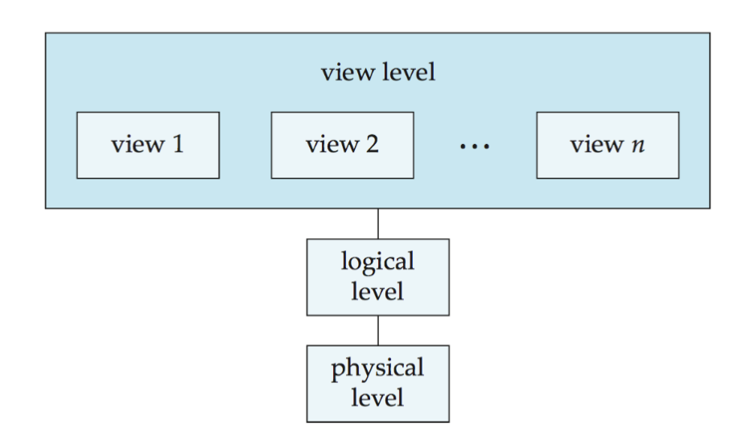
- ### Schemas and Instances 模式和实例
  - 模式类似于变量类型声明，而实例类似于每一个变量，在不同时间段会有不同的值。
  - #### Instances
    - 特定时刻数据库中所储存的信息
  - #### Schemas
    - 对于数据库的总体设计
    - Physical schema: database structure design at the physical level 
    - Logical schema: database structure design at the logical level 
    - Subschema: schema at view level
- ### Physical Independence vs. Logical Independence （物理独立性和逻辑独立性）
  - Independence ：可以在修改某一个模式*的时候，不影响其他模式的工作
  - **Physical data independence** ：修改物理模式的时候，不影响逻辑层
  - **Logical data independence**  ：在修改数据逻辑时，不影响应用程序
- ### 数据库结构的基础是数据模型
  
## Lecture 2: Relational Model 关系模型
- ### Relational model
  - 关系数据库(relational database)是由多个关系(relation)组成,关系(relation)是通过表(table)的形式表达(行row和列column)
- ### Structure of Relational Databases (关系数据库结构)
  - **关系(relation)** 代指实际的表(table)
    - 关系是$D_{1} \times D_{2} \times... D_{n}$ 的一个子集(D所表达的是一个集合 就是表中的属性 attribute)
    - 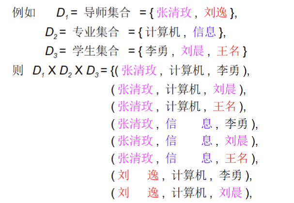
    - 关系包含两个方面：关系模式(relation schema)和关系实例(relation instance)
    - #### Relation Schema
      - $R = (A_{1},A_{2}...)$ eg.instructor=(id,name) 说白了就是表的第一行
      - r(R)表示关系模式R下的一组关系 eg.r(R)={ (123,lhy),(234,abc)}
        - r(R)中的一个元素表示表中的一行，**表达了一个满足关系模式的n元组的集合**
    - #### Relation Instance
      - 关系实例是此时表中的具体的值，是对此时表的一个快照
      - 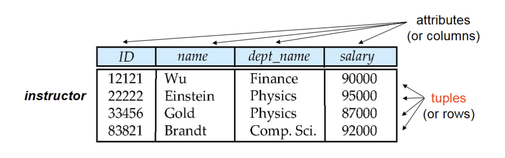
      - t表达了一个元组，则可以用$t[name]$表达符合这个属性元素的值
    - **元组的顺序不重要**
    - **不能有重复的元组**
  - n元组(n-tuple)是指n个数据之间的联系，例如(name,age,phone_num),在表中通常表示一行(row)
  - 属性(attribute) 代表表中的一列(column)，一列数据会共有的属性(表头或者叫属性名)
    - 对于每一个属性都有一个取值的集合 称为域(domain)
    - 属性中的通常是原子的(atomic)，原子意味着是不可再拆分的单元(关系理论第一范式)
    - 空值(null),是所有域中都存在的值，例如，电话号码不存在就不填
- ### Key
  - $K \subseteq R$ 码就是几个属性
  - **超码(superkey)**:一个属性能够区分(唯一表示)每一个元组，例如 名单上的学号，学号不会重复一个人只有唯一的学号决定身份。
  - **候选码(candidate key)** 超码的任意真子集都不是超码，**表达为最小超码** 比如{id,name}可以表示为超码 但是子集{id}也是超码，但是此时{id}的子集就不是了，于是{id}是候选码
  - **主码(primary key)**:被设计着选中作为主要的区分关系的候选码。习惯将主码放在最前面，主码添加一个下划线。
  - **外码(Foreign Key)**:一个关系r的属性中包含另一个关系s的主码，该属性称为r的外码。r为参照关系(referencing relation),s为被参照关系(referenced relation)
    - a foreign key from r1 referencing r2 r1中参照r2的外码、
    - 表示时从r中外码用箭头指向s中的主码
- ### Schema Diagram
  - 用图像表示数据库模式
  - 主码下要添加下划线
  - 外码添加时要从参照关系指向被参照关系(从外指向主)
- ### Query language(查询语言)是非过程化语言(nonprocedural language)
- ### Fundamental Relational-Algebra Operations 基本的关系代数的运算
  - #### Select(选择)
    - 选择出满足条件的行
    - $\sigma_{p}(r)=\{t|t \in  r ~and ~ p(t) \}$
    - p是选择谓词，是一个筛选关系的条件
    - 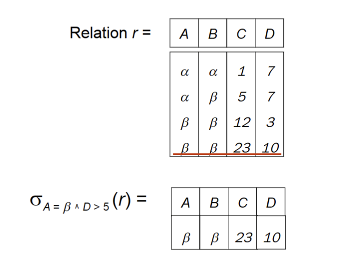
  - #### Project(投影)
    - 截取一张只包含某些属性的表
    - $\prod_{A_1,A_2,\cdots,A_k}(r)$
    - 注意：要删除重复的行
  - #### Union(并)
    - 将多个关系结合起来
    - $r \cup s=\{t|t\in r ~or ~t \in s\}$
    - 条件是
      - 两个关系必须有相同数量的属性
      - 属性的域必须是可比较的
  - #### Set difference （差）
    - 差操作：$r-s=\{t| t\in~ r ~and ~t \notin s\}$ 
    - 交操作 $r \cap s=r-(r-s)$
  - #### Cartesian-Product笛卡尔积
    - $r\times s=\{tq| t\in r ~and~ q\in s\}$ 
    - 两个关系必须是不相交的 否则需要对相交的属性重命名
      - 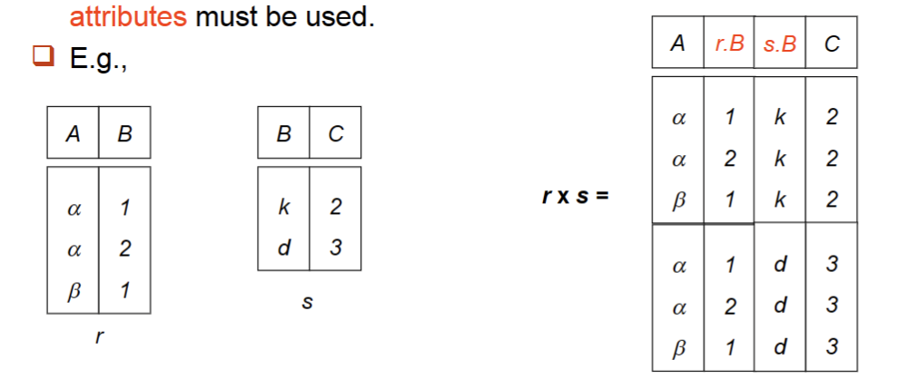
  - #### Rename Operation(重命名)
    - 对一个关系进行重命名操作，建立一个与之前的表不同名称的新表，可解决同一个表对自己进行笛卡尔积的操作所带来的问题。
    - $\rho_x(E)$ 把原本表的名称E改写为x
    - $\rho_{x(A_1,A_2....A_n)}(E)$ 同时改写表格的名称和属性的名称
    - 当需要找到一个表中最大的数据时，例如 $E=(name,age)~~~max_{age}=\prod_{age}(E)-\prod_{E.age}(\sigma_{E.age<x.age}(E\times\rho_x(E)))$
- ### Additional Relational-Algebra Operations 附加的关系代数运算
  - ##### Set-Intersection Operation(集合交运算)
    - $r\cap s=\{t|t\in r~and~t\in s\}$
    - $r\cap s=r-(r-s)$
  - ##### Natural Join Operation Formalization 自然连接
    - 在笛卡尔积之后需要保证两个相同的属性对应相等，于是就使用自然连接。
    - $ R=(A,B,C,D),S=(B,D,E)$
      $r\Join s=\prod_{r.A,r.B,r.C,r.D,r.E}(\sigma_{r.B=s.B \wedge r.D=s.D}(r\times s))$
    - 对于模式也能进行集合运算，R和S是两个表的关系模式，通过 $R\cup S~~R\cap S~~~R-S$ 来表达属性的取舍
    - 如果没有共同属性运算结果就和笛卡尔积完全相同
  - ##### Theta Join Operation Formalization （theta连接）
    - $r \Join_\theta S=\sigma_\theta(r\times s)$
  - ##### Division Operation (除法运算)
    - 用于出现“for all”的查询
    - $r\div s$ 简单来说表达的就是，所有r-s中有一个元组，在**r中能对应所有的s**，把这些元组取出来。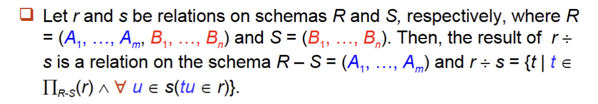
    - $r\div s$ 简单来说表达的就是，所有r-s中有一个元组，在**r中能对应所有的s**，把这些元组取出来。
    - 当出现s中的某个属性r中没有时，直接忽略该属性
  - ##### Assignment Operation 赋值运算
    - 类似于其他语言，用一个临时变量赋值 $temp\leftarrow r\times s$
  - ##### priority of operations
    - Project > Select > Cartesian Product (times) > Join, division > Intersection >Union, difference 
- ### Extended Relational-Algebra Operations 扩展关系运算
  - ##### 广义投影Generalized Projection 
    - 将原本投影的选取行，扩展成属性运算或者常量
  - ##### Aggregate Functions and Operations（聚集函数以及运算符）
     |函数名|作用|
     |-----|----|
     |avg|平均数|
     |min|最小值|
     |max|最大值|
     |sum|求和|
     |count|元素的个数|
    - $_{G_1,G_2...G_n}g_{F_1(A_1),F_2(A_2)...F_n(A_n)}(E)$,新得到的表中，从E中选取出进行计算的每一组数据G的取值是一一致的。
    - G的值代表分组，F的值是代入函数的值
    - G的值代表分组，F的值是代入函数的值
- ### 数据库的操作
  - 简单来说主要使用Deletion、Insertion、Updating
  - Deletion  
    - $r\leftarrow r-E$
  - Insertion
    - $r\leftarrow r\cup E$
  - update
    - $r\leftarrow \prod_{F_1...F_n}(r)$

## Lecture 3: SQL 语言 
## Lecture 3: SQL 语言 
- ### SQL operation 分为几个部分：
  - Data-Definition Language(DDL) 数据定义语言，提供定义、删除、修改关系模式的指令
  - Data-Manipulation Language (DML) 数据操纵语言：提供查询信息，插入删除修改元组的指令。
  - Data-Control Language (DCL) 数据控制语句
- ### Data Definition Language 
  - 定义关系的模式、定义属性的取值类型、定义完整性约束、定义磁盘上的物理存储、定义索引、定义关系视图
  - #### Domain Types in SQL 
    - **char(n)**：字符串，当储存字符串长度小于n，则在末尾用空格补充
    - **varchar(n)**:可变长度字符字符串，最大长度为n，不满则自动调整长度，不用空格
    - **int**：整型
    - **smallint**：小整数类型
    - **numeric(p,d)**:p位数字(加1位符号位)，d位在小数点右边
    - **real，double precision**：float 和 double
    - **float(n)**：精度至少位n的浮点数
    - 注意：由于char和varchar中会出现补充空格和不补充的情况，当对于两个一样的字符串进行比较的时候可能会出现否定的结果，于是尽量使用varchar
- ### SQL基本语言
  - #### Create Table
    - 在数据库中创建一个关系
    ```sql
    CREATE TABLE r
    (A1 D1
     A2 D2
     ...
     <完整性约束>
    );
    ```
    - 完整性约束
      - `primary key(A1,A2...An)`:指定属性为主码，是非空的
      - `foreign key(A1.A2...An)reference S`声明外码，声明A的属性取值，必须和S中对应属性取值保持一致
      - `not null`非空
      - `check(P)`:对于数据进行约束
  - #### Drop and Alter Table
    ```sql
    DROP TABLE r;  //从数据库中完全删除该表
    DELETE FROM r; //只是删除所有元组，保留属性
    ALTER TABLE r ADD A D;  //在表中添加属性
    ALTER TABLE r ADD (A1 D1,A2 D2..);
    ALTER TABLE r DROP A; //删除属性A
    ```
  - #### Create Index 
    ```sql
    CREATE INDEX <i-name> ON <table-name> (<attribute-list>); //建立一个索引
    Eg.
    create index b_index on branch (branch_name);
    create index cust_strt_city_index on customer (customer_city,customer_street);
    CREATE UNIQUE INDEX <i-name> ON <table-name> (<attribute-list>);//将该索引声明为候选键
    DROP INDEX <i-name>  //删除索引
    ```
  - #### Select 选择语句
    ```sql
    SELECT A1 A2... //选择属性
    FROM R1 R2 R3   //选择表
    WHERE P         //限制条件
    ```
    - 名称不要出现'-'一般使用'_'
    - ##### 去重复
      ```sql
      SELECT distinct  //去除重复
      SELECT all        //不去除重复 默认all
      ```
    - ##### 选择全部属性
      ```sql
      SELECT * 
      SELECT A*10 //允许计算
      ```
    - ##### Where 
      - 中使用 `and or not `和`between...and..`
  - #### 重命名操作
    ```sql
    old_name as new_name  //as有时可以省略
    ```
  - #### 字符串操作
    - Like 操作对于字符大小写是敏感的 大写字母不等于小写字母
    - `%` 代表所有子串
    - `_` 代表所有字符
    ```sql
    WHERE A LIKE '%a'                 //使用like 
    WHERE a LIKE '\%ABC' escape '\'  //把\当作转意字符 来显示%
    SELECT 'a='||name   //表达字符串连接 结果为 'a=jdshf'
    upper() //把小写改写成大写
    lower() //把大写改写为小写
    ```
  - #### 元组的次序
    ```sql
    order by A1,A2   //多个属性时,先按照第一个排列 如果有重复再按照第二个排列
    order by A1 desc //按照降序排列
    order by A2 asc //按照升序排列
    ```
  - #### 集合操作
    - 集合运算是对于表之间的运算,用于两个 SELECT 之间
    ```sql
    union            //交操作 默认去重
    union all        //不去重
    intersect        //并
    intersect all
    except           //差
    except all
    ```
  - #### 聚集函数 aggregate function
    ```sql
    avg(col): average value 
    min(col): minimum value 
    max(col): maximum value 
    sum(col): sum of values 
    count(col): number of values // count(*)忽略空值
    ``` 
    - **SELECT 中选择的属性必须是 GROUP BY中提及的属性以及聚集函数**
    - 去重复 只需在聚集函数中选择的属性前加 distinct
    - `Group by` 意思是将所有元素按照这个属性进行分组
    - `having`是对于分组进行删选
  - #### **Select选择的顺序**
    - `From` : 先对表做笛卡尔积
    - `where` : 对于生成的大表先进行一定的筛选 **不能在这里用聚集函数**
    - `group by`: 对于生成的表中按照某一属性进行分组 之后才能使用聚集函数
    - `having`:选择需要的分组
    - `select`:从表中选出需要的属性展示
    - `distinct`:去除重复
    - `order by` :按照顺序输出
  - #### NULL 空值
    - 空值的逻辑操作会返回`unknown`
    - OR: 
      - (unknown or true) = true
      - (unknown or false) = unknown       
      - (unknown or unknown) = unknown 
    - AND:
      - (true and unknown) = unknown
      - (false and unknown) = false 
      - (unknown and unknown) = unknown 
      - NOT:(not unknown) = unknown 
    - 当需要判断一个值是空,或者判断是否知道时:
      ```sql
      amount is null
      amount is not null
      is unknown
      is not unknown
      ```
  - #### 嵌套语句 Nest
    - 在某个范围之内
    ```sql
    WHERE name in/not in (SELECT ......) //在其中或者不在其中
    ```
    - 集合之间的比较
      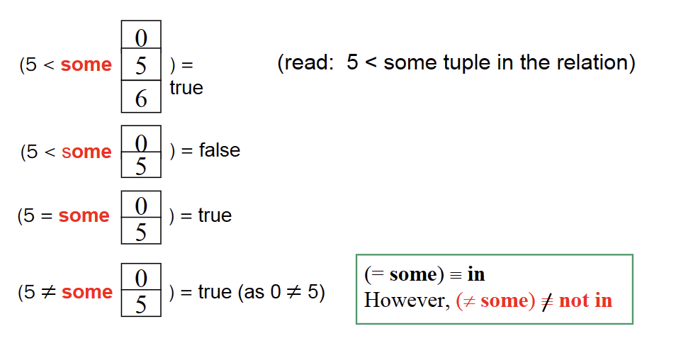
      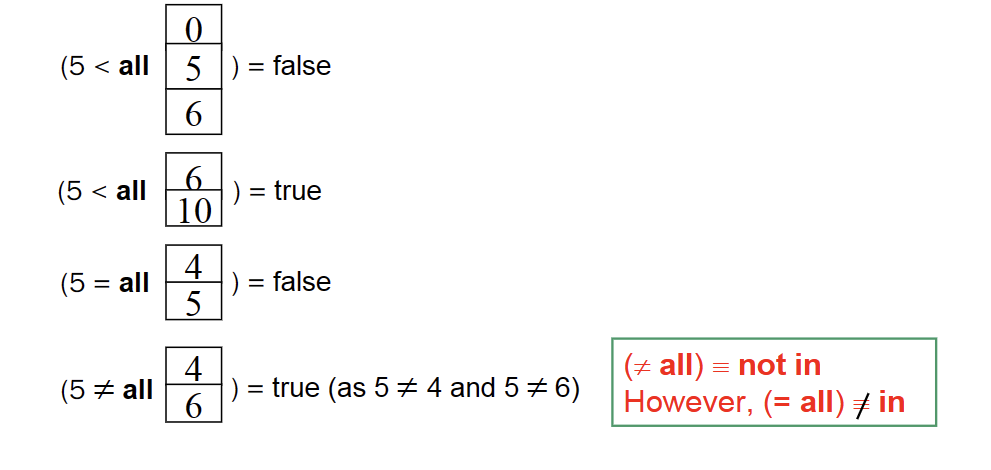
    ```sql
    WHERE A > some (SELECT .......) //比之间的一个大或者小就行
    WHERE a > all (SELECT ........) //比其中所有的大或者小
    ```
    - 判断集合是否存在元素 
    ```sql
    exists //存在返回1
    not exists //不存在返回0
    ```
    - 判断存在性 (判断只出现一次,或者至少出现一次时用)
    ```sql
    unique  //只出现一次 返回1 多次出现返回0
    not unique //出现多次 返回 1 出现一次返回0
    ```
  - #### 视图 view
    - 原表数据更行 试图同步更新
    ```sql
    CREATE VIEW <v_name> (c1, c2, ...) AS 
    SELECT e1, e2, ... FROM ... 
    DROP VIEW <V_NAME> 
    ```
  - #### Derived Relations 
    - 相当于在选择语句中建立临时视图 导出表 **无论是否使用都需要给出别名 AS**
      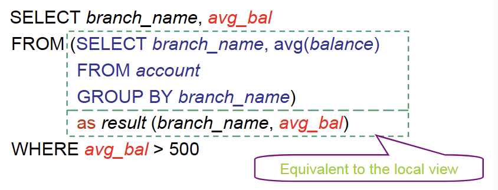
    - with 语句
      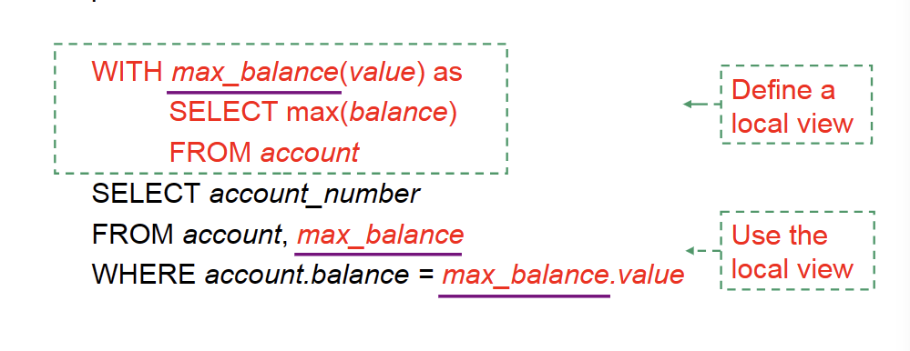
    都是临时的视图,只在这一个语句中有效
  - #### Deletion 删除
    ```sql
    DELETE FROM <TABLE>
    WHERE [CONDITION]
    ```
    - 不支持多个表自然连接 再删除。删除多个表信息时，应当一个一个删除。
    - 在同一SQL语句内，除非外层查询的元组变量引入内层查询，否则层查询只进行一次。
      - 先计算平均值
      - 之后再与平均值比较，不会重复计算平均值
    ```sql
    DELETE FROM account 
    WHERE balance < (SELECT avg(balance)FROM account) 
    ``` 
  - #### insert 插入  
    ```sql
    #单一插入
    INSERT INTO <table|view> [(c1, c2,...)]     //表的属性可以省略
    VALUES (e1, e2, ...)   //插入时没写的数据自动赋值为null
    # 多元素插入
    INSERT INTO <table|view> [(c1, c2,...)]
    SELECT e1, e2, ...     //只执行一次
    FROM ... 
    ```
  - #### update 更新
    ```sql
    UPDATE <table | view> 
    SET <c1 = e1 [, c2 = e2, ...]> 
    [WHERE <condition>] 
    ```
    - 更新需要注意顺序
    ```sql
    UPDATE account 
    SET balance = case
      when pred1 then result1
      when pred2 then result2
      ... 
      else resultn 
      end 
    ```
     - 视图更新
       - 对于视图为单一表的子表时，可以进行删改操作，能转化成对于基础表的操作。
       - 对于复杂视图多表合成的视图，不能进行更新操作，没有意义。
       - View 是虚表，对其进行的所有操作都将转化为对基表的操作
       - 查询操作时，VIEW与基表没有区别，但对VIEW的更新操作有严格限制，如只有行列视图，可更新数据。
  - #### transaction事务
     - transaction 是由更新查询语句构成，把一条或者一系列语句视为一个整体
       - commit work：提交这个transaction所进行的操作
       - Rollback work：撤销该transcation中对于数据库的更改
     - 在数据库中默认是一条语句是一个事务
     - 当需要将多个语句作为一个事务，保持其原子性(atmoic)
      ```sql
      begin atomic
      ....
      end
      ```
  - #### 连接 join
  - #### transaction事务
     - transaction 是由更新查询语句构成，把一条或者一系列语句视为一个整体
       - commit work：提交这个transaction所进行的操作
       - Rollback work：撤销该transcation中对于数据库的更改
     - 在数据库中默认是一条语句是一个事务
     - 当需要将多个语句作为一个事务，保持其原子性(atmoic)
      ```sql
      begin atomic
      ....
      end
      ```
  - #### 连接 join
     - 连接类型
      ```sql
      inner join          #舍去一边有，一边没有的连接 
      left outer join     #左边表为主，左边表有几行结果有几行，有右表找不到的自动补充null
      right outer join    #同上为右边
      full outer join     #左右外连接
      ```
    - 自然连接：添加关键字 `natural` 用同属性相等作为连接条件 **相同属性只保留一个**
    - 自然连接：添加关键字 `natural` 用同属性相等作为连接条件 **相同属性只保留一个**
    - 非自然连接：
      - `on<连接条件判别式>` **不消去重复属性**
      - `using<属性名>`把该属性相等作为连接条件 **会消去重复属性** 类似于自然连接
      - `using<属性名>`把该属性相等作为连接条件 **会消去重复属性** 类似于自然连接

## Lecture 4：Advanced SQL
## Lecture 4：Advanced SQL
- ### 数据类型和数据域定义
  - #### 自定义类型创建 自定义域创建
  - #### 自定义类型创建 自定义域创建
  ```sql
  Create type person_name as varchar (20)
  Create domain Dollars as numeric(12, 2) not null; 
  Create domain Pounds as numeric(12,2); 
  Create type person_name as varchar (20)
  Create domain Dollars as numeric(12, 2) not null; 
  Create domain Pounds as numeric(12,2); 
  ```
  - #### 类型和域的区别
    - 域可以添加声明约束：not null等
    - 域的类型可以被用于其他域的定义，类型只能用基础的定义
  - #### large object type大对象
  - #### 类型和域的区别
    - 域可以添加声明约束：not null等
    - 域的类型可以被用于其他域的定义，类型只能用基础的定义
  - #### large object type大对象
    - blob:二进制文件
    - clob：字符文件
    ```sql
    image blob(10MB)
    ```
    - clob：字符文件
    ```sql
    image blob(10MB)
    ```
- ### Integrity Constraints 完整性约束
  - #### 单一关系约束
    ```sql
    not null
    primary key
    unique
    check<约束条件>
    ```
  - #### 自定域的约束
    ```sql
    Create domainhourly-wagenumeric(5, 2) 
    Constraint value_test check (value > = 4.00)   #<value_test>是可选的 只作为这个限制的名称
    ```
  - #### 自定域的约束
    ```sql
    Create domainhourly-wagenumeric(5, 2) 
    Constraint value_test check (value > = 4.00)   #<value_test>是可选的 只作为这个限制的名称
    ```
  - #### 参照约束
    - Assume there exists relations r and s: r(A, B, C), s(B, D), we say attribute B in r is a foreign key from relation r, and r is called referencing relation(参照关系), and s is called referenced relation(被参照关系). 
    - 参照关系中外码的值必须再被参照关系中存在，或者为null
    - ##### insert
      - 在参照关系中插入，需要保证外码在被参照关系中存在
      - 在被参照关系中插入，不需要考虑参照关系
    - ##### delete
      - 在参照关系中删除，不考虑被参照关系
      - 在被参照关系中删除，需要调整参照关系
        - 如参照关系存在被参照关系中删去的数据：删除指令被拒绝 or 或者同时被删除
    - ##### update
      - 参照关系中更新数据，只需要保证更新后的数据在被参照关系中存在
      - 如果在被参照关系中更行数据：指令被拒绝 or 一同被被更新
    - ##### 外键定义
      - 如果在被参照关系中更行数据：指令被拒绝 or 一同被被更新
    - ##### 外键定义
    ```sql
    foreign key (branch_name) references branch #在两张表中名字可以不同 被参照表中使用的一定是主键
    # 在删除被参照关系中时 参照关系表中也删除
    on delete cascade
    # 在更新被参照关系时 参照关系也同步更新
    on update cascade 
    # 删除时设置为ull
    on delete set null   
    # 在删除时设为默认值                   
    foreign key (branch_name) references branch #在两张表中名字可以不同 被参照表中使用的一定是主键
    # 在删除被参照关系中时 参照关系表中也删除
    on delete cascade
    # 在更新被参照关系时 参照关系也同步更新
    on update cascade 
    # 删除时设置为ull
    on delete set null   
    # 在删除时设为默认值                   
    on delete set default 
    on update set null
    on update set default  
    on update set null
    on update set default  
    ```
  - #### Assertion 断言
    ```sql
    CREATE ASSERTION<assertion-name>
    CHECK <predicate>;  # 永远保证为真
    ```
    - 对于任意x p(x)为真
      - 通常使用不存在 一个x 使得p(x)为假(not exist)
      - 通常使用不存在 一个x 使得p(x)为假(not exist)
  - #### Trigger触发器                                               
    - 在某些操作之后 启动触发器
    - ##### 行级触发器
    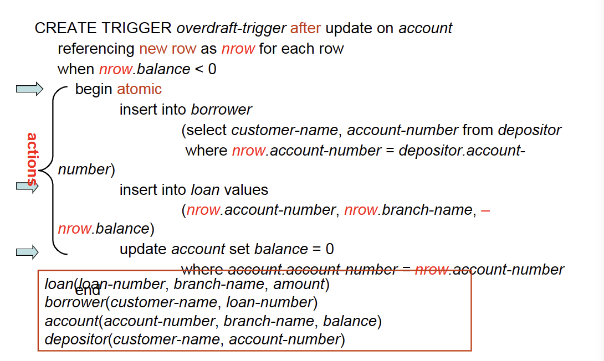
    ```sql
    Create trigger overdraft-trigger after<before> <对于每一行操作 eg. update of <table_name> on <arrtibute_name>/delete/insert on  <table_name>>
    Create trigger overdraft-trigger after<before> <对于每一行操作 eg. update of <table_name> on <arrtibute_name>/delete/insert on  <table_name>>
    Referencing old row as ... //for deletes and updates 
    Referencing new row as ... //for inserts and updates 
    inserted/deleted # 代替nrow和orow
    ```
    ```sql
    CREATE TRIGGER check1 after insert(delete) on ...
    referencing new row as nrow
    for each row
    when(....)
    begin
     rollback
    end;
    inserted/deleted # 代替nrow和orow
    ```
    ```sql
    CREATE TRIGGER check1 after insert(delete) on ...
    referencing new row as nrow
    for each row
    when(....)
    begin
     rollback
    end;
    ```
    - ##### 语句级触发器(statement)
      - 对于一个表进行操作之后，触发触发器
      ```sql
      referencing old table as
      referencing new table as
      ```
    - ##### 删除触发器
      ```sql
      DROP trigger <name>
      ```
- ### Authorization 安全权限 授权
  - 权限是对于整张表，并不能对行赋予权限
  - #### 权限授予图
    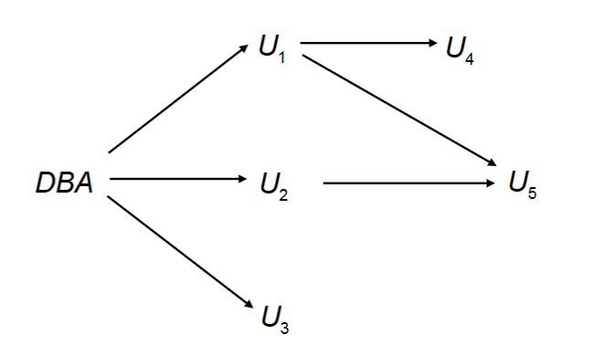
    - **必须有从根到所有节点的路径**
    - 当父亲节点权限被收回之后，子孙节点的权限也就不存在了
    - 避免环的出现
  - #### 授予用户权限
  - #### 权限授予图
    
    - **必须有从根到所有节点的路径**
    - 当父亲节点权限被收回之后，子孙节点的权限也就不存在了
    - 避免环的出现
  - #### 授予用户权限
    ```sql
    GRANT <privilege list> ON <table | view> 
    TO <user list> 
    GRANT SELECT ON department to a,b; #给ab授予在department上查询的权限
    GRANT UPDATE(A1) ON department to a,b #值赋予一个属性的更新权力 不写属性就是全部属性
    GRANT INSERT(A1) ON department on a,b #值赋予一些属性的更新权力 其他属性默认为空
    GRANT SELECT ON department to a,b with grant option; #给ab赋予权限，同时允许ab分发权限
    GRANT SELECT ON department to a,b; #给ab授予在department上查询的权限
    GRANT UPDATE(A1) ON department to a,b #值赋予一个属性的更新权力 不写属性就是全部属性
    GRANT INSERT(A1) ON department on a,b #值赋予一些属性的更新权力 其他属性默认为空
    GRANT SELECT ON department to a,b with grant option; #给ab赋予权限，同时允许ab分发权限
    ```
  - #### 回收权限
  ```sql
  REVOKE <privilege list> ON <table | view> 
  FROM <user list> 
  Revoke select on branch from U1, U3 restrict; # 防止联级别收回 只收回该人的 不管其子孙
  Revoke select on branch from U1, U3 <cascade>;# 默认联机收回 
  ```
  - #### 权限种类      
    - `select`:能读某些关系，或者建立视图
    - `insert`:添加元组
    - `update`：更新表
    - `delete`:删除元组
    - `reference`:声明外键，建立关系
    - `ALL privileges/ALL`:全部权限
  - #### 视图权限
    - 建立视图的权限是和本身权限绑定的不会超出，如：只有SELECT权限 只能建立视图，没有任何权限，不能建立视图。有UPDATE权限，能UPDATE视图。
  - #### 角色
    - 不具体分发权限到每个人，值分发到每个角色
    ```sql
    CREATE role teacher;
    grant select on a to teacher;
    grant teacher to Amy;
    CREATE role student
    grant teacher to student;
    ```
  - #### Audit 审计
    - 记录某些用户对于这张表的操作日志
    ```sql
    AUDIT <st-opt> [BY <users>] [BY SESSION | ACCESS] [WHENEVER SUCCESSFUL | WHENEVER NOT SUCCESSFUL] 
    audit table by scott by access whenever successful
    audit delete, update on student #对这张表的删除更新操作
    ```
- ### Embedded SQL  
  - 把SQl语言嵌入到其他语言中
  ```sql
  EXEC SQL <embedded SQL statement> END_EXEC
  ```
  - #### 单行查询
    - 宿主变量，再宿主语言中可以直接赋值，能带入SQL中，再SQL中需要添加：
    ```sql
    #变量声明
    EXEC SQL BEGIN DECLARE SECTION;
    float a;
    EXEC SQL END DECLARE SECTION;

    EXEC SQL SELECT branch_name, balanceINTO:bn, :bal FROM account WHERE account_number = :V_an; 
    END_EXEC
    ```
  - #### 多行查询
    ```sql
    EXEC SQL DECLARE c CURSOR FOR    # 视为游标
    <select>
    END_EXEC 
    EXEC SQL OPEN c        #打开游标
    while(SQKSTATE!='02000')#意味不在有数据吧
    EXEC SQL FETCH c INTO :cn,:ccity    #读出游标
    EXEC SQL CLOSE c              #关闭游标
    ```
    -  SQLSTATE 等于 ‘02000’ 时代表已经没有可读数据了 常用循环结束条件
 - #### 单行修改
  ```sql
  Exec SQL BEGIN DECLARE SECTION; 
  char an[20]; 
  float bal; 
  Exec SQL END DECLARE SECTION;     
   ...... 
   scanf(“%s, %d”, an, &bal);   // 读入账号及要增加的存款额 
   EXEC SQL update account set balance = balance + :bal
   where account_number = :an; 
  # 除了直接用update语句 也可以使用游标来进行更改
  EXEC SQL DECLARE csrCURSOR FOR 
  SELECT * FROM account WHERE branch_name = ‘Perryridge’ 
  FOR UPDATE OF balance; 
  # 之后就和之前的循环一样
  while(1)
  EXEC SQL update account set balance = balance + 100 where CURRENT OF csr;
  #对每一行执行该操作
  ```
  - #### 多行修改
    - 先选出所需要修改的 存在游标中去
    ```sql
    EXEC SQL DECLARE csr CURSOR FOR 
    SELECT * FROM account 
    WHERE branch_name = ‘Perryridge’ 
    FOR UPDATE OF balance; 
    ```
    - 顺序读取游标修改每一个数据
    ```sql
    EXEC  SQL OPEN csr;
     While (1) { 
      EXEC SQL FETCH csr INTO:an, :bn, :bal;
       if (sqlca.sqlcode <> SUCCESS) BREAK;          
        ......   // 由宿主语句对an, bn, bal中的数据进行相关处理(如打印) 
        EXEC SQL update account 
        set balance = balance + 100 
        where CURRENT OF csr;}
         ...... 
      EXEC SQL CLOSE csr; ...... 
    ```
- ### ODBC Open DataBase Connectivity (ODBC, 开放数据库互连) 
- ### JDBC
- ### SQL injection
  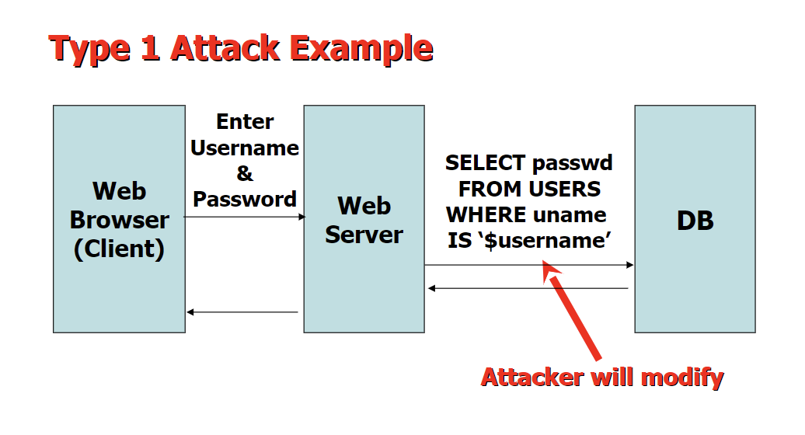
  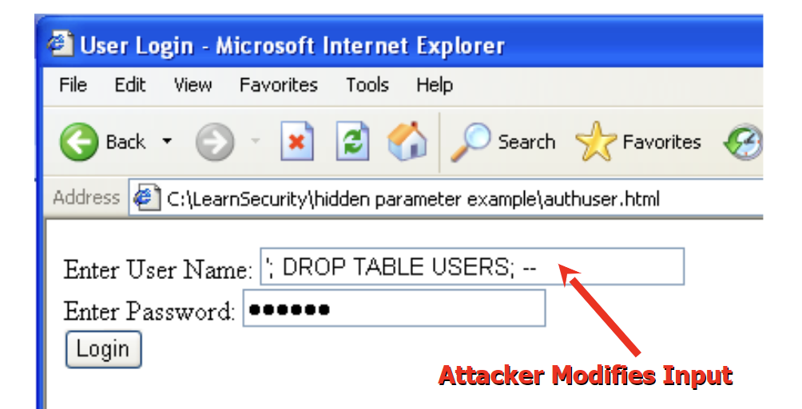
  - 输入姓名：`X’ or ’Y’ = ’Y` 等效于`select * from instructor where name = ’X’ or ’Y’ = ’Y’`
  - #### Prepared statment
  - 固定好需要填入的内容 防止注入
  ```sql
  PreparedStatement pStmt = conn.prepareStatement(                              “insert into account values(?,?,?)”);  
  pStmt.setString(1, "A_9732"); 
  pStmt.setString(2, "Perryridge"); 
  pStmt.setInt(3, 1200); 
  pStmt.executeUpdate(); 
  pStmt.setString(1, "A_9733"); 
  pStmt.executeUpdate(); 
  ```

    ```sql
    AUDIT <st-opt> [BY <users>] [BY SESSION | ACCESS] [WHENEVER SUCCESSFUL | WHENEVER NOT SUCCESSFUL] 
    audit table by scott by access whenever successful
    audit delete, update on student #对这张表的删除更新操作
    ```
- ### Embedded SQL  
  - 把SQl语言嵌入到其他语言中
  ```sql
  EXEC SQL <embedded SQL statement> END_EXEC
  ```
  - #### 单行查询
    - 宿主变量，再宿主语言中可以直接赋值，能带入SQL中，再SQL中需要添加：
    ```sql
    #变量声明
    EXEC SQL BEGIN DECLARE SECTION;
    float a;
    EXEC SQL END DECLARE SECTION;

    EXEC SQL SELECT branch_name, balanceINTO:bn, :bal FROM account WHERE account_number = :V_an; 
    END_EXEC
    ```
  - #### 多行查询
    ```sql
    EXEC SQL DECLARE c CURSOR FOR    # 视为游标
    <select>
    END_EXEC 
    EXEC SQL OPEN c        #打开游标
    while(SQKSTATE!='02000')#意味不在有数据吧
    EXEC SQL FETCH c INTO :cn,:ccity    #读出游标
    EXEC SQL CLOSE c              #关闭游标
    ```
    -  SQLSTATE 等于 ‘02000’ 时代表已经没有可读数据了 常用循环结束条件
 - #### 单行修改
  ```sql
  Exec SQL BEGIN DECLARE SECTION; 
  char an[20]; 
  float bal; 
  Exec SQL END DECLARE SECTION;     
   ...... 
   scanf(“%s, %d”, an, &bal);   // 读入账号及要增加的存款额 
   EXEC SQL update account set balance = balance + :bal
   where account_number = :an; 
  # 除了直接用update语句 也可以使用游标来进行更改
  EXEC SQL DECLARE csrCURSOR FOR 
  SELECT * FROM account WHERE branch_name = ‘Perryridge’ 
  FOR UPDATE OF balance; 
  # 之后就和之前的循环一样
  while(1)
  EXEC SQL update account set balance = balance + 100 where CURRENT OF csr;
  #对每一行执行该操作
  ```
  - #### 多行修改
    - 先选出所需要修改的 存在游标中去
    ```sql
    EXEC SQL DECLARE csr CURSOR FOR 
    SELECT * FROM account 
    WHERE branch_name = ‘Perryridge’ 
    FOR UPDATE OF balance; 
    ```
    - 顺序读取游标修改每一个数据
    ```sql
    EXEC  SQL OPEN csr;
     While (1) { 
      EXEC SQL FETCH csr INTO:an, :bn, :bal;
       if (sqlca.sqlcode <> SUCCESS) BREAK;          
        ......   // 由宿主语句对an, bn, bal中的数据进行相关处理(如打印) 
        EXEC SQL update account 
        set balance = balance + 100 
        where CURRENT OF csr;}
         ...... 
      EXEC SQL CLOSE csr; ...... 
    ```
- ### ODBC Open DataBase Connectivity (ODBC, 开放数据库互连) 
- ### JDBC
- ### SQL injection
  
  
  - 输入姓名：`X’ or ’Y’ = ’Y` 等效于`select * from instructor where name = ’X’ or ’Y’ = ’Y’`
  - #### Prepared statment
  - 固定好需要填入的内容 防止注入
  ```sql
  PreparedStatement pStmt = conn.prepareStatement(                              “insert into account values(?,?,?)”);  
  pStmt.setString(1, "A_9732"); 
  pStmt.setString(2, "Perryridge"); 
  pStmt.setInt(3, 1200); 
  pStmt.executeUpdate(); 
  pStmt.setString(1, "A_9733"); 
  pStmt.executeUpdate(); 
  ```
