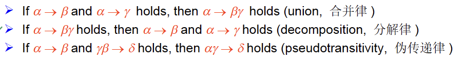

# Lecture 5：Eniitiy-Relationship Model

## Entity set 实体集
- 实体构成的集合，实体间具有相同类型的属性
- 每一个实体是一个单独的对象，与别的实体有区别
- 实体具有属性：实体相当于表中的一行，一个元组
- ### attributs 属性 类型
  - simple and composite ：简单属性是不可再分的属性，复合属性是还可以细化：如name 可以分为姓氏和名
  - single-value and multi-valued ：单值属性是对实体都只能取一个值，如性别，多值属性是可以有多个值，如电话号码 表示用 ${}$ {telephone number}
  - derived attribute：能通过其他属性计算得出，如根据出生时间推算年龄，不需要单独存储

## Relationship sets 关系集
- 关系是指多个实体之间的关联
- 关系集是相同类型关系构成的集合：实体之间存在关系，实体集之间存在关系称为关系集
  - 比如说学生和课程是两个实例集，两者之间有选课的关系，一个学生选某一门课时关系，所有学生的选课就是课程和学生的关系
- 关系集合也有自带的属性(descriptive attribute)描述性属性 如选课的日期。
- 参与一个关系的实体集合的数量称为度degree
- ### mapping cardinalities
  - 一个联系集中，一个实体可以与另一类实体相联系的实体数目。其中数目是指最多一个还是多个
  - 一对一：一个实体只能对应一个实体
  - 一对多：一个实体能对应多个实体 一个班级对应多个学生
  - 多对一：多个病人对应一个医生
  - 多对多：多个学生对应多个课程

## Key 码
与关系数据库中的码一致

## E-R diagram er图
- 箭头指向一 直线是多
- 全参与：用双直线表示(每一个实例都参与这个关系)
- 也可以用 $a..b$ 表示一个实例的参与映射的数量 $0..*$ 表示是部分参与的多关系 $1..1$ 表示全参与的至多一个关系
- 多关系图尽量转化称双关系

## 弱实体集
- 没有主码的集合，依附于强实体集存在，存在一个分辨符(discriminator)
- 强实体集是一对多的，若实体集必须是全参与的
- 对于如实体集的主码 是强实体集的主码 加上 分辨符

## 扩展的E-R特性 
- ### 特化 specialization
  - 自上而下的设计流程，对于高层的继承
- ### 泛化 generalization
  - 自下而上的设计流程，合并相同的属性
- ### ER图设计
  
  只有一个三角形，意味着身份不能相交
  多个三角形代表可以代表多个身份
  完全性约束：每一个高层必须有下层的身份 

### ER图

## 将ER图转化成表格
- 简单强实例集直接转成相同属性的表格
- 对于复合属性，将复合属性直接展开
- 对于多值属性 新建一个表格，用原表主键加上多值属性构成
- 弱连接：用主键加上弱连接
- 关系集：由两边主键构成一个表(多的那边作为主键)
  - 对于一对多多对一，可以将关系合并到多的实体表中

## 范式 Normal Form
- ### First Normal Form 第一范式
  - 原子性：属性不能继续分割
  - 如果所有属性是原子性，该关系就是第一范式 (关系数据库应当都是第一范式)
- ### Pitfalls in Relational Database Design
  - #### Decomposition
    - 无损连接分解Lossy/lessy-join decomposition
      - 两张表属性不损失
      - 两张表自然连接之后是原表 (只要不等于原表都视为有损)
    - **判断；两个表的公共属性是某一张表的超码**
- ### Functional Dependencies 函数依赖
  - $\alpha$ 决定于 $\beta$ 当 $\alpha$ 确定之后 $\beta$ 一定是确定的
  - $t_1[\alpha] = t_2[\alpha]  \rightarrow t_1[\beta]=t_2[\beta]$
  - 函数依赖于键的关系 如果R依赖于k(k是R中都某些属性)则k是R的键
  - **Trivial and Non-Trivial Dependency**
    - 平凡(trivial)：永远成立的函数依赖关系 **$\alpha \rightarrow \beta ~~ \beta \subseteq \alpha$**
    - 非平凡的函数依赖:只要不是子集关系都是 *Non-trivial*
  - **Closure of a Set of Functional Dependencies 闭包**
    - 通过已知条件推出的依赖关系 $closure of F :F^+$
    - **Armstrong’s Axioms 枚举闭包公理**
      
      
    - 判断a是否是候选码 
      - **做题：画出有向图，寻找入度为0的节点，并且到其他所有节点都有通路**
      - 原理：找到a直接或者间接决定的属性的集合，称为$a^+$,只需要判断$R \subseteq a^+$
  - **Canonical Cover (正则覆盖)**
    - Extraneous Attributes (无关属性) 
      - 去除某个属性不改变函数依赖的闭包
    - 找到一个最小的函数依赖集合 使得该集合的闭包与原闭包相等
      
      - 删除能被其他关系推出来的依赖关系
        
      - 删除左边多余的属性
        
      - 删除右边多余的属性
        
  - ### Decomposition 
    - 判断是否是一个好的形式应当满足一下三个条件：
      - 无损连接分解
        - 所有属性都不要缺失
        - 自然连接之后还是原表
        - **只需保证分解之后的表的公共属性是某一张子表的码**
      - Dependency preservation（依赖保持） 
        $F_i \subseteq F^+ F_i只有R_i的属性$
        $(F_1 \And F_2....Fn)^+=F^+$
        - 对于F中的某个依赖, 投影到各个Ri中, 判别是否有某个Ri能保持函数依赖. 若对F中的每都能有一个Ri满足函数依赖, 则该分解保持依赖
      - 每一个关系都是 BCNF或者是3NF
  - ### Boyce-Codd Normal Form
    - 满足以下条件之一就成为BC范式。对于闭包中所有的函数依赖
      - $\alpha \rightarrow \beta$ 是trivial
      - $\alpha$ 是R的超键
    - **BC范式检测**
      - 只需要检查F中的函数依赖是否满足BC范式的要求即可
      - 但是必须在F的闭包的情况下判断R分解是否满足(分解之后可能存在不出现在F中的依赖，需要特别检查)
    - **BC范式分解**
      - 把不满足BC范式的依赖单独分出去，把原依赖中$\beta$删除
  - ### Third Normal Form
    - 增加一个条件：
      - $\beta-\alpha 包含在R的一个候选码中$‘=
    - 检测
      - 之间检测F即可
      - 判断左边是否是超键
      - 如果不是超键则需要判断 右边是否属于候选码
    - 分解 **需要考虑正则覆盖**
      - 将正则覆盖中的每一个关系都都分成一张表，最后只需要检查是否有一个子表包含原表主键。
      - 包含就结束，不包含单独建立一个主键表
  - ### 多元依赖Multivalued Dependencies 很迷的东西
    - $\alpha \rightarrow \rightarrow \beta$
    - 一个 $\alpha$ 可能对应多个 $\beta$ 当剩下的属性改变时 也要保证 这个对应
    - 简单来说剩下的属性只要改变，就需要再添加一个完全一样的 $\beta$
    - 所以$\alpha \rightarrow \rightarrow \beta$和$\alpha \rightarrow \rightarrow R-\alpha -\beta$等价
  - ### Multivalued Dependencies 
    - 和BC范式完全一样，只是变成了多值依赖的形式
    - 分解也和BC类似，就不在这里过多叙述了