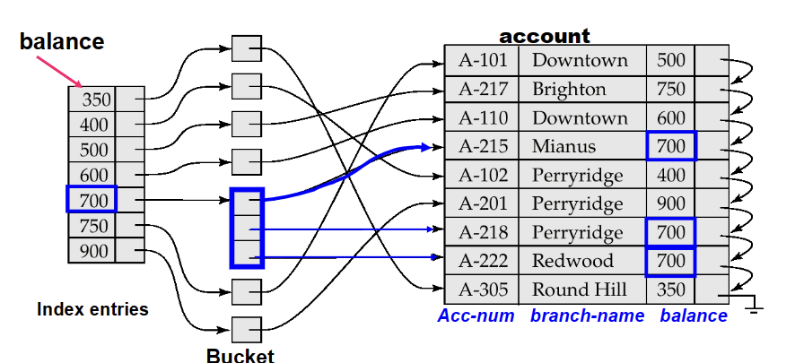
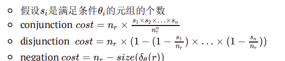
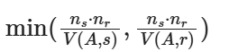
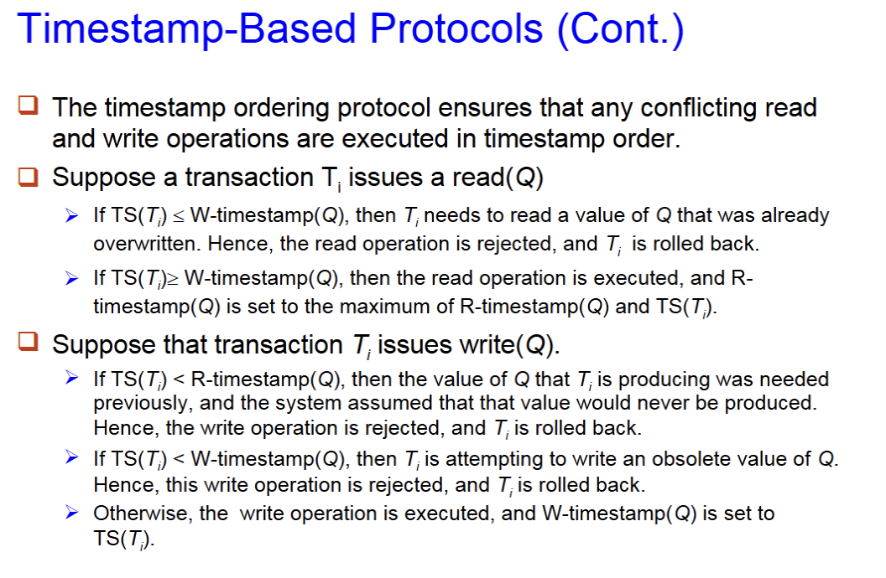
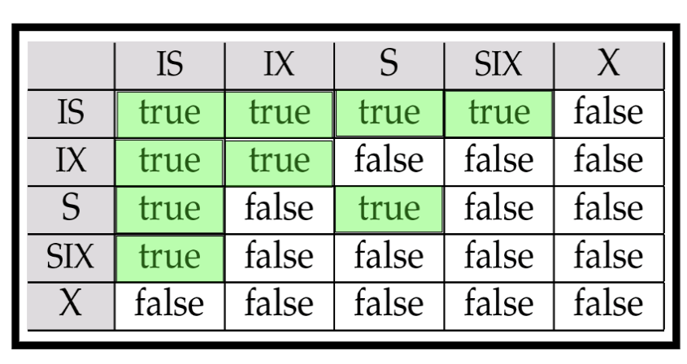

# Lecture 8: Storage and File Structure 

## 1 物理存储

- 分级存储：primary storage、secondary storage/online storage 、tertiary storage\offline storage
- 级别越高速度越快，成本越高，数据更容易丢失

## 2 磁盘 magnetic disk

- 性能评估：

  - access time：发出读取请求到数据发出的时间
    - seek time： 找到正确的磁道的时间，平均寻道时间是最坏情况的一半
    - rotational latency time：旋转等待时间，平均时间是旋转一周的一半
  - data-transfer rate 数据从磁盘读写的速度
  - MTTF：出现failure之前的平均运行时间

- 磁盘访问的优化

  - block ：一个磁道中的若干连续扇区组成的序列

  - buffering：缓冲区域

  - read-ahead：多取数据

  - disk-arm-scheduling：访问多块时的顺序选择

  - file organization: 通过按照访问数据的方式来组织block优化访问时间

- RAID
  - Level 5 is preferred for applications with low update rate, and large amounts of data. 
  Level 1 is preferred for all other applications. 


## 3 **File organization** 文件组织

### 3.1 Free List

​	用指针来存储被删除的（空闲）的块的位置，避免了移动。

### 3.2 Variable-length records 变长记录

- 典型的变长记录

  - 属性按照顺序存储

  - 变长的变量用offset+data的形式存储，空值用null-value bitmap存储

- slotted page结构，它的header包含

  - 记录的总数
  - block中的空闲区域的end
  - 每条记录所在的位置和大

- 文件中记录的组织方式

  - heap
  - sequential
  - hashing
  - nulti-table clustering file organization:把用关系的元组储存在一起，尽管不是同一张表
  
  

# Lecture 9: Indexing and Hashing

## 1 Ordered indices

​	Sequentially ordered file (顺序排序文件）:按照某一个属性顺序排列，称为search-key

### 1.1 Primary index/clustering index 聚集索引

- 与对应的数据文件本身的排列顺序相同的索引称为主索引（通常但并非一定是主码）
- 当不是主码时，遇到相同的search-key值的元素时，往往指向第一个

### 1.2 Secondary index(辅助索引)non-clustering index

- 选择的search-key和文件排列的search-key不同

- 当要搜查的属性不是文件的search-key，用一个索引指向索引（桶）索引中存辅助索引的值，**不能使用稀疏索引**
- 

### 1.3  Two types of ordered indices

- **Dense index (稠密索引)** ：索引中虽有的search key全部都出现

- **Sparse index (稀疏索引)**：并不是全部出现
  - 只能用于顺序存储的文件
  - **搜索顺序**：
    - 需要找一个search-key值为k的数据
    - 先在索引中找到最大的比k小的数据
    - 顺序搜索接下来的行
  - **Good tradeoff**: sparse index with an index entry for every block in file, corresponding to least search-key value in the block. (a block中通常包含多个数据记录，每块中最小的搜索键值放到索引项中。)
  
  - 一次性能取一个block 于是用最小的值提高效率
  

### 1.4 Multilevel Index

​	表过大时，索引的表也过大，于是把索引拆开，再用上一级索引来索引这一级索引。

### 1.5 Index Update: Deletion

- step：
  - 找到所需要删除的记录，删除该记录
  - 更新索引文件：
  - **对于聚集索引**
    - search-key有唯一性：直接删除索引
    - 如果没有唯一性，即存在一个search-key对应多个的情况
      - 辅助索引：之际在bucket中删除这个指向。
      - 主索引：删除这个索引，并指向下一个相同search-key的
  - **对于稀疏索引**：
    - 如果删除的search-key在索引中没出现，即直接跳过
    - 如果出现了直接删除并把下一个元素补充到这个索引

### 1.6 Index Update: Insertion

- step：
  - 根据索引找到插入位置，在文件中插入，根据不同情况修改索引
  - 对于一级索引：
    - **聚集索引**：如果没出现在索引中直接添加索引，如果存在多指针就添加指针，单指针就跳过
    - **稀疏索引**：如果建立了新block，则建立一个新索引，如果是原来block中最小的，需要修改索引。

## 2 B+-Tree Index **Files**

### 2.1 basic

总体来看与ads中的B+树相似，但存在差异：

- 对于非叶子和非根节点有 $\lceil\frac{n}{2}\rceil$~$n$个孩子
- **对于叶子节点只有$\lceil\frac{n-1}{2}\rceil$~$n-1$个孩子** ，孩子之间也通过指针相连
- 
- 
- 基础结构：


	k表示search-key p表示一个执政

- **通常把一个节点直接对应一个blcok**

### 2.2 query & insertion

与ads中所讲一致

### 2.3 deletion

- 先找到需要删除的节点，删除之后判断删除是否会造成不满足B+树的性质
- 如果不满足性质需要合并邻居节点（**叶子判断元素个数 非叶子判断指针个数**）：
  - 如果和邻居合并能满足性质，直接邻居合并，删除原先的执政和父亲节点对应的指针，递归向上
  - 如果无法合并 合并之后不满足单节点的情况：重新分配成两个节点，更新父亲节点的指针
  - 如果删除后根节点只有一个孩子，则删除根节点，其儿子成为新根

## 3 Hash index

### 3.1 静态哈希索引

- 使用一系列的buckets存储records，通过哈希函数计算search-key对应的bucket（哈希函数：search-key映射到bucket index），从index找到对应文件
- 

**其他不重要！**

## 4 Write-optimized Indices （处理写的频率高的技术）

### 4.1 Log Structured Merge (LSM) Tree

- 加快修改和添加操作速度 降低查询速度


# Lecture 10: Query Processing

**CPU不能直接操作磁盘中的数据。**

**磁盘数据读写(传输)速度的增长速度远低于磁盘大小的增长速度。**

**磁盘寻道速度的增长速度远低于磁盘数据传输速度的增长速度。**

**(磁盘大小>IO传输时间>寻道时间)**

## 1 overview

### 1. 1 Basic steps in query procrssing

1. 先转把SQL语句转化位关系代数表达式
2. 经过优化器转化为执行计划
3. 执行器来执行执行计划
4. 输出结果


### 1.2 Optimization

​	一种SQL查询可能对应了多种等价的关系代数表达式，可以通过估计每种方式的cost来评判方法的好坏，查询优化会选择最节约的方式进行查询

## 2 Measures of Query Cost（计算要考）

​	**Disk access + CPU + network communication**

### 2.1 Disk access计算

- seek operation performed

- read * avg cost

- write* avg cost

  **读和写都视为transfer time**

在B个blocks中查询S次所消耗的时间=B * 转移到一个block的时间（transfer time）+S * 一次查询的时间（seek time）

## 3 Selection Operation 

### 3.1 Basic algorithms 基于等于

**File scan：不使用INDEX**

- A1（linear search）线性扫描：只需要seek一次 +所有的block的transfer
  - 最坏情况：$b_r~block~transfers~+~1~seek$
  - 查询值位主码找到即可停止：$\frac{b_r}{2}t_T+~t_S$
- A2 (binary search) 二分查找：文件必须顺序排列
  - cost：$\lceil\log_2(b_r)\rceil~(t_T~+~t_S)$

**Index scan:使用INDEX、使用B+树**  

- A3 (primary index, equality on key)：树根到树叶 做一次查找和transfer
  - cost：$(h_i+1)(t_T+t_S)$
- A4 (primary index, equality on nonkey):不是一个key，有许多相同结果需要再多搜索一些相同结果记录
  - cost：$h_i(t_T+t_S)+t_S+t_T*b$
- A5(secondary index, equality on nonkey) 二级索引
  - 如果查的是个键（唯一结果）：与A3情况相同
  - 当不是键时，查询到n个相同结果，于是最坏多做n次seek & transfer：$(h_i+n)(t_T+t_S)$​：可能比较expensive 不如linear scan
  - 还有一种储存方式是，叶子上指向存储指针的m个桶 桶中指针再指向n个块，$(h_i+m+n)(t_T+t_S)$

### 3.2 基于比较

- A6 (primary index, comparison, 基于主索引的比较)：直接线性搜索
  - 如果要找A>v，通过索引找到第一个满足的即可，从那里开始顺序扫描
  - 如果小于，线性扫描直到找到A>v 不用索引
- A7 (secondary index, comparison,基于辅助索引的比较)：
  - 找A>v ,通过索引找到第一个满足条件的，再顺序扫描叶子
  - 找A<v 扫描所有叶子节点，直到找到A>v

### 3.3 Implementation of Complex Selections 多个条件：需要判断条件个数

**全部都是且操作，满足多个条件**

- A8 (conjunctive selection using one index)：先执行代价最小的条件，放回内存再执行下一个条件
- A9 (conjunctive selection using composite index)：正好复合索引和条件相同
- A10 (conjunctive selection by intersection of identifiers)如果部分有索引，可以单独做有索引的再交起来

**或者连接 ，满足一个即可**

- A10 (disjunctive selection by union of identifiers)：
  - 每一个条件先选择出来，再并起来
  - 直接使用线性扫描

**非操作**

- 线性扫描
- 满足非条件少，直接使用索引


## 4  Sorting External Merge Sort

### 4.1流程

- 第一轮传入M块数据，进行原地排序。（使用快排、堆排序等原地排序算法）
- 第二轮及后面每轮，合并M-1个有序序列。**Merge**
- 注意，需要在memory块中预留一个区域存放排序好的有序序列，所以每轮合并后，有序序列的段数就少了M-1倍（预留出一个输出块的原因是：可以以块为单位写回，节省时间开销）

### 4.2 cost 分析

​	M:是内存中能够存放页的数量 $\frac{b_r}{M}$​为初始时分的总的部分的数量

**cost of transfer**

- 一次merge操作，选出M-1个页，以及一个临时页作为存储进行合并，于是每一轮Mer

- ge之后剩余原来的 $\frac{1}{(M-1)}$,于是一共需要的轮数：$\lceil \log_{M-1}(b_r/M)\rceil$​ 

- 在每一轮的Merge中 所有数据都要被读出和写入，于是transfer开销 $2b_r$

- 假定最后一轮拍好之后不写回磁盘

- 于是总的transfer次数为：$2b_r\lceil \log_{M-1}(b_r/M)\rceil+b_r$​ (第一次的选出排序，之后所有轮的Merge 最后一轮只做一次transfer)

**cost of seek**

- 第一次全部选出排序需要搜索次数 ：2$\lceil \frac{b_r}{M} \rceil$ 读入和写入都需要seek 于是是两遍
- 在Merge时每次需要读入一些参与Merge的块 设每次读入$b_b$块，于是一轮Merge就需要$\lceil \frac{b_r}{b_b} \rceil$ 次读入和写入，
- 总计需要$\lceil \frac{b_r}{b_b} \rceil(2\lceil \log_{M-1}(b_r/M)\rceil-1)$​由于最后一轮不写
- 最后结果为$2\lceil \frac{b_r}{M} \rceil+\lceil \frac{b_r}{b_b} \rceil(2\lceil \log_{M-1}(b_r/M)\rceil-1)$

## 5. Join Operation

### 5.1 Nested-Loop Join

```
for each tuple tr in r do begin
    for each tuple ts in s do begin
        test pair (tr, ts) to see if they satisfy the join condition
        if they do, add tr·ts to the result
    end
end

```

- 从第一张表中选出一个，在遍历所有的第二张表进行比较。
- 最坏情况，每一次只能读入这两个表的一个block
  - transfer：$b_r+n_r*b_s$
  - seek: $b_r+n_r$

- 最好情况：所有能全部读入
  - transfer：$b_r+b_s$
  - seek:2

### 5.2 Block Nested-Loop Join

```
for each block Br in r do begin
    for each block Bs in s do begin
        for each tuple tr in Br do begin
            for each tuple ts in Bs do begin
                test pair (tr, ts) to see if they satisfy the join condition
                if they do, add tr·ts to the result
            end
        end
    end
end
```

两张表都先读入一个block，把这个block中的所有元组先进行自然连接

- 最坏情况 只能读两个
  - transfer：$b_r+b_rb_s$
  - seek:$2b_r$
- 最好情况直接全部读入
  - transfer：$b_r+b_s$
  - seek:$2$​
- improvement：
  - 假设内存中能存放M块 ，第一张表一次读M-2块，里面的表一次读入一块，还有一块留给结果
  - cost：$\lceil \frac{b_r}{M-2}\rceil*b_s+b_r+2\lceil \frac{b_r}{M-2}\rceil$

### 5.3 Indexed Nested-Loop Join

- 原理：外层遍历tuple(每次读取一个block)，内层使用索引匹配（如B+树索引等）
- cost：$b_r\times(t_T+t_S)+n_r\times c$

### 5.4 Merge Join

- 两张公共属性排好序的表
- 只需要遍历一遍
- cost：
  - transfers : $b_r + b_s$+排序
  - seek  $\lceil \frac{b_r}{b_b} \rceil +\lceil \frac{b_s}{b_b} \rceil$+排序

### 5.5 Hash - Join

- block transfer: $3(𝑏_𝑟+𝑏_𝑠)+4𝑛_ℎ$
  - 划分过程需要遍历表，包含读出和写回 $2\times(𝑏_𝑟+𝑏_𝑠)$
  - 匹配过程需要遍历表，只包含读出$ 𝑏_𝑟+𝑏_𝑠$
  - 但是若Hash表非满，则至多制造出𝑛ℎ个非满块，涉及划分的写回和匹配的读出，作用于两个表，故共$4𝑛_ℎ$ (实际中𝑛ℎ一般很小，可以忽略不计)
- seek times : $2(⌈𝑏_𝑟/𝑏_𝑏⌉+⌈𝑏_𝑠/𝑏_𝑏⌉)+2𝑛_ℎ$
  - 划分过程需要遍历表，假设每次放入内存块中$𝑏_𝑏$个，则读出写回共需$2(⌈𝑏_𝑟/𝑏_𝑏⌉+⌈𝑏_𝑠/𝑏_𝑏⌉)$次
  - 匹配过程中直接取Hash块，共$2𝑛_ℎ$

- 若有递归划分
  - 递归划分的原则是，每次将划分的大小降为原来的𝑀−1，直至每个划分的最多占𝑀块为止（使得内存能够容纳下，以便于建立索引）
  - block transfer:$2(𝑏_𝑟+𝑏_𝑠)⌈ \log_{𝑀−1}(𝑏_𝑠)−1⌉+𝑏_𝑟+𝑏_𝑠$
    - 共进行$⌈\log_{𝑀−1}(𝑏_𝑠)−1⌉$轮
    - 其余参照没有递归划分的情况
  - seek times:$2(⌈𝑏_𝑟/𝑏_𝑏⌉+⌈𝑏_𝑠/𝑏_𝑏⌉)⌈\log_{𝑀−1}(𝑏_𝑠)−1⌉+2𝑛_ℎ$
    - 共进行$⌈\log_{𝑀−1}(𝑏_𝑠)−1⌉$轮
    - 其余参照没有递归划分的情况


# Lecture 11: Query Optimization

### Equivalence Rule(等价关系表达式)可以抄下来

1.  $𝜎_{𝜃1∧𝜃2}(𝐸)=𝜎_{𝜃1}(𝜎_{𝜃2}(𝐸))$
2.  $𝜎_{𝜃1}(𝜎_{𝜃2}(𝐸))=𝜎_{𝜃2}(𝜎_{𝜃1}(𝐸))$
3.  投影直接看最外层：$Π_{𝐿1}(Π_{𝐿2}(...(Π_{𝐿𝑛}(𝐸))...))=Π_{𝐿1}(𝐸)$
4.  选择可以变成笛卡尔积：
    1.  $𝜎_𝜃(𝐸_1×𝐸_2)=𝐸_1⋈_𝜃𝐸_2$ 
    2.  $𝜎_{𝜃1}(𝐸_1⋈_{𝜃2}𝐸_2)=𝐸_1⋈_{𝜃1∧𝜃2}𝐸_2$

5.  交换律：$𝐸_1⋈_𝜃𝐸_2=𝐸_2⋈_𝜃𝐸_1$
6.  结合率：$(𝐸_1⋈𝐸_2)⋈𝐸_3=𝐸_1⋈(𝐸_2⋈𝐸_3)$
    1.  𝜃2时只有2和3共有的属性：$(𝐸_1⋈_{𝜃1}𝐸_2)⋈_{𝜃_2∧𝜃_3}𝐸_3=𝐸_1⋈_{𝜃1∧𝜃3}(𝐸_2⋈_{𝜃2}𝐸_3)$

7.  选择优化先选择再连接
    1.  (1) 𝜃0是只有E1有的属性：$𝜎_{𝜃0}(𝐸_1⋈_𝜃𝐸_2)=(𝜎_{𝜃0}(𝐸_1))⋈_𝜃𝐸_2$
    2.  (2)  1和2分别都是E1和E2独有的属性：$𝜎_{𝜃1∧𝜃2}(𝐸_1⋈_𝜃𝐸_2)=(𝜎_{𝜃1}(𝐸_1))⋈_𝜃(𝜎_{𝜃2}(𝐸_2))$

8.  如果𝜃 只包含𝐿1∪𝐿2的属性，先投影后连接: $Π_{𝐿_1∪𝐿_2}(𝐸_1⋈_𝜃𝐸_2)=(Π_{𝐿_1}(𝐸_1))⋈_𝜃(Π_{𝐿_2}(𝐸_2))$
9.  满足交换律$𝐸_1∪𝐸_2=𝐸_2∪𝐸_1, 𝐸_1∩𝐸_2=𝐸_2∩𝐸_1$
10.  满足结合率：$(𝐸_1∪𝐸_2)∪𝐸_3=𝐸_1∪(𝐸_2∪𝐸_3), (𝐸_1∩𝐸_2)∩𝐸_3=𝐸_1∩(𝐸_2∩𝐸_3)$
11.  满足分配律：$𝜎_𝜃(𝐸_1−𝐸_2)=𝜎_𝜃(𝐸_1)−𝜎_𝜃(𝐸_2)$
12.  The projection operation distributes over union Π𝐿(𝐸1∪𝐸2)=(Π𝐿(𝐸1))∪(Π𝐿(𝐸2))
13.  Join的顺序优化：当有若干张表需要join的时候，先从**join**后数据量最小的开始

### Cost Estimation(结果集大小估计)

- $n_r$:元组的数量

- $b_r$：块的数量

- $I_r$: 元组大小

- $f_r$:一个block能容纳turple的平均数量

- $V(A,r)$:在关系中属性A能取到同值的数量

- $b_r=\frac{n_r}{f_r}$

#### 选择估计

$\sigma_{A=v}(r)$

- 对于均匀分布的情况 $cost=\frac{n_r}{V(A,r)}$
- 如果是主键 $cost=1$

$\sigma_{A\leq V}(r)$

- $cost=0$ 如果A比其中最小的还小
- $cost=n_r\frac{v-min(A,r)}{max(A,r)-min(A,r)}$类似一种均匀分布

#### 多重选择



#### 连接估计

- 笛卡尔积的情况下，关系R,S的join最终元组的个数为$n_r \times n_s$
- 如果没有公共元素 那么结果同上
- 如果公共元素是 R的key 结果小于 $n_s$（如果有些r中没有就会被删除）
- 如果共同属性是s到r的外键（保证r中全部拥有）
- 一般情况公共属性不是key：选剩下少的

#### 其他


**n个关系自然连接顺序：$\frac{2(n-1)!}{(n-1)!}$**

Heuristic Optimization 探索式的优化

- 尽早进行selection
- 尽早进行projection
- 选择最严格的selection和operations操作

# Lecture 12: Transaction

## 1 ACID

- 原子性 **Atomicity**
  - 不可分割，只能commit或者rollback
- 持久性 **Durability**
  - 更新之后哪怕软件出了问题，更新的数据也必须存在。
- 一致性 **Consistency**
  - 单独执行事务可以保持数据库的一致性
- 隔离性 **Isolation**：
  - 事务在并行执行的时候不能感知到其他事务正在执行，中间结果对于其他执行的事务是隐藏的。

## 2 Transaction State

- active 初始状态，执行中的事务都处于这个状态

- partially committed：在最后一句指令被执行之后,要输出的结果可能还在buffer中

- failed：在发现执行失败之后

- aborted：回滚结束，会选择是重新执行事务还是结束

- committed：事务被完整的执行，显式提交，如果不提交转到aborted


## 3 Concurrent Executions 并发执行

- 增加吞吐量，提高效率。降低平均响应时间。

### 3.1 Schedules 调度

#### 3.1.1 Serial schedule 串行调度

- 事务串行执行

#### 3.1.2 Concurrent schedule

equivalent schedule 等价调度：改变处理的顺序但是和原来等价

### 3.2 Serualizability 可串行化

- 只考虑读和写操作 其他不会破坏一致性，保证前后一致
  - 多个读取操作不会引发冲突，只要有写操作就会出现冲突
  - 如果不冲突 两个操作可以交换顺序，冲突不可以交换顺序
- **conflict equivalent**：两个调度之间可以通过改变一些不冲突的指令来转换，就叫做冲突等价
- **conflict serializable**：冲突可串行化：当且仅当一个调度S可以和一个串行调度等价。冲突可串行化在某些情况下还是能做到可串行化（view serializable）

#### 3.2.1 **Precedence graph** 前驱图

- 图中的顶点是各个事务，当事务a、b冲突并且 a先访问出现冲突的数据的时候，就画一条边a->b

- **一个调度是冲突可串行化的当且仅当前驱图是无环图**

- 拓扑序就是一个合适的串行执行顺序

### 3.3 Recoverable schedules 可恢复调度

​	如果一个事务T1要读取某一部分数据，而 T2要写入同一部分的数据，则 T1必须在T2 commit 之前就commit，否则就会造成dirty read.

- **Cascading Rollbacks** 级联回滚
  - 单个事务的fail造成了一系列的事务回滚
- **Cascadeless Schedules**对于每一组事务a和b并且b需要读入一个a写入的数据，那么a必须在b的读操作开 始之前commit 避免级联回滚的调度

# Lecture 13  Concurrency Control 并发控制

​	尽量保证一个事务是冲突串行化或者是视图串行化，并且是可恢复调度，避免级联回滚。

## 1 Lock-Based Protocols

- Exclusive(X): lock-x 表示事务可读可写 写锁：写数据加x锁
- shared（S）：lock-s 表示只能读 读锁 读数据：加S锁

### 1.1 Lock-compatibility matrix

|     | S     | X     |
| --- | ----- | ----- |
| s   | true  | false |
| x   | false | false |

- 在读取某一个数据之前，需要先获取这个数据的S锁，才能读取数据
- 写数据之前先要获取x锁
- 可以有任意多的事务持有S锁，但是如果有一个事务持有X锁，其他的事务都不可以持有这个数据项的锁
- **dead lock**：两个事务互相在等待对方的锁release，造成一直等待。
- **Starvation**：一个事务在等一个数据项的Xlock，一群别的事务在等release，造成饥荒

### 1.2 Two-Parse Locking Protocol 二阶段锁协议

- 遵循协议能保证冲突可串行化

- **两个阶段**（对于一个事务而言）：

  - 第一个阶段growing 只接受锁 但是不释放

  - 第二个阶段 shrinking 只释放锁 但是不接受

- **strict two-phase locking**

  - 严格两阶段封锁协议(strict two-phase locking protocol)：要求事务持有的 X 锁必须在 事务提交之后方可释放。解决级联回滚的问题。

- **Rigorous two-phase locking**
- 强两阶段封锁协议(rigorous two-phase locking protocol)：要求事务提交前不得释放 任何锁。

### 1.3  Lock Conversions锁转换

- 把S锁升级为X锁
- **两个阶段**
  - 第一个阶段可以设置S和X锁，也可以升级S锁
  - 第二个阶段可以释放S和X锁，也可以降级X锁

### 1.4 lock table

- 是内存中的一个hash表

### 1.5 Graph-Based Protocols

​	对于data item建立一个有向图，每一个事务第一个锁没有要求，之后的锁必须满足盛情所有指向他的锁之后才能申请。

​	只能申请X锁，允许在任何时间解锁，一个数据不能被同一个事务反复上锁。



## 2 Multiple Granularity 多粒度

 	允许数据项具有不同的大小，并定义数据粒度的层次结构，其中小粒度嵌套在大粒度中。

### 2.1 Intention Lock

- Intention-shared (IS，共享型意向锁)：存在某一个后代存在S锁
- Intention-exclusive(IX,排他意向锁)：后代存在X锁
- ShareShared and intention-exclusive (SIX，共享排它型意向锁):SIX=S+IX 后代都被加S锁 至少一个加X锁

- 父亲节点加意向锁，子节点包括自己加S/X锁
- 

**加锁自顶向下，解锁自下而上，且遵守2PL协议**

## 3 Deadlock Handing

### 3.1 死锁预防

- 拿到所有锁再开始
- 先进行排序 再开始

- **wait-die**：非抢占。老的事务可以等待，新的事务直接回滚。
- **wound-wait**：抢占。老的事务强制让新的事务回滚而不等待其释放，新的事务等待。

### 3.2 检测

等待图，如果事务 **i 需要 j 释放一个数据项**，则在图中 画一条点 i 到点 j 的有向边，如果图中有环，说明系统存在一个死锁

### 3.2 死锁恢复

- 彻底回滚 (total rollback)：将事务终止之后重启 
- 部分回滚 (partial rollback)：不直接 abort 而实仅回滚到能解除死锁的状
- 同一个事务经常发生死锁会导致starvation，因此避免starvation的过程中cost要考虑回 滚的次数 **不能回滚太多**


## Lecture 14: Recovery System

### 1 Failure Classification

**Transaction failure**：包含逻辑错误和系统错误，死锁属于系统错误

**System crash**：系统崩溃导致的故障(磁盘没出事）

**Disk failure**：磁盘中的问题导致磁盘存储被销毁

### 2 Log Based Recovery

**事务开始**：`<T start>`

**事务结束** ：`<T commit>`

**改写操作**：`<Ti,X,V1,V2>` 把变量X从V1改成V2

#### 2.1 check point

通过定期执行checkpoint操作来完成简化的恢复，日志处理从check point开始处理

- 将内存中的记录都写到稳定的存储中 。
- 将所有更改过的block写入磁盘中 。
- 写入日志记录< checkpoint L> ，其中L是一个在checkpoint时依然处于进行状态的事务。

#### 2.2 恢复算法

1. 初始化undo-list 和 redo-list

2. 从尾部向前读取，直到找到一个checkpoint

   1. 找到了 <Ti commit> 把Ti添加到 redo-list
   2. 只找到了<Ti start> 添加到undo-list
   3. <checkpoint Ti> 如果没有加入任何一个 则加入undolis
   4. 如果时<Ti abort>添加到undo-list

3. 从头执行redo-list

4. 从尾部执行undo-list

#### 2.3 log record buffering

- 写入稳定存储中的时候日志记录按照原本的顺序写
- 在commit记录被写入稳定存储的时候，Ti才算进入commit状态 
- WAL(write-ahead logging)规则：在数据block写入数据库之前，必须先必须先把日志写入稳定 的存储中


  

