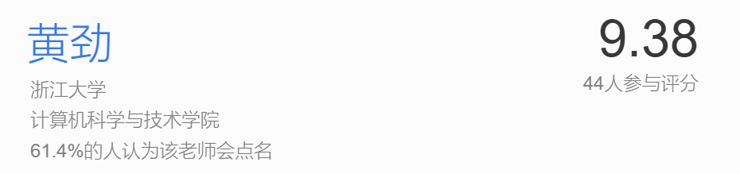

## 数值分析 NA 春夏

### 课程感受

**学习内容**：课程内容涵盖很广，主要是为了解决计算机的计算精度与稳定性问题。从最开始的迭代法求解一元方程的解，扩展到迭代求解线性方程组，以及最后的迭代寻找常微分方程初值问题。每个模块介绍了多种解法，提高精度、增加稳定性。除此之外，还将学习最大特征值计算、多项式插值、多项式逼近函数，之后将通过对以上工具的使用解决数值积分、数值微分的估计。

**学习要求**：这个课程需要对于微积分与线性代数有比较好的掌握。按照hj老师说的：这个课程学的东西都是之前接触过的，但是这个课程会给一个新的理解和角度。

**个人感受**：由于在上课之前看了查老师上说的，春夏的NA难度很高，于是就一直很慌，在课程完全结束之后感觉其实只要跟着老师的进度，每周愿意花点时间消化一下本周所学，期末好好过一遍，这个课程并没有所说那么可怕，而且能从中收获很多有用的知识。hj老师也是一个学术水平很高的老师，讲课很生动，但是由于我个人对于之前的线代知识有了许多遗忘，所以在听课时会有很多跟不上的。所以还是需要花点时间捡起来大一的线代和微积分。

### 课程构成

没有具体的分数构成，主要是以下任务：

1. 15次小测，每节课都是有一道题小测，但有时候因为课程内容过多就把小测进行顺延。小测不是很难，但是内容分散，难免遗忘之前所学知识（~~可以关注以之前的智云~~）。
2. 一次小组展示，展示ppt中的topic
3. 8 次lab小测，前两次有点难度，之后的内容就比较简单了，都是书中的算法，可以对照书中的伪代码解决。（**:warning:不要抄！！查重很严格！！！**）
4. 期末考试 开卷能带计算器，不会考察你暴力迭代计算。

`review`中提供了期末复习整理，lab中提供了前两次作业的分析。

### 课程成绩

97/100 5.0

个人你感觉期末的占比是比较大的，平时小测相当于是签到。我的期末复习大概是过了一遍知识点，自己整理了复习笔记，重新做了一遍小测题，也可以看看回忆卷会有一些相似题型。

