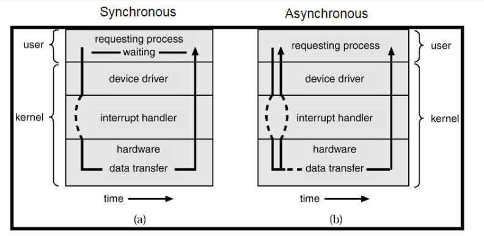
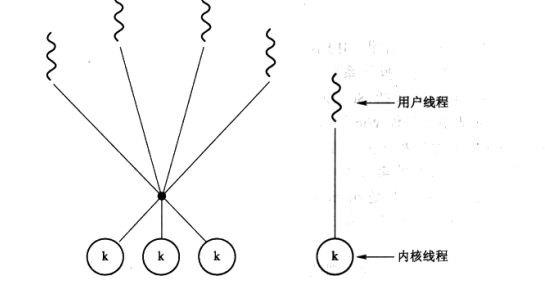
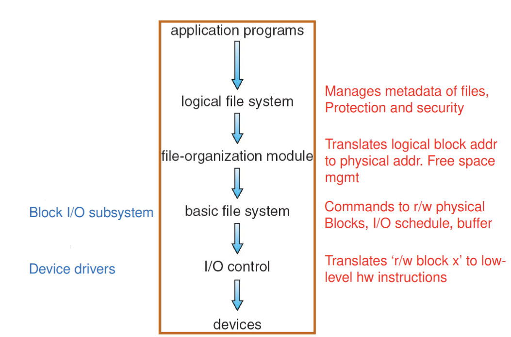
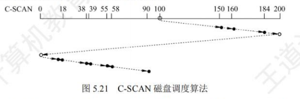

# 操作系统

> 期末考试 50%
>
> 作业 5%
>
> 课堂测试 5%
>
> 实验报告 20%
>
> 实验验收 20%

## Chapter 1 Introduction

### 操作系统的定义

:star:**operating system**：A **program** that acts as an intermediary between a **user** of a computer and the computer **hardware**. （*操作系统是控制用户的应用程序对硬件的使用*） **Kernel 内核：在计算机中永远运行的程序**

- resource allocator 
- control program

**Computer System Structure 系统架构（四个组成部分）**：

- Hardware 硬件：CPU memory I/O
- Operating system
- System & application programs
- Users ：People, machines, other computers

### 计算机系统组成

**计算机启动 start up**：开机和重启时加载 引导程序（bootstrap program），位于 **ROM **和 EEPROM，称为**固件（firmware）**。

- Loads operating system kernel and starts execution，于是需定位内核并载入内存。

**计算机系统组成**：One or more CPUs, device controllers connect through common bus providing access to **shared memory（核心）**

- I/O和CPU并发执行任务
- 每个设别控制器控制特定类型设备
- 每一个设备控制器有单独的 local buffer
- CPU 控制把 data 从主存移动到 loacl buffer
- I/O 是从设备传递到local buffer
- 设备控制器通过制造中断来告知 CPU 完成了操作 
  - 使得设备能独立于CPU工作，同时通过中断使得CPU及时相应状态变化。

#### 中断 interrupts

- 中断发生之后将由interrupt service routine（ISR）控制，通过 interrupt vector （**包含service routines 地址**）找到处理中断子程序。
- 中断结构也需要保存中断前程序的地址
- Incoming interrupts are disabled while another interrupt is being processed to prevent a lost interrupt.在中断处理时，屏蔽其他中断
- software-generated interrupt 称为 trap ，由错误或者**用户请求导致（后者被称为system call）**
- **An operating system is interrupt driven.**

**中断分类**

- 硬件：I/O
- 软件中断（trap）：
  - error
  - system call

**操作系统是中断驱动的**

**中断处理**

- 操作系统记录寄存器和PC
- 确定中断类型
  - polling 轮询所有类型
  - vectored interrupt system 中断表

#### I/O Methods

**synchronous 同步** ：只能处理一个 I/O

**Asynchronous 异步** 能支持多个 I/O



**DMA direct memory access structure**

- 用于高速 I/O 设备，直接将块信息转递到 CPU 并且不引起中断
- 按照块传递，一个块引起一个中断。
- Only one interrupt is generated **per block**, rather than the one interrupt **per byte**.

####  Storage

**Storage systems organized in hierarchy.**

**Caching**：主存是二级存储的cache，不是指cache而是一种机制

**Multitasking**：必须使用most recent value，无论存储在哪一级别 **多级存储一致性**

**Multiprocessor**：在多核系统中也要抱枕给cache coherency **缓存一致性**

**Multiprocessor Systems** 每一个处理器（processor）有一套自己的寄存器和cache，但是公用主存


**Multicore Systems**：多核心处理器


**NUMA 结构**


### 操作系统结构:star:

**Multiprogramming** ：多任务执行，在job 1 中断时能进行之后的任务。确保CPU能一直工作。

**Timesharing (multitasking)** 分时多任务，能实现多用户公用，CPU分时切换任务。用户之间无感知，相应时间小**interaction交互性强**：

- **CPU** **scheduling** 当多任务需要同时运行
- **Process**：每个用户至少有一个程序在内存中
- **Swapping**：当某程序不适合在内存中运行时，将其交换出
- **Virtual memory **：allows execution of processes not completely in 

  memory

### 操作系统操作

> [!TIP]
>
> **Interrupt** driven by hardware 
>
> Software error or request creates **exception** or **trap**

为了防止某一个程序出现的问题不影响到其他程序的正常运行、包括操作系统：

####  Dual - Mode 双模式

- **User mode** and **Kernel mode**

- 硬件提供一个 Mode bit：

  - 用于区分不同的mode
  - **Privileged instruction：** 只能在内核模式才能使用的指令。
  - **系统调用 system call** 用户程序能将模式更改成内核模式，在返回之后切换回用户模式。

  

#### Timer and  Interrupt

防止**无限循环/进程**，在某一个设定的时间（可变或不变）之后中断。

- Set **interrupt** after **specific period** 
- 变长：操作系统设置一个计数器，当counter 减少到0 ，执行中断

### 进程管理

**process 进程**：一个执行的程序，是一系列工作（处于执行中的程序）。

> **Program is a passive entity, process is an active entity**

- 单线程进程有一个 Program Counter 记录下一个指令的位置。指令线性执行。
- 对于多线程的进程，每一个线程有一个计数器

:star:**多进程的核心是 CPU复用（Multiplexing CPU）**

###  内存管理

Memory management activities:

- Keeping track of which parts of memory are currently being used and by whom 
- Deciding which processes (or parts thereof) and data to move into and out of memory 
- Allocating and deallocating memory space as needed

## Chapter 2 OS structures

### 2.1 OS Services

- 对于用户：

1. **User Interface** 【Command-Line、Graphics User Interface（GUI），Batch】
2. **Program execution** ：只是加载程序进入内存，而编译器等并不是
3. **I/O operations**
4. **File-system manipulation **
5. **Communications【between computers or over a network】 **
6. **Error detection**

- 对于系统：

1. **Resource allocation**
2. **Accounting**
3. **Protection and security**

### System Calls

- 操作系统给**程序提供服务的接口**

- **Application Program Interface (API)** ：高阶的接口，还是系统调用。**程序的调用通常使用API，而不是直接系统调用**

#### SC 执行

- 每一种system call 都有一个都有一个编号，系统调用接口维护一个列表索引，根据索引执行系统调用程序。
- 返回系统调用状态（returns status of the system call）
- 调用者不需要知道系统调用是如何执行的，只需要获取API，大多数的细节都被API隐藏

​	

#### SC parameter pass 参数传递

- 最简单：使用寄存器传递
  - 但是参数量大于寄存器
- 将参数存储在内存中的block中，通过寄存器传递block的地址
- 把参数压入栈中

### Type of SC

1. Process control
2. File management
3. Device management
4. Information maintenance (e.g. time, date)
5. Communications
6. Protection

### System Programs

提供了sc接口完成程序，要**方便执行程序【main】**就需要系统程序。

- 只有一些是简单的用户系统调用接口，大多是比较复杂的（比如编译器、连接器等）：主要是为了程序所以多考虑程序使用的系统程序。

操作系统和应用程序之间的结构，**绝大多是用户看见的操作系统应该是系统程序**

<div style="color:red;">
          注意System Program 并不属于 Operating System 提供的功能，只是给操作系统提供的功能提供一个接口
</div>

System programs provide a convenient environment for program development and execution：

- File manipulation 
- Status information
- File modification
- Programming language support
- Program loading and execution
- Communications：能够通过网页来发送信息

**Application programs** ：数据库，网页浏览器等


### :star:Operating System Design and  Implementation

- **Start by defining goals and  specifications 定义系统目标和规格**
- Affected by choice of **hardware**, **type of system**
- 需求分类：
  - **user goal**：方便使用学习等
  -  **system goal**：灵活、设计简单等

#### 机制和策略

**Policy** :   **What** will be done? 策略（确定具体做什么事）如何去结合底层操作，实现需要的功能。【eg.对不同文件设置一个等级权限】

**Mechanism** :  **How** to do it? 机制（定义做事方式） 抽象的底层操作，支持不同的策略实现。 【eg.通过二进制码来记录等级权限】

**The separation of policy from mechanism is a very important principle**, it allows maximum flexibility if policy decisions are to be changed later。

- 方便在固定机制或者微调机制的情况下，修改策略。

### OS structure

MS-DOS ：使用最小的空间提供最多的功能。

【问题】没有按照模块划分，尽管有很多结构，但是接口和功能级别没有很好的划分，所以容易出现错。

**Monolithic Structure 宏内核**：将所有存储在系统调用接口和物理硬件之间

UNIX也是受限于硬件功能，只有两个部分：系统程序和核心（硬件和系统调用接口之间的结构，包含大量的函数）

当一个模块出现错误时整个系统都会出问题


**Microkernel Structure** ：把一些非必要功能转移到系统应用和用户应用。

- **保留了信息交流和内存管理进程调度 中断处理的功能**。

- 用户模块之间需要交流需要通过微内核。
- 【优势】更加容易扩大微内核、更容易将操作系统移植到新的操作系统、更加可靠（程序在内核中运行减少）
- 【劣势】用户模块和内核之间信息交流的开销，效率就低于宏内核。

**Hybrid Structure**：结合宏内核与微内核，暂时理解为保留微内核，同时在内核中添加一些其他功能：调度、内存管理等。

 **Layered Approach 分层策略**：0层硬件层、N层用户界面，每一层只能使用更低层的函数以及操作。

- 方便检测和修正错误，从底层向上检测。
- **层的定义比较困难**，执行效率比较低，要穿越多层调用


**Modules 分模块策略**：

- Uses object-oriented approach 使用面向对象方法分块
- Each core component is separate 块之间的内容是分离的
- Each talks to the others over known interfaces **块之间交流不需要通过内核，相比于微内核的优势**
- Each is loadable as needed within the kernel 每一个都能读入内存


### Virtual Machines

A virtual machine takes the layered approach to its logical conclusion.  It treats hardware and the operating system kernel as though they were all hardware 【理解：使用分层的思想，把虚拟机放在高层次，将本机的硬件和内核都视为虚拟机的硬件】

The operating system creates the illusion假象 of multiple processes, each executing on its own processor with its own (virtual) memory 【理解：在虚拟机上的多进程，实质上是本机上一个进程，使用一块虚拟内存而产生】


优势：

- 能提供一个完全隔离的环境，虚拟机之间彼此难影响
- 方便在虚拟机上进行系统的开发
- 虚拟机的想法很难完全实现，由于与底层的交流需要十分精准。【可以理解为，本机与底层交流有许多接口，虚拟机和本机先进行交互，再用本机与底层交互，本机和虚拟机之间交互可能会没有足够的空间接受所有的请求。如同本机有x个请求留有x个位置存放不同请求类型，虚拟机有2x个请求类型，这样当然不能完全精准传递】

### Operating System Generation and System Boot

**Generation**:

- 使用 `SYSGEN`程序区获取系统的配置与硬件信息
- Booting - starting a computer by loading the kernel
- Bootstrap program– code stored in ROM that is able to locate the kernel, load it into memory, and start its execution。

**Boot**：通常使用两步：

- 一段小代码--Bootstrap 定位内核，把启动程序加载进内核并启动
- Sometimes two-step process where boot blockat fixed location loads bootstrap loader 固定位置的引导块找到位置bootstrap，bootstrap加载程序。

***

以上内容对应王道第一章节在这里将记录一下王道第一章节学习：

**操作系统特征**

- Concurrence （并发）and parallel（并行）
- Sharing ：
  - 互斥共享
  - 同时访问
- Virtual
- Asynchronism
> [!CAUTION]
>
> - 对于multiprogram system 保持了局部 `serial` 串行、但是没有保证 sequence 顺序性！
> - 对于 timesharing 使用  priority 、 non-preemptive 调度 能减少响应时间
> - 对于 multiprogram system ，Process之间是并发concurrence，而cpu 和 I/O device 之间是 parallel

**关于操作系统提供给用户的接口**：

- 命令接口：联机和脱机命令接口
- 系统调用：**是只提供给应用程序的接口** :star:


- 原语 atomic operation 就是与原子操作
- 系统调用时 从用户态转化到内核态通过硬件实现，而从内核态转化到用户态是通过特权指令 sret 实现的。
- :star:**注意区分 系统调用的 call 和 execute ，call 是可能发生在用户态，而execute 是发生在内核态。系统调用就是操作系统提供给用户程序的一个接口。**
- 
  - Trap 通常是系统调用
  - Fault 通常是内核的错误，比如除以0，**缺页异常**
  - Abort ：是CPU的硬件问题
  - interrupt 中断：是CPU外部导致的中断，例如**时钟中断**、I/O操作
  
- 区分系统调用和程序调用：

  - 中断处理程序地址是通过硬件获取
  - 都需要保存PC寄存器的值，但是系统调用 需要保存系统状态寄存器的值。**系统调用通过中断隐指令（硬件实现）保存PC寄存器和系统状态字。**
  - 系统调用执行一定在内核态，子程序的执行可以在内核也可以是用户态


内核设计补充：

- 微内核Microkernel：
  - 进程管理功能
  - 低级存储器管理 （逻辑地址转化喂物理地址）
  - 中断处理（判断中断再给服务器解决）
  - 可扩展性、可靠性和安全性、可以指性、分布式计算
  - 一个功能模块出错不会影响整个系统
- 外核 exokernel：为虚拟机进行资源分配，但是对于硬件的操作就比较少。
- 层次结构操作系统的最显著特点：设计困难、额外开销、方便调试测试。
- 模块化：所有模块都在内核中，**一个模块出错了就会导致内核错误。**
- 宏内核：主流操作系统使用，**性能优势**

虚拟机 virtual 

- 第一类虚拟机：虚拟机应用程序类似于操作系统，是唯一一个运行再最高特权级的程序。每一个虚拟机的硬件都是一样，虚拟机就是用户态的一个进程。

- 第二类虚拟机，依赖于宿主操作系统，更像一个进程：

  


***


## Chapter 3 Processes

batch system （a batch is a sequence of jobs）

**process**：

- text section (code)
- data section (global var)
- stack (functions parameters ;local vars;return address)
- heap (dynamically allocated memory)
- program counter PC


**Process state**：

- new ： the process is being created
- running : instructions are being executed
- ready: the process is waiting to be assigned to a processor
- waiting / blocked :waiting some events (eg.I/O)
- terminated : the process has finsihed execution


> [!CAUTION]
>
> 需要纠正一个之前的不全面的想法：
>
> - running 到 waiting 是需要等待某些事件发生进行切换，比如等待I/O设备等
> - 在running使用系统调用也会导致状态转变，也就是等待I/O完成也是现需要进入waiting状态
> - 

###  Process Control Block

进程只要产生就生成一个 PCB 在进程结束时删除。内容如下：

- 进程状态 process state ：五种状态
- 程序计数器 program counter ： 记录下一个指令的地址
- CPU 寄存器Contents of CPU registers ： 用于保存寄存器内容
- CPU scheduling information：CPU 调度参考的信息，包括优先级、调度队列的指针、调度参数等
- Memory-management information：内存分配信息
- Accounting information ：CPU时间、进程使用时间等
- I/O status information ： 分配的I/O设备列表。


###  Process Scheduling

**Job queue** :  set of all processes in the system

**Ready queue**:set of all processes residing in main memory , ready and waiting to execute.

**Device queues** : set of processes waiting for an I/O device. 每一个I/O设备有自己的divice queue

**Queueing - Diagram**：当进程分配到CPU时往往通过以下的路径执行。


- 请求一个 I/O 操作，进入I/O队列
- 时间片耗尽重新进入 Ready queue
- 产生一个子进程，等待子进程执行完成
- 中断产生等待中断结束。

####  Schedulers 调度器

**Long-term/Job scheduler** : 选择一个进程把他读入内存中（ready queue）**infrequently、slow**  主要控制 **degree of multiprogramming 多道程序**

**Short-term/CPU scheduler**: 从ready queue中选择出下一个执行的进程并分配CPU **frequently、fast**


**Medium Term Scheduling**：为了改善进程组合，能将程序从内存中移出swapping：


**process**:

- I/O-bound process : I/O时间大于CPU执行时间
- CPU-bound process： CPU时间大于I/O时间

**Need to select good combination of CPU bound and I/O bound processes.**

####  Context Switch

when CPU switches to another process,the system must save the state of the old process and load the saved state for the new process.

**context-switch time is overhead,time dependent on hardware**


###  Operations on Processes

####  Process Creation

**资源共享**：

- share all resources
- Children share subset of parent’s resources
- Parent and child share no resources

**执行**：

- Parent and children execute concurrently
- Parent waits until children terminate

**地址**：

- Child duplicate of parent 子进程是复制品
- Child has a program loaded into it 装入另一个新程序

####  Process Termination

- 使用 `exit` 删除结束进程，使用 `wait` 获取子进程向父进程传递的数据，此时收回所有资源。
- 父进程能中断子进程 `abort`:
  - 子进程超出分配资源
  - 此任务不再需要
- 不同操作系统处理不同：
  - 删除父进程之后，所有子进程全部删除 cascading termination
  - 删除父进程，子进程把init进程作为父进程

### Cooperating Processes

**independent procrss**：不受到其他进程执行的影响

**Cooperating process**：能够影响并被影响。

> [!NOTE]
>
> information sharing 、Computation speed-up 、modularity 、Convenience

#### Producer-Consumer Problem 生产者消费者问题 **共享内存**

producer process produces information that is consumed by a consumer process

- unbounded-buffer ： 空间没有限制，消费者需要等待直到有新消息
- bounded-buffer ： 固定内存，当内存空间满了，生产者需要等待

###  Interprocess Communication IPC

Two models for IPC: **message passing** and **shared memory**

####  Message-Passing

- 不需要共享变量
- 提供两种操作：
  - send(message) – message size fixed or variable 
  - receive(message)
- 信息传递过程：
  - 先建立`communication link`
  - 通过两种操作 实现信息交换

**Direct Communication**

- **send (P, message)** – send a message to process P
- **receive(Q, message)** – receive a message from process Q

> [!IMPORTANT]
>
> **Communication Link**
>
> - 连接自动建立 
> - 一个链接只能在一对进程之间进行
> - 每一对进程只能有一个连接
> - 连接可以双向可以单项

**Indirect Communication**

Messages are directed and received from mailboxes (also referred to as ports) 使用端口进行端到端的交流

- 每一个mailbox 有唯一id
- 交流只需要交换共享mailbox id即可

**send(A, message)** – send a message to mailbox A	

**receive(A, message)** – receive a message from mailbox A

**流程：**

- 建立一个mailbox **建立连接**
- 通过mailbox 交换信息
- 删除这个mailbox

> [!IMPORTANT]
>
> **Communication Link**
>
> - 当共享端口之后建立连接
> - 一个连接能由多个进程使用A link may be associated with many processes
> - 每一个进程能同时使用多个连接Each pair of processes may share several communication links

通信最快的方式是：共享内存，没有额外开销


####  信息同步与异步

**Blocking** is considered **synchronous**

- **Blocking send** has the sender blocked until the message is received
- **Blocking receive** has the receiver block until a message is available

**Non-blocking** is considered **asynchronous**

- **Non-blocking receive** has the receiver receive a valid message or null
- **Non-blocking** **send** has the sender send the message and continue

####  Buffer

信息传递过程中将临时存储在队列中，有三种实现方式：

- **Zero capacity** – 0 messages Sender must wait for receiver
- **Bounded capacity** – finite length of n messages Sender must wait if link full
- Unbounded capacity – infinite length Sender never waitsControl of Buffering

##  Threads


**Benefits**：

- Responsiveness 交互性增强
- Resource Sharing ：memory for code and data can be shared.
- Economy 经济性 ：creating processes are more expensive.
- multi-threading increases concurrency.

### Models

**User Threads and Kernel Threads ULT KLT**

####  Many to one

多个 User threads 映射到 Kernel Thread，管理效率高

**缺点：**一个线程出现block 整个线程都会阻塞。

#### One to One

一个User 映射到一个Kernel。能在一个线程阻塞时保证其他的正常运行（**并发性好**）。

**缺点：**开销过大

####  Many to Many

多个User多个 Kernel，当一个出现阻塞时，会有另一个内核调度执行


####  Two-Level Model



###  Threading Issues

####  fork() & exec()

两种不同的fork方式：

- 只复制调用fork的线程
- 复制进程中的所有线程

exec 则还是会替换所有的线程

####  Thread Cancellation

> [!NOTE]
>
> **cancellation** 用于线程 **Termination** 用于进程

两种不同的取消方式：

- asynchronous cancellation 异步取消：立即终止目标线程
- deferred cancellation ： 不断检查是否能够取消 ，检查flag（cancellation point）*常用于分配资源或者正在跟更新共享数据的线程*

####  Signal Handling

**Signals**：用于线程 thread 向进程 process 传递信息（当某些操作发生之后）

**Signal handler** 用于处理异步或者同步信号：

- Signal is generated by particular event
- Signal is delivered to a process
- Signal is handled

####  Thread Pool

建立`thread pool`是用于存放所有等待工作的线程：

- 使用存在的线程 比新建线程更快
- 允许将程序中的线程数绑定到内存池的大小。

####  Thread Specific Data

创建线程的数据副本，每一个线程都是独一无二的。

***

王道知识点补充：

- 用户级线程：

  - 用户视角看到的线程，线程管理等操作都是通过 **线程库** 实现

  - 内核视角就只有一个线程，只进行进程调度

  - 所以在调度时，无论有多少用户线程，只以进程为单位调度。100个用户线程的进程和一个用户线程的进程分配时间一致。

  - 线程切换不需要进入内核态，节约资源。

  - 但是一个用户线程出现问题就会导致全部都无法使用

  - 能够在任何操作系统中运行，由于只依赖于库函数：

    

- 内核级线程：

  - 内核可见的线程，每一个都有一个TCB
  - 通过内核进行调度，当一个线程出现问题时，还是能正常运行

- 组合方式：**现在常用**

  - 用 内核线程 对应 用户线程，就是课程中学习的 
  - 多对一：每个进程就只有一个内核线程，就是类似于上面的只有用户级线程的情况
  - 一对一：对应类似于上面的内核级线程的情况
  - 多对多：融合两者优点

**进程永远都是资源分配的单位**

**引入线程之后，内核级线程就成为了进程调度和分派的单位**，为了解决用户级线程出现的问题：


- 所以线程切换可能引起进程切换：

  

- 内核态线程能被多个CPU并行，而用户态线程并不行：

  

***

##  CPU Scheduler

### Baisc

**Goal**： 通过多程序 (multiprogramming) 获得 CPU 最大利用率。

**CPU-I/O Burst Cycle**: 程序执行包含 **CPU执行** 和 **I/O等待** 的环。

发生调度的情况：

1. Process switch from the **running** to **waiting** (I/O or wait()) 
2. Process switch from the **running ** to **ready** (interrupt or high prority)
3. Process switch from the **waiting ** to **ready** (I/O completion会发出中断)
4. When a process terminates 

**Nonpreemptive**: 1 和 4 是非争抢式的

**Preemptive**：2、3是争抢式的 

**Dispatcher：调度器**  把控制权从CPU转移到进程中，完成一下操作：

- 切换上下文 存储PCB
- 调整到user mode（**注意：并不是必须，有的进程仍然保持在内核态进行**）
- 跳跃到程序的正确执行位置，重新开始执行这个程序。

#### Scheduling Criteria

**CPU utilization**：CPU的使用率，使用时间的占比。**MAX**

**Throughput**：吞吐率，单位时间内完成执行的**进程数** **MAX**

**Turnaround time**：执行一个进程的时间：提交任务时间~完成任务时间。包含执行时间以及等待时间。 **MIN**

**Waiting time：** 进程在Ready queue中等待的时间 **MIN**

**Response Time**：一个进程提交到第一次回应的时间（注意知识第一次回应并不一定执行完成）体现出**算法的交互性**【用于 Time-sharing environment】 **MIN**

Response Ratio = $\frac{CPU~burst+waiting~time}{CPU~burst}$​

> [!WARNING]
>
> **不要忘记了响应比这个衡量标准 和HRRN这个算法！！！！**
>
> 


| name      | structure                                              | need                            |
| --------- | :----------------------------------------------------- | ------------------------------- |
| FCFS      | 有利于long和CPU繁忙型                                  | waiting time                    |
| SJF       | 有利于Short，最好的avg-wait和avg-trunaround ，导致饥饿 | CPU burst time                  |
| Static PS | 以上两种都是特例                                       | -                               |
| HRRN      | FCFS 和 SJF 的折中 不会导致饥饿 利于短                 | waiting time 和  CPU burst time |
| RR        | 用于 time-sharing，交互性强，turnaround时间长          | CPU time 时间                   |

### First-Come,First-Served (FCFS)

- **Convoy effect护航效应:** short process behind long process, the average waiting time may be long, leads to I/O devices CPU being idle. 

- Nonpreemptive

- 对 long process 有利 ，对 short process 不利

  *长进程先到达，会导短进程 waiting time 很长*

- 有利于 CPU 繁忙型，不利于 I/O 繁忙性。

  *I/O繁忙性会导致需要不停排队等待时间就会很长*

### Shortest-Job-First (SJF) Scheduling

- 两种执行模式：

  - Nonpreemptive ： 只要一个进程在 CPU 中运行，就不能叫停进行调度。
  - Preemptive： 当传入的新进程短于队列中正在执行的**remaining time**，直接切换。

- 预测 CPU Burst

  - Exponential averaging 指数平均法：

    - $t_n$ 第n次 CPU burst ，$\tau_{n+1}$ 第n+1次预测值 ，$\alpha ,0\leq\alpha\leq 1$:
    - $\tau_{n+1}=\alpha t_n+(1-\alpha)\tau_n$

- **SJF is Optimal  :SJF 调度的平均 waiting time 和 平均 Turaround time  都是最优的**
- 会导致 starvation （长作业不被调用）：有利于短进程

### Priority Scheduling

根据优先级进行调度，同样存在两种模式：preemptive、nonpreemptive。

- 优先级越高，表达优先级的数越小

- SJF 能理解为优先级是CPU burst time 的有衔接调度

- Static Priority : 进程产生时设置一个优先级 ，对于优先级低的进程会导致starvation 发生。

解决方法：Dynamic priority（Aging老化）：随着时间更新优先级。

- **Highest Response Ratio Next HRRN 高响应比**：
  - **Response Ratio = $\frac{CPU~burst+waiting~time}{CPU~burst}$**
  
  - 响应比约高，优先级越高
  
  - 非抢占式 nonpreemptive ，时FCFS 和 SJF 的一个折中：
    - 等待时间相同时，burst 越大相应比越小，所以短进程优先执行，符合SJF
    - burst 相同时，等待时间越长，优先级越高，类似于 FCFS
  

### Round Robin (RR)时间片轮转调度算法

  - 给每一个 process 分配一个小CPU time，时间到了就换。

- 更高的 average Turnaround time ，但是有更好的 response CPU utilization

- 时间片过大：类似于FCFS。时间片太小：上下文切换的overhead太高。
- 常用于Time-sharing system

### Multilevel Queue Scheduling 多级队列

把Ready queue 分成多个子队列，例如：前端队列和后端队列。

- 使用不同的调度算法：前端-RR 后端 FCFS
- 需要对两个队列进行调度

###  Multilevel Feedback Queue

通过队列之间的切换来实现aging的操作

实现基本思想：

- 为每一个队列设置优先级，第一级队列优先级最高，逐渐下降
- 从最高到最低，时间片逐层翻倍
- 每一个队列使用 FCFS。进入内存先进入1级队列，时间片结束：
  - 执行完成，跳出队列
  - 执行未完成，进入下一级队列，以此类推
- 最后降级到n级队列，符合RR调度。
- 只有当高级别的队列全为空时，才会执行低级别队列。如果有高级别进入，则立刻把正在执行的放在本层队列尾部，执行高优先级进程。

### Others NOT IMPORTANT

#### Multipl-Pricessor Scheduling

- Asymmetric multiprocessing 对称：只有一个处理器来获取数据，不需要实现数据共享。
- Symmetric multiprocessing (SMP)：多个处理器自调度，多个处理器都能对数据结构进行访问。

#### Real-Time Scheduling

- Hard real-time systems – required to complete a critical task within a guaranteed amount of time. 对时间要求高
- Soft real-time computing – requires that critical processes receive priority over less fortunate ones.对时间要求没有hard那么高（腾讯会议）
- 使用 最早截至时间优先算法 Earliest Deadline First
- 使用 最低松弛度优先 Least Laxity First （还能摆的时间）
  - 松弛度 = 必须完成的时间 - 运行需要的时间 - 当前时间

#### Thread Scheduling

- Local Scheduling ：用户级线程调度，**线程库决定**
- Global Scheduling：内核级线程调度，内核决定

***

- 进程在临界区也能被调度
- 上下文切换存储的内容：
  - CPU所有寄存器中的值
  - 进程的状态信息和控制信息
  - 堆栈中的内容
- 注意：如果是实时系统则需要选择抢占式的高优先级算法，如果是需要交互性则选择时间片轮转
- 操作系统需要调度的**直接原因** 是运行的进程不能继续运行了：时间片耗尽、运行结束、出错、等待事件发生、自我阻塞
- 优先级设置：
  - 系统进程 > 用户进程
  - 交互式>非交互式
  - I/O进程> 计算进程
- 降低优先级的合理时机是时间片用完，也就是运行结束降低一下

***


## Chapter 6 Process Synchronizatioin

> [!TIP]
>
> Concurrent access to shared data may result in **data inconsistency**
>
> $\to$ Process **Synchronization 同步** : 多进程环境，按照一定顺序正确访问**共享资源** ，重点是**正确性**

### Background

#### Race Condition

A race condition is a situation in which a memory location is accessed 

concurrently, and at least one access is a write.

*对 producer and consumer 进行补充：*

- *添加一个变量对 buffer 中数据数量进行标记*

- *在两个进程并发修改 count 变量数值时会出现问题 Race Condition：(并发对一个变量进行write操作)*

  - `count++`:

    ```assembly
    r1 = count
    r1 = r1 + 1
    count = r1
    ```

  - `count--`:

    ```assembly
    r2 = count
    r2 = r2 - 1
    count = r2
    ```

  - 当出现汇编代码的交错执行时就会出现问题：`count = 5`

    ```assembly
    r1 = count
    r1 = r1 + 1
    r2 = count
    r2 = r2 - 1
    count = r2
    count = r1
    ```

    结果：`count = 6`

####  **Critical Section Problem**临界区问题

- 临界资源 Critical Resources： 被多线程共享的资源,需要保证一个时刻只能用一个进程访问这些资源
- 临界区 Critical Section ： 访问临界资源的代码片段
- Entry section：检查资源是否能进入临界区（可能是 running ready wait）

```c++
while(true){
	entry section;
	critical section;
	exit section;
}
```

####  解决临界区问题：

- **Mutual Exclusion 互斥** ：(忙则等待)当一个进程进入 critical section 时，其他进程必须等待。互斥的准则：

- **Progress 空闲让进**：critical section 空闲时允许进程申请进入临界区。

- **Bounded Waiting 有限等待**：保证在有限的 number of times（等待次数） 进入临界区，放置无限等待。

  > [!IMPORTANT]
  >
  > 注意：这里是等待次数有限，需要控制等待次数小于某个阈值。而不需要考虑每一个进程的执行速度。

  - **让权等待Leave to wait**：当不能进入临界区，应当释放处理器，防止等待时间过长。（避免忙等）
  

###  软件实现方法

####   Single Flag method

- 设置一个变量 turn 记录允许进入临界区的进程编号,对于 $P_i$进程，设置$P_j$下一个进入。两个进程交替进入。

  ```c
  while(trun != i);
  critical section;
  turn = j;
  remainder section;
  ```

- Mutual Exclusion 实现

- 不能实现 Progress ：当 Pi 执行完之后 设置为 Pj ，但是 Pj 不进入，则此时其他需要进入的进程无法进入。

- Bounded waiting 实现： 等待一次即可进入。

####  双标志后检查法（Double Flag After Check Method）

- 设置布尔数组 flag[2] 标记进入临界区的意愿 ，true代表想进入。

- 先设置自己想进入，在询问别人的意愿，访问结束后设置自己意愿：

  ```c++
  flag[0] = true;
  while(flah[1]);
  critical section;
  flag[0]=false;
  remainder section;
  ```

- Mutral Exclusion 实现

- 不能实现 Progress：当两个进程都想意愿执行时，会导致死循环，都进不去，导致饥饿。

- Bounded waiting 不能保证（不出现死循环则1次）

####  双标志先检查法

- 确定对方不想进入再表达自己的意愿：

```c++
while(flag[1]);
flag[0]=true;
critical section;
flag[0]=false;
remainder section;
```

- Mutral Exclussion 不能实现，如果1，2行之间跳出进程，之后临界区内会有多个进程在其中执行。

####  Peterson`s Solution

结合了前两个算法的思想，设置flag[2]和turn.谦让法则：当自己想进入时把机会让给对方。

```c++
flag[0]=true;
turn =1;
while(flag[1]&&trun==1);
critical section;
flag[0]=false;
remainder section;
```

- Mutral Exclussion :实现 一次只能一个进入临界区，由turn的值决定谁来进入临界区。
- Progress：当都希望进入的时候，由于turn只有一个值维护了，进入的进程只有一个。
- Bounded waiting：1次

#### Bakery Algorithm 面包房算法

**思路：**

- 在进入临界区之前，会先获取一个号码，获取小号的进程先进入临界区

- 当进程获得的号一样时，按照进程id从下进入。

  ```c++
  boolean choosing[n]; //表示每一个进程是否在取号
  int number[n]; //记录每一个取到的号码
  (a,b)<(c,d) :a<c ?a==c&b<d
  ```

```c++
    choosing[i]=true;
    number[i]=max{number[0],....number[n+1]}+1;
    choosing[i]=false;
    for(int j=0;j<n;j++){
        while(choosing[j]);
        while((number[j]!=0)&&(number[j],j)<(number[i],i));
    }
    critical section;
    number[i]=0;
    remainder section;
```

### 硬件实现方法 synchronization hardware

Atomic = Non-interruptable

#### Disable interupts

进入临界区之前屏蔽中断：

```c++
while(true){
	Disable interrupts;
	Critical section;
	Enable Interrupts;
	Remainder section;
}
```

缺点： 

- 影响系统效率
- 不适用于多CPU系统
- 安全性问题

#### TestAndSet Instruction

```c++
bool TestAndSet (bool *target)
{
	bool rv =*target;
	*target = TRUE;
	return rv;
}
while(true){
    while(TestAndSet(&lock));
    cirtical section;
    lock = FALSE;
}
```

Mutual Exclusion: 实现互斥

Progress：空闲让进实现（原子操作）

Bounded Waiting：没能实现


#### Swap Instruction

```c++
void Swap(bool *a,bool*b)
{
	bool temp = *a;
	*a =* b;
	*b =*temp;
}
```

`lock`全局变量，初值为false，每个进程设置局部变量 key，初值为true，调用`swap()`交换两个值，实现上锁。

```c++
while(true){
	key=true;
	while(key==true){
       Swap(&lock,&key);
    }
	critical,section;
	lock=FALSE;
	remainder section;
}
```

Mutual Exclusion : 原子操作实现

Progress：实现

Bounded Waiting：不能实现

#### The compare_and_swap(CAS) Instruction

```c++
Int compare_and_swap（Int *value, Int expected, Int new_value）
{                  
	int temp = *value;    
	if (*value == expected)    
		*value = new_value;
	return temp;   
} 
while (true) 
{
    while ( compare_and_swap(&lock, 0, 1) != 0);   
    //do nothing
    critical section
    lock = FALSE;
    remainder section 
}
```

Mutual Exclusion:实现

Progress:实现

Bounded Waiting：没能实现

####  Bounded-waiting with Compare-and-Swap

```c++
while (true) {
    waiting[i] = true;         
    key = 1;         
    while (waiting[i] && key == 1) 
        key = compare_and_swap(&lock,0,1); 
    waiting[i] = false; 
    /* critical section */ 
    j = (i + 1) % n; 
    while ((j != i) && !waiting[j]) 
        j = (j + 1) % n;
    if (j == i) 
        lock = 0; 
    else 
        waiting[j] = false; /* remainder section */ }
```

#### Mutex Locks 互斥锁

两个原子操作 `acquire()` 获取锁和 `release()` 释放锁。

```` c++
while(true){
	acquire();
	critical section;
	release lock;
	remainder section;
}
````

```c++
acquire() 
{
    while (!available); /* busy wait */
    available = false;
}
release() 
{
    available = true;
}
```

导致一个busy waiting（不停空循环，不断判断while），这种锁被视为spinlock（自旋锁）

#### 硬件实现总结：

优点：

- 适用于任意数目的进程，在单处理器或多处理器上
- 简单，容易验证其正确性
- 可以支持进程内存在多个临界区，只需为每个临界区设立一个布尔变量

缺点：

- 耗费CPU时间，不能实现“让权等待” busy waiting
- 可能不满足有限等待
- 可能死锁

### :star:Semaphore 信号量

Semaphore S a integer variable

只能通过**两种atomic**操作来修改信号量：

- `wait()` /`p()`/`Proberen()`
- `signal()`/`V()`/`Verhogen()`

```c++
wait(S){
	while(s<=0);
	s--;
}
signal(S){
	S++;
}
```

- Counting semaphore 计数型：可以是任意一个域的数

- Binary Semaphore二进制型：取值只能取0和1，also known as mutex locks(互斥锁)

  *能用多个二进制信号量来表示计数型信号量*

#### 使用信号量作为同步工具

- Mutual Exclusion 互斥操作实现（类似与Spinlock）

```c++
Semaphore S = 1；
wait(S);
Critical Section
Signal(S);
Remainder Section;
```

- 同步实现：P1需要在P2之前执行：

```c++
P1:S=0;
S1
Signal(S);
p2:
Waiting(S);
S2;
```

（*理解为P2需要资源，但是这个资源只能从P1释放*）

**注意 ： 同步实现时并不信号量的初始值并不是固定为0，如果期望的消息未产生则设置为0，若消息存在，则信号量设置为一个整数**

> [!NOTE]
>
> Four rooms, four identical keys. How many semaphore? 
>
> （翻译：有四个能够使用的共享资源，需要多少个信号量维护）：**1即可**：初始值设置为4，能满足四个进程访问这个共享资源。
>
> Four rooms, each with a unique key (four different keys)How many semaphore? 
>
> （翻译：四个不同的资源，需要使用多少个信号量进行维护）：4个，如果只用1个，会导致互斥无法维护。如果两个进程同时申请同一个操作（同一把钥匙），申请通过导致互斥性无法完成。

但是这样的操作还是会导致busy waiting，提供一种解决方法：

#### Semaphore Implementation

需要保证不能有对一个信号量同时进行`wait()P（）`和`signal()V()`操作。

> [!TIP]
>
> 忙等实现机制 busy waiting
>
> ```c++
> V(){
> 	acquire(lock);
>     	s++;
>     	release(lock);
> }
> P(){
>     	while(s==0);
>     	acquire(lock);
>     	s--;
>     	release;
> }
> ```
>
> P中会出现忙等问题，取决于V的运行时间

**Semaphore Implementation with no Busy waiting**

- 每一个信号量有一个waiting queue，每一个信号量有两个不同的items（value和指向PCB队列指针（waiting queue））

- 使用两种系统调用操作：

  - block（sleep）：place the process invoking the operation on the appropriate waiting queue.
  - wakeup：remove one of processes in the waiting queue and place it in the ready queue.


中心思想：在进程P()等待时，直接sleep（）让其他进程先执行。

  ```c++
  wait(S){
  	value--;
  	if(value<0){
  		block();
  	}
  }
  Signal(S){
  	value++;
  	if(value<=0){
  		wakeup(P)
  	}
  }
  ```

信号量讨论：

- 信号量表示资源或者临界区
- S > 0 代表能使用的资源的数量
- S = 0 表示无可用资源以及不允许进入临界区
- S < 0 表示正在等待队列中的个数，或者等待进入临界区的进程数量
- Wait 和Signal 必须成对出现
- 两个wait操作相邻，顺序至关重要，而两个相邻的signa操作的顺序无关紧要。
- 同步wait操作在互斥wait操作前（如果一个进程先请求互斥访问共享资源，然后等待另一个进程完成操作，这可能导致循环等待，从而引发死锁）。（*理解：一个进程在执行前P1操作，第二个进程在执行互斥操作，在P1没执行完之前，P2完成互斥操作，第二个操作顺序完成不能保证同步性*）**先同步**
  - 另一种理解：A需要在B完成之后，对一个临界区进行一个互斥操作。如果A先进行互斥的wait，再进行同步wait，如果刚好B需要使用这个临界区的内容之后才能同步signal，会导致死锁。


> [!NOTE]
>
> 能发现忙等和非忙等存在区别：在于忙等时S不能为负数，而非忙等会为负数（绝对值代表队列中的值）。

这种实现和最初的实现类似（S不能为负数的实现）

```c++
P()/wait(){
    while(s==0)
        sleep();
    acquire(lock);
    s--;
    release(lock);
}
V()/signal(){
    acquire(lock);
    s++;
    wakeup(s);
    release(s);
}
```

这样可能会出现 lost wake-up的问题：先执行了 wakeup 但是还没有sleep。

- 考虑在P中先上锁，再进行sleep，但是也会出现问题：上锁之后去sleep，这个锁就永远无法解开，导致死锁。
- 于是修改一下sleep：先sleep再把锁释放了：

```c++
P(){
    acquire(lock);
    while(s==0)
        sleep(s,lock);
    s--;
	release(lock);
}
```

*注意：P原子操作，当被唤醒之后并不从 sleep 开始执行而是从头重新运行*

### Classical Problems of Synchronization

对于信号量：由于只能把0作为判断标准。如果需要维护的实际关系是需要判断大于0，这个很好实现。但是如果需要判断一个关系是<N.这个就需要把正常的加操作，改成信号量初始为N的减操作。

#### Bounded-Buffer Problem

N 个buffers ,each hold one item : 存和取时都需要保证互斥，存取顺序要保证同步，于是需要三个信号量：

- Semaphore **mutex** initialized to the value 1.
- Semaphore **full** initialized to the value 0, counting full items.
- Semaphore **empty** initialized to the value N, counting empty items.

**Producer:**

```c++
while (true) {
    //   produce an item
    wait (empty);
    wait (mutex);
    //  add the item to the  buffer
    signal (mutex);
    signal (full);
}
```

**Consumer:**

```c++
while (true){
    wait (full);
    wait (mutex);
    //  remove an item from  buffer
    signal (mutex);
    signal (empty);
    //  consume the removed item
}
```

#### Readers-Writers Problem

A data set is shared among a number of concurrent processes

- Readers – only read the data set; they do not perform any updates

- Writers   – can both read and write.

Problem:allow multiple readers to read at the same time ,Only on Single writer can access the shared data at the same time.(读者优先：先读完才能写，于是需要维护一个变量 readcount)：需要控制readcount互斥访问，维护写的互斥。

**Writer**

```c++
while (true){
    wait (wrt) ;
    //    writing is performed
    signal (wrt) ;
}
```

**Reader**

```c++
while (true){
    wait (mutex) ;
    readcount ++ ;
    if (readcount == 1)  wait (wrt) ; //不允许写者写了
    signal (mutex)
    // reading is performed
    wait (mutex) ;readcount-- ;
    if (readcount  == 0)  signal (wrt) ;//允许写者写
    signal (mutex) ;
}
```

#### Dining-Philosophers Problem

- 每一个筷子设置为一个互斥信号量

```c++
while (true)  { 
    wait ( chopstick[i] );//拿左边的
    wait ( chopStick[ (i + 1) % 5] );//拿右边的
    //  eat
    signal ( chopstick[i] );//放左边的
    signal ( chopstick[ (i + 1) % 5] );//放右边的
    //  think
}
```

导致死锁：只允许四个人吃饭，一人反拿，轮转调度。

### Monitors

更高效的同步方法：一个时间只允许一个进程在 monitor 中 active ，其他进程都在 monitor 中sleep。但是降低了并发性。

#### Condition Variables

两个 条件变量 `x y`， 提供两种操作：

- `x.wait()`: a process that invokes the operation is suspended.
- `x.signal()`: resumes one of processes (if any) that invoked x.wait ()

```c++
monitor DP{ 
	enum { THINKING; HUNGRY, EATING) state [5];
    condition self [5];
    void pickup (int i) { 
        state[i] =HUNGRY;
        test(i);
        if (state[i] != EATING) 
            self [i].wait;
    }
    void putdown (int i) 
    { 
        state[i] = THINKING;
        test((i + 4) % 5);
        test((i + 1) % 5);
    }
    void test (int i) 
    { 
        if ( (state[(i + 4) % 5] != EATING) &&			(state[i] == HUNGRY) &&(state[(i + 1) % 5] 			!= EATING) ) 
        { 
            state[i] = EATING ;
            self[i].signal ();
        }
    }
    initialization_code()
    { 
        for (int i = 0; i < 5; i++)
            state[i] = THINKING;
    }
}
```

使用时：

```c++
dp.pickup(i)
EAT
dp.putdown(i)
```

问题：两个相邻成员不断拿放，导致某一个其他进程 starve

#### Pthreads Synchronization

提供了：mutex lock 、condition varibles 操作

***

- PV操作是原子操作
- 互斥信号量的值初始值设置为 1 ，同步信号量设置为 0 或者 临界资源数量
- 

***


##  Chapter 7 DeadLock

### Background

A set of blocked processes each holding a resource and waiting to acquire a resource held by another process in the set.

Deadlock Characterization ：需要同时满足四个条件才能死锁：

- **Mutual exclusion 互斥条件**：Only one process at a time can use a resource.(一个资源在同一时刻只能被一个资源拥有)
- **Hold and wait请求保持条件**:A process holding at least one resource is waiting to acquire additional resources held by other processes.(一个进程能获得多个资源，在获取额外资源时保持已获得资源)
- **No preemption 不剥夺条件**：A resource can be released only voluntarily by the process holding it, after that process has completed its task.（资源只能被获取资源的进程释放）
- **Circular wait 循环等待**：P1等待 P2，P2等待 P3..... Pn等待P1，构成循环。

#### System Model

- Resource types : $R_1,r_2...R_n$(CPU，memory space ，I/O devices)
- Instances ：$R_i$ has $W_i$ (I/O :有打印机等)
- 三种操作： request 、 use、release

#### Resource-Allocation Graph

- Vertices :
  - $P = \{P_1,P_2....P_n\}$  :all processes.
  - $R = \{R_1,R_2....R_n\}$ :all resources
- Request edge :$P_i\rightarrow R_j$
- Assignment edge : $R_j \rightarrow P_i$


#### Basic Facts

If graph contains **no cycles**  then  **no deadlock.**

If graph contains a **cycle** then:

- if **only one instance per resource** type, then deadlock.
- if several instances per resource type, possibility of deadlock.(所有资源被占据)

### Methods for Handling Deadlocks

#### **Prevention 死锁预防**

破坏死锁产生的必要条件之一：

-  Mutual Exxclusion ——— Prevent Mutual Exclusion (hold **nonsharable resources**)
- Hold and Wait ———— Prevent Hold and Wait (在请求时不能占用任何资源)
  - 在执行之前获取所有资源，但是导致 Low Resource Utilization ;Starvation(占用时间过长，其他进程的不到资源)
- No preemption————Prevent No Preemption 
  - 当一个进程无法申请到其他某个资源时，将自身已经获取的资源释放。
- Circular wait————Prevent Circular Wait ：在获取资源时有一个顺序 total ordering ，只能从小编号开始申请，不会出现先获取到大序号再申请小序号的问题。

#### Avoidance**死锁避免**

Dynamically examines the resourse-allocation state to ensure that there can never be a circular-wait condition.

通过动态检测的方式，确保系统不会进如不安全状态。

**Safe State 安全状态**: 在资源分配前进行一个安全状态检测，存在一个 sequence $<P_1,P_2...,P_n>$按照这个推进序列能使得进程顺利执行。如果找不到则就是不安全状态。

- If a system is in **safe state** ——**no deadlocks**.
- If a system is in **unsafe state** ——**possibility of deadlock.**

> [!NOTE]
>
> 不安全状态 不一定导致死锁。虽然处于不安全状态，但是在运行过程中可能有一些策略导致占用资源的进程提前主动放弃资源，于是不产生死锁。

**Resource Allocation Graph Algorithm**

> [!IMPORTANT]
>
> **Single instance of a resource type** : 一个资源 $R_i$ 中只有一个名额 ，也就是说这个资源在同一时刻只能被一个进程占用。

- Claim Edge ：P 可能需要申请这个资源。当发出申请之后转变成 request edge ，当资源释放之后 assignment edge 转化为 claim edge。$P_i \to R_j$

- 所有需要资源必须提前声明（Resources must be claimed a priori in the system.）

- 只有不产生 **环路** 才会分配资源。（**从 Request 转化到 assignment 时需要进行检测**）
- 最初状态： 考虑分配P2资源：
- 此时 产生环路，于是这个申请不能满足。

**Banker's Algorithm**

> [!IMPORTANT]
>
> **Multiple instances:**一个资源能有多个实例，能分配给多个进程，或者一个进程可以申请多个相同资源。
>
> 所有进程需要在初始阶段声明最大资源使用量。

银行家算法需要使用的数据结构：

- `n`:进程数量，`m`:资源种类数量

- `Avarilable[m]`:代表每一个资源的可用实例数目。

- `Max[n][m]`: n 个进程对于 m 个资源的最大需求数

- `Allocation[n][m]` :表示已经分配的资源数量

- `Need[n][m]`:表示还需要的资源数量

  `Need[i,j] = Max[i,j] - Allocation[i,j]`

**Safety Algorithm**

思想：把此时能执行的进程占有的资源一个接一个释放，判断是否所有进程都能释放，如果都能释放则途中无环，是安全的。

```python
 Work = Available;
 for i from 0 to n-1:
 	Finish [i] = false;
 for i from 0 to n-1:
 	if Finish[i] =false and Need[i] <= Work:
 		work = work + Allocation[i]
 		finish[i] = true
 for all i:
 	if finish[i] = true :
 		IS Safe state
```

**Resource-Request Algorithm for Process Pi**

`Request[n][m]` : 代表所有进程现在申请的资源数量

思想：先尝试分配资源，检测一下分配之后是否还是安全状态，如果仍然保持则分配

```python
if Request[i] <= Need[i]:
	if Request[i] <= Available[i]:
		Available[i] = available[i] -Request[i];
		Allocation[i] = Allocation[i] +Request[i];
		Need[i] = Need[i] -Request[i];
		if safe:
			allcate to pi
		else 
			wait and restore
	else :wati
else:error
```

#### **Detection、Recovery 死锁检测解除**

- 检测可以通过 `Wait-for graph` :$P_i\to P_j$​ i在等待j，观察是否存在环

- 检测算法就是之前的 **安全检测**
- Completely Reducible Graph ：可完全化简图，消去所有边可称为可完全化简，一个点能分配资源执行则删去这个点的边直到删去所有边。

**Recovery**：

- Process Termination ： 中断所有进程、中断部分进程（按照优先级等顺序）
- Resource Preemption ：回退到安全状态
- 资源剥夺法：把部分进程挂起，剥夺其资源
- 撤销进程法：撤销部分进程，释放资源
- 进程回退法：让一个进程或多个进程回退到避免死锁的地步，释放中间资源
- 依据： 进程的优先级、已执行时间、剩余时间、已用资源、交互还是批处理等

#### **Ignore the problem 鸵鸟算法**

***

- 死锁定理：资源分配图能够简化 （用于死锁检测）
- banker ：保证出现一个安全队列（通过保证至少有一个进程能获得全部资源）
- 
- banker 不能判断是否处于死锁状态 虽然有安全检测
- 当系统出现死锁时，必然有两个以上处于阻塞态
- 注意是 Max 还是 Allocation 还是 need

***

## Main Memory

### Background

 **Main memory** and **registers** are only storage CPU can access directly.

Register access in one CPU clock(or less).

Main memory can take many cycles.

Cache sits between main memory and CPU registers.

#### Multistep Processing of a User program

- **Compile:** transforms source code into a computer language
- **Link**: Combine one or more objects into a single executable program.
- **Load:** Load the .exe file into memory for execution.

#### 三种不同的地址表达

- **Symbolic Address**: Addresses in the source program are generally symbolic (such as the variable count).  【变量名称 &a】
- **Relocatable Addresses**（可重定位地址）: A compiler typically binds these symbolic addresses to relocatable addresses (such as “14 bytes from the beginning of this module”). 【相对于初始地址偏移】
- **Absolute Addresses**（绝对地址）: The linker or loader binds the relocatable addresses to absolute addresses (such as 74014).【直接使用真实地址】

#### Binding of Instructions and Data to Memory

在三个不同的阶段将数据和指令装入内存中：

- **Compile time**（编译时刻）:  If memory location known a priori, absolute code can be generated; must recompile code if starting location changes.

  > [!NOTE]
  >
  > 编译阶段：使用**绝对地址**则直接 bind，如果使用**符号地址**，则编译器会将地址转化为**可重定位**的地址。
  >
  > 只要是在compile time时刻写入，那么就一定保证**物理地址等于逻辑地址**

- **Load time**（装入时刻）:  Must generate relocatable code if memory location is not known at compile time。

  > [!NOTE]
  >
  > 装入阶段：Loader会将可重定位地址转化为绝对地址。
  >
  > 在此时进行bind泽也同样能保证**物理地址等于虚拟地址**
  >
  > 地址转化通常使用静态重定位：
  >
  > 

- **Execution time**（执行时刻）:  Binding delayed until run time if the process can be moved during its execution from one memory segment to another.  Need hardware support for address maps (e.g., base and limit registers)

  > [!NOTE]
  >
  > 在此时bind时需要先进行地址转化，把可重定位地址转化为绝对地址，此时可重定位地址便是虚拟地址，绝对地址便是物理地址。

#### Basic hardware

使用两个寄存器来给一个进程划分一段地址空间：**base** 和 **limit**

- Base（Relocation） Register : 记录起始基地址
- Limit Register: 记录空间限制长度

#### **MMU**

- **Hardware Device**

- Map vritual to physical address. 在 Executio time 时使用计算地址。

#### Dynamic Loading

Routine is not loaded until it is called.子程序只有在需要使用的时候才会载入内存中使用。

#### Dynamic Link

连接过程：

- 修改相对地址，把模块连接时需要修改相对地址
- 变换外部调用符号，把外部调用符号转化为相对地址。这个就是`stub` ，把`stub`替换成子程序，并执行子程序。所以在连接之前需要判断是否加载过子程序了。

### Contiguous Allocation(连续分配)

内存空间通常被分为两个部分：

- Resident operating system, usually held in low memory with interrupt vector.
- User processes then held in high memory.

#### Single Continuous Allocation单一连续分配

分为系统区和用户区，用户区一次只放入一道程序，不能并发。

没有外部碎片，实现简单。

#### Multiple-partition allocation (多分区分配)

将内存划分成若干个连续区域，称为分区。每个分区只能存放一个

进程。

- Fixed Partitioning 固定分区大小
- Dynamic Partitions 需要维护以下信息
  - Hole：block of available memory;
  -  allocated partitions

### Dynamic Storage-Allocation Problem

**First-Fit**：Allocate the first hole that is big enough. 

**Next-Fit**：Allocate the next hole that is big enough. 

**Best-fit**:  Allocate the smallest hole that is big enough; must search entire list, unless ordered by size 能满足条件的最小的hole

**Worst-fit**:  Allocate the largest hole; must also search entire list  

**快速适应算法**：按照大小分类，把原来的单链变成多链

**伙伴系统**：分区大小时2的幂次，不断除以2来找最适应的划分

**哈希算法**：建立哈希表，用空间大小计算得到哈希的位置

#### Fragmentation 碎片

**External Fragmentation **– total memory space exists to satisfy a request, but it is not contiguous. 总的hole空间足够，但是这些空间时分散成小的碎片的，比如说申请125 hole是128，这样就产生了一个3 kb碎片

- **Reduce**： **Compaction/defragmentation**
  - 把所有分散的内存空间压缩合并成一个大的block
  - 但是只有动态的relocation才能实现，这个必须实现在execution time
  - I/O操作不能够进行compaction 

**Internal Fragmentation**：allocated memory may be slightly larger than requested memory; this size difference is memory internal to a partition, but not being used.实际分配的内存要比需要的内存略大一点，这个差距就是内部碎片

### Paging nonncontiguous

分页是一个非连续性发分配操作：

Divide **physical memory** into fixed-sized blocks called **frames**

Divide **logical memory** into blocks of same size called **pages**

虚拟地址会被划分为如下结构：


- Page number ：所有Page的数量，记录一个编号
- Page offset ：在每一个Page中的偏移量。

> [!NOTE]
>
> 如果逻辑空间大小是 $2^m$ 并且page size是$2^n$
>
> 那么页表的总数是 $2^{m-n}$ 所以 page number 是m-n
>
> offset 就是 n

**Free Frames**：直接从 free-frame list 中分配空闲frame

**Valid-invalid bit**: 表示这个页是否被占用 ,V代表可用,I代表已经不可用.

#### Hardware Implementation of Page Table

- 存储在 main memory
- **Page-table base register (PTBR)**：points to the page table
- **Page-table length register (PTLR)**：indicates size of the  page table

为了解决 two memory accesses 问题 是同 **块表 TLB** 结构，块表存在cache中，结构和页表中几乎一致

- 页表会存 address-space identifiers (ASIDs) 来标记这个页表中的这一段是属于哪个进程的.
- **cache中只有一TLB**

#### Shared Pages

- **Shared Code** 对应 read-only 的一些code 和data可以共享,也就是所有进程能够在同一块物理地址找到。
  - 并且所有的逻辑地址都是相同的：是为了在TLB中只用存一遍即可。
- **Private code and data** ：这些数据是不能共享的。

#### Structure of the Page Table

**Hierarchical Paging 多级页表**

> [!NOTE]
>
> 使用多级页表的原因：
>
> 32 位的页表项中，使用12位存储offset，所以20位作为页编号，此时就有 $2^{20}$个页，这里需要 1k 页作为页表。
>
> 这显然太多了，并且是连续的内存空间作为页表（不维护页表序号 所以是连续空间），于是使用多级页表。

**对于一个二级页表而言：**

- 一个页的大小是 4 KB，那么 page offest 就是 12位
- 则二级页表的页号也是10位
- 此时刚好剩下10位作为一级页表的编号（刚好 1K个页表项 4KB 空间 占用一个页表）

> [!NOTE]
>
> **Example**
>
> 对于一个 32 bits 的 1k的page size的情况
>
> 此时需要 10 bits 存放 offest 则pagenumber 用22bits
>
> 此时再进一步分成 12bits的pagenumber 和10bits的offest
>
> p1 是页表的编号 P2是这个页表中的偏移量，找到这个项之后就可以定位物理地址的位置
>
> 

**Hashed Page Tables 哈希表**

所有的虚拟页号能够哈希到一个页表中，这个页表的每一项包含了一系列相同哈希值的元素。

之后搜索遍历整个链找到最合适的一个，匹配项目

**Inveerted Page Table**

Only one page table in the whole system.


#### Swapping

把需要的进程传入内存，把不需要的进程暂存在 backing store


### Segmentation 分段

将用户程序逻辑地址分成大小不一的段，每段地址都从0开始编排，分配一段连续的地址空间 存放这个段。

#### Segmentation Architecture 

- 此时**逻辑地址**就变成：

  

- **Segment table** ：把虚拟地址映射到实际物理地址上。

  

  - Base ： 本段在物理地址中的起始地址
  - limit ：段的长度

- 和页表一样有两个寄存器记录页表的具体信息：

  - Segment-table base register (STBR) points to the segment table’s location in memory
  - Segment-table length register (STLR) indicates number of segments used by a program （这个区别于页表 这个记录程序使用的段的数量，而不是大小）

- 段表保护位：

  - validation bit = 0 illegal segment
  - read/write/execute privileges

#### 段页管理


此时虚拟地址这样划分：


***

- 内存保护：为了确保每一个进程都有一个单独的内存空间，不受其他进程影响（os和硬件合作完成）

  - 使用limit 寄存器设置上限和下限地址
  - 使用 relocation register 来进行物理虚拟地址转化
  - 使用Boundary register 来判断是否越界

- 硬件地址变换机构

  - 使用动态重定位实现：动态分区分配，分页等
  - 静态分配不需要使用，单一连续分配，固定分区分配

- 固定分区大小是可以不同的，但是需要再编译确定：

- 

- BestFit 和 WorstFit 是需要对空闲区页表进行排序的:

  

- 查找页表的工作是通过硬件完成：

  

- 分段更方便使用动态连接：

  

***


## Chapter 9 Virtual Memory

### Background

- Virtual Memory : separation of user logical memory from physical memory.

  - Logical Address **larger** than physical address.
  - Only **part** of the program needs to be in memory for execution.(程序虽然没有在实际的物理内存中载入，但是逻辑上程序认为是在内存中的)
  - Allows address spaces to be **shared** by several processes.

  （逻辑上对内存容量进行扩展的一种虚拟的存储管理系统）

- 局部性原理 (principle of locality)：

  - 时间局部性：指令访问往往集中在一个较短的时间周期内。
  - 空间局部性：访问内的指令和数据集中在一个较小的区域内。

- Benefits：

  - System libraries can be shared by several processes through mapping of the shared object into a virtual address space.

- Process Creation:

  - Copy-on-write 写时复制 allows both parent and child processes to initially share the same pages in memory
    - 如果有进程需要修改内存空间，此时需要copy内存空间。
    - 共享的页面通常标记为 read only

  - Memory-Mapped Files (later): 将文件内容映射到进程的地址空间的技术。通过内存映射文件，可以像访问内存一样访问文件内容，而无需显式地进行读写操作。这种技术在处理大文件、提高文件访问性能以及实现进程间通信等方面非常有用。

### Demand Paging

**Bring a page into memory only when it is needed!**

- Lazy swapper : never swaps a page into memory unless page will be needed .(只有有需求使用时在进行页交换)

**在外存中使用 contiguous disk space，在内存中可能使用非连续**

**Valid - Invalid Bit**:

- V 代表存在在内存中、i代表不存在内存中
- 请求i的页，会导致 Page Fault

> [!NOTE]
>
> - 状态位 P ：代表标识这个页是否调入内存
>
> - 访问字段：代表最近被访问的次数
>
> - R/w：判断是否被修改过
>
> - 外存地址：外存中使用的地址

#### Page Fault

解决流程：

1. 找到一个内存空间中空的frame
2. 将所需页交换进入内存空间
3. 重置页表
4. 重新执行导致page fault的指令

- Block move 导致数据不一致性，拷贝部分出现page fault：

  

  - 解决方法是，在读入内存时把周围数据预先载入。


### Page Replacement 

- Use  modify (dirty) bit to reduce overhead of page transfers – only modified pages are written to disk.
- Prevent **over-allocation of memory（防止循环切换）** by modifying page-fault service routine to include page replacement
- Use modify (dirty) bitto reduce overhead of page transfers – only modified pages are written to disk （**只重写脏页**）

具体流程：

1. Swap out victim page
2. change to invalid
3. swap  desired page in
4. reset page table for new page

#### Page Replacement Algorithms

- **Address sequence**: `<page number , page offset>`

- **reference string**:只关注页的序号，连续调用同一个页，只保留一个

  > [!NOTE]
  >
  > Address sequence:
  >
  > `0100, 0432, 0101, 0612, 0102, 0103, 0104, 0101, 0611, 0102,0103, 0104, 0101, 0610, 0102, 0103, 0104, 0101, 0609, 0102, 0105`
  >
  > is reduced to reference string:
  >
  > `1, 4, 1, 6, 1, 6, 1, 6, 1, 6, 1`

- Algorithm Input : reference string.

- Algorithm Output : number of page fault

- The more Frames ,the less page fault.

##### First-In-First-Out (FIFO) Algorithm

- 替换最先进入内存的frame

##### Optimal Algorithm （最佳置换算法）

- 替换未来最长时间不使用的页。
- 但是需要知道未来的调用顺序，实际无法实现

##### Least Recently Used (LRU) Algorithm

最近最久未使用置换算法：选择内存中最久没有引用的页面被置换。这是局部性原理的合理近似，性能接近最佳算法。但由于需要记录页面使用时间，硬件开销太大。

- Every page entry has a counter; every time page is referenced through this entry, copy the clock into the counter。（直接使用一个counter来记每一个页的使用时间，当需要替换时使用counter判断）
- 使用一个栈的方式来记录，栈最底下的元素时最长时间没用的元素。（把访问的页面移动到栈顶）
- 移位寄存器：每一个frame 设置一个移位寄存器，访问时将最左边设置为一，定期会向右边移动并补0，寄存器数值最小的页面就是最旧没有使用的页

##### LRU Approximation Algorithm / second chance algorithm / clock algorithm

- Refernece bit : 
  - initially = 0
  - 当被访问时 设置为 1
  - 如果遍历时这个位置是1则修改为0,如果是0则被替换。
- 每一个页设置一个 reference bit ，初始值设置为 0，当被访问时设置为1.
- 把所有页面连接成一个循环队列，并设置一个替换指针。
- 当某一页被替换时指针指向该页面的下一个页面
- 当出现 `page fault` 时，才移动指针，循环遍历，直到找到一个可以替换的页。


##### Ehanced Second chance Algorithm

- 引用位 + 修改位：（refernece bit,modified bit）
- 淘汰次序：（0，0）> （0，1）>（1，0）>（1，1）
  - 第一轮扫描 查找（0，0） 不做修改
  - 第二轮扫描 （0，1） 修改访问位 为 0
  - 第三轮扫描（0，0） 不做修改
  - 第四轮扫描 （0，1） 一定能找到一个替换的位
- 与普通的 clock 相比 ，只是在遍历寻找时需要多考虑一个修改位置

##### LFU （Least Frequently Used）

- Replaces page with smallest count

##### MFU Algorithm（Most Frequently Used）

- Replaces page with Leagest count
- 考虑一种情况是，当页面刚写入内存空间时，调用次数很小，但是未来可能频繁使用，所有需要保留这个页面。

##### Page Buffering ALgorithm

- 通过被置换页面的缓冲，有机会找回刚被置换的页面

- 把被替换的页面放入两个页表中：
  - 如果未修改，则写入空闲页表中
  - 如果被修改了，则写入修改链表中
- 定时将修改页面写入外存中，并归入空闲页面链表中。
- 需要调入新页面时，直接把这个页放在空闲页面链表的链表头

### Allocation of Frames

#### Fixed Allocation

- Equal allocation – For example, if there are 100 frames and 5 processes, give each process 20 frames.
- Proportional allocation – Allocate according to the size of process（按照比例分配）

#### Priority Allocation 

- 把之前比例分配的size替换成优先级
- 如果有page fault：
  - 可以单独替换这个进程分配的frame之一
  - 或者选一个优先级更低的进程替换一个

#### Global vs. Local Allocation

- Global replacement：从全部frame中选一个替换
- Local replacement：只替换自己本地的

### Thrashing （抖动 、颠簸）

- 一个进程的page fault rate 很高，**a process is busy swapping pages in and out**
  - 导致CPU使用率太低，操作系统认为进程数量太少了，所以会增加新进程

#### Demand Paging and Thrashing

- 所有局部性空间如果大于内存空间则会发生抖动
- 使用局部replacement 来限制抖动，防止从一个进程扩散到全局
- To prevent thrashing: allocate memory to accommodate its locality

#### Working-Set Model （了解即可）

-  $\Delta$  : 工作集窗口的大小

- Working set :WS

- $WSS_i$ 每一个进程的 working set 的size

- $D = \sum WSS_i $ : 所有进程此时需要的frame的数量 ，如果大于可用的frame的数量 就会导致Trashing。可以通过杀死部分进程来解决

- 

- **Keeping Track of the Working Set**：

  - 使用间隔计时器 interval timer+ a reference bit（定时器为访问k次触发一次）
  - 并在内存中设置 m 个位 （$m \times k =\Delta$）
  - 定时中断并设置 reference bits ，当触发时，需要将所有 refrence copy到前一位 并修改为0
  - 每一次获取窗口大小时，只需要获取这内存中的m位置上是否有0，有0就代表在工作集中
  - 于是可以发现与实际存在一个 k 次访问的时间差，所以是近似算法

  Improvement = 10 bits and interrupt every 1000 time units：减少这个时间差，这样更精准

### Memory-Mapping Files

- Memory-mapped file I/O allows file I/O to be treated as routine memory access by mapping a disk block to a page in memory.

  

### Allocating Kernel Memory（非重点）

- Buddy System :Memory allocated using power-of-2 **allocator**:

  

- Slab Allocator:

  

### Other Issues （不重要）

#### Prepaging (预调页)

- Prepage all or some of the pages a process will need, before they are referenced

#### Page Size

- 大小需要考虑 Fragmentation \ table size \ I/O times \ Locality

####  TLB Reach TLB 范围

- TLB Reach - The amount of memory accessible from the TLB
- TLB Reach = $(TLB~size) \times (Page~size)$

#### Program Structure

- 程序的访问顺序也会产生影响

#### I/O interlock (I/O 锁定)

- I/O Interlock – Pages must sometimes be locked into memory
- Consider I/O - Pages that are used for copying a file from a device must be locked from being selected for eviction by a page replacement algorithm。

***

关于虚拟地址空间大小：

- 与实际物理空间与外存空间无关，只与实际地址记录有关：
- 
- 虚拟同台内存管理的基础是程序的局部性
- Swap 交换区使用率高 代表交换频繁，扩大交换区大小并不能改善情况。

***


## Chapter File-System Interface

### File concept

The way that controls how data is stored and retrieved in a storage medium.

#### File Structure

- None - sequence of word
- Simple record structure - Lines \ fix Length \ Variable Length\
- Complex Structure : Formatted document \ Relocatable load file (.exe)
- Complex Structure  / Simple record Structure =  None  + control characters
- Program / OS decide which structure

#### File Attributes

- Name （实际存储在目录中，并不是文件的内容）
- Identifier 唯一的标识符
- Type
- Location
- Size
- Protection :Read \ wirte \ execute

#### File Operation

Create \ Write \ Read \Reposition within file(file seek 跳转) \ delete \ Truncate（截断）

#### Open - File table

- Open() return a **pointer to an entry** in the open-file table

- Per- process table（本进程的文件信息  读写指针**Access rights**） -> System-wide table （全局文件信息 **Open count**） 

- 进程表指向系统文件表：

  

#### Open files

- File pointer：跟踪上一次读写位置的指针，对进程唯一
-  File-open count ： 跟踪当前文件的打开和关闭的数量
- Disk location of the file：在内存中修改文件，不必每一个操作都修改磁盘。
- Access rights：记录访问模式（创建、只读、读写、等）

#### Open File Locking

Mandator：强制锁，很好的安全性，保持一致性

Advisory：processes can find status of locks and decide what to do 建议锁，为了效率和灵活性的妥协

### Access Methods

#### Sequential-access File

- read next \ write next 顺序一个一个读取

#### Direct / Random access

- 定长文件、直接读取文件

### Directory Structure

- A symbol Table translates **file names** into their file control blocks. (**FCB**) containing information of the file

- Efficiency(location) \ Naming (convenient to user)  \ Grouping

#### Single -Level Directory


整个文件系统只有一张目录，每个文件占一个目录项。不能出现重名的情况。查找速度慢不方便贡献文件。

#### Two-Level Directory

第一层：Master file directory 存用户

第二层：user file directory 存放用户文件

不同用户能使用同一个文件名称，但是搜索效率需要提高，仍然不能分组共享。

#### Tree - structured Directories

- 每一个 directory entry 携带一个bit来标志是文件还是文件夹
- 使用 Absolute和 relative路径

#### Acyclic-Graph Directories

- **File Sharing** : share subdirectories and files (同一个文件共享，多个文件路径) 共享 Inode
- delete -> **dangling Pointer** (解决多路径文件删除)
  - Backpointers  (维护一系列指向一个共享文件的指针)：删除文件时删除所有指针
  - Link 

#### General Graph Directory

- File deletion problem (count = 0 can delete) ,but cycles

- Guarantee no cycles:
  -  Soft Links to file not subdirectories 只能指向文件	
  - Garbage collection
  - cycle detection algorithm ：每次添加新连接自动检测是否存在环
  
- Soft（symbolic） and Hard Link
  - A soft link is a **separate file** that points to the original file by **storing its path**.  记录一个新的文件（只记录原来文件的路径），有自生单独的Inode，所以能够跨越文件系统：
  
    
  
  - A hard link is an additional name for an existing file. 多条连接指向同一个 Inode，此时需要维护Inode的 count的数量。但是**不能跨越文件系统**：
  
    

### File System Mounting 文件系统挂载

文件系统必须 mount 后才能被访问，一个未 mount 的文件系统 is mounted 在一个 mount point **上**

挂载到新节点之下，新节点之前的数据就不能从这个节点访问了

挂载就是更换原先文件夹中的FCB的数据

### File Sharing

- User IDs：identify users, allowing permissions and protections to be per-user
- Group IDs：allow users to be in groups, permitting group access rights
- Remote File Systems：Uses networking to allow file system access between systems

## File System Implementation

分层是为了更好的模块化封装：



### Data Structures Used to Implement FS

- Disk structures：

  - Boot control block (per volume) ：启动整个volume

  - Volume control block per volume (superblock in Unix)：存放卷的基本信息

  - Directory structure per file system

  - Per-file FCB (inode in Unix)：

    

- In-memory structures

  - In-memory **mount table** about each mounted volume ：安装表来追踪所有卷
  - Directory cache
  - System-wide open-file table
  - Per-process open-file table


### Virtual File Systems

屏蔽不同操作系统之间的差异和细节操作，为用户提供统一的调用接口。


- **superblock object**: a specific mounted filesystem, corresponding to (but not equal) the superblock in the disk structure 。文件系统信息
- **inode object** : a specific file, corresponding to (but not equal) FCB in the disk structure
- **dentry object**: an individual directory entry
- **file object**: an open file as associated with a process, existing as long as the file is opened

### Directory Implementation

-  Linear List ：文件名和指向数据块的指针（遍历时间过长）
- Hash Table：用文件名来做哈希 （容易发生碰撞，导致降低为线性列表）

### Allocation Methord

文件在磁盘中的空间分配方式：

- Contiguous Allocation：在磁盘中连续分配
  - 目录中记录文件只需要记录：起始位置和文件长度
  - 优势：支持随机访问
  - 劣势：**产生碎片（空间利用率很低）**，扩展文件比较复杂。
  - **Extent-Based Systems**：
    - 空间上连续的几个 block 作为一个extent。
    - 当 block 为 1时可以视为 linked Allocation
- Linked Allocation：
  - 在目录中记录：文件开始块 + 文件结束块
  - 每一个块中需要记录下一个块的地址
  - 优势： 简单而且不会浪费空间
  - 缺点：不支持随机访问，可行度低（一个块坏了整个文件就有可能出现问题），寻找必须要顺序搜索
  - 使用 FAT 来解决顺序遍历时IO过多的情况
    - 在内存空间中记录磁盘中块的链接方式，空间换取时间
- Indexed Allocation
  - 使用一个 Index block 存储 data block 的序号
  - 在寻址时先找到 Index block ，再找数据。
  - 优势：支持随机访问，并且没有文件碎片

### Free-Space Management

- Bit Vector/Bit Map:

  

  - 更新时需要先更新 bit map 中的位信息，再修改磁盘

- Linked List （free list）

  - 对于连贯空间并不方便，但是能使用FAT

- Grouping：

  

### Efficiency and Performance

- Efficiency ： disk allocation and directory algorithms
- Performance ：
  - disk cache
  - free-behind and read-ahead
  - Ram disk

### Page Cache

给用户程序开辟的单独的空间，用户程序对于文件的修改读取都能够通过对Page cache的修改来实现，提高了性能：


***

- 只有打开文件时需要使用文件名称，其他操作都不需要，只需要使用文件描述符
- ACL 访问控制表 规定用户的访问类型
- 关于软连接：对于文件的删除 彼此是无感的，也就是删除了文件，对于软连接本身没有影响

***

## Chapter 12 Mass-Storage Systems

### **Overview of Mass Storage Structure**

### Disk

**Accessing a Disk Page**:

- seek time (moving arms to position disk head on track) :找到正确的磁道
- rotational delay (waiting for block to rotate under head)：转动到需要读的位置
- transfer time(actually moving data to/from disk surface)：读数据扫盘

#### Disk Scheduling

- 这里主要优化 seek time 并假设 seek time 等于 seek distance
- 不同的磁道track会有一个编号，从外侧到内侧从小到大。
- 根据不同的需求序列，提供不同的调度算法。

**FCFS**：先来先服务

**SSTF**：最短寻道时间优先算法：

- 导致 starvation

**SCAN**： elevator algorithm：先向一边搜索，到头再翻转方向


**C-SCAN** 循环扫描：区别于上一个算法，当一次扫描到头之后，再次回到头位置，不折返扫描：（**注意 这个返回头部的扫描磁道数也需要添加，也就是需要添加200个磁道**）



**C-Look|LooK**：是上述算法的改版优化，扫描并不扫描到头 而是扫描到最大和最小值（请求队列中）：


> [!NOTE]
>
> SSD 使用 FCFS ，SSD速度快 没有必要调度。

#### Disk Management

- Boot block initializes system.
  - The bootstrap is stored in ROM.
  - Bootstrap loader program.
- 在第一个扇区中存放一个 MBR （boot code and partition table）：用于启动系统：
  - boot code ： 启动代码
  - partition table ： 记录磁盘分区

#### Swap-Space Management

- Swap-space ：虚拟内存吧磁盘空间作为内存空间的扩展

- 内核使用 swap map 记录每一个 page slot的使用情况：

  

#### RAID Structure

**RAID**： multiple disk drives provides  reliability via redundancy （通过冗余存储来提高存储可信度）

**Disk striping** uses a group of disks as one storage unit。（简单来说，把文件条带化，文件不同部分存放在不同的disk中，提高并行性）

- Mirroring or shadowing  keeps duplicate of each disk.（通过冗余增加可行度）
- Block interleaved parity uses much less redundancy.（通过存储纠错码，来降低冗余的程度）

**RAID Levels**：

- RAID 0：没有冗余 但是速度最快 条带化
- RAID 1：Mirrored disk （有效冗余，但是磁盘数量多）
- RAID 2：memory-style error-correcting codes (存储纠错码，但是存放纠错码的量也很大)
- RAID 3：存放 bit level 的奇偶校验
- RAID 4： 改成block level

- 通常使用 RAID(1+0)（mirror then stripe）

  


## Chapter 13 ：I/O System

### I/O Hardware

- 基本概念
  - Port ：设备上有端口，设备与总线的连接点
  - Bus : 连接到控制器
  - Controller (host adapter)
- 对I/O设备的控制：特殊的指令、Memory-mapped I/O
- I/O Port Registers ：**IN OUT 相对于 Host 而言**
  - Data-in: read by the host to get input
  - Data-out : written by the host to send output
  - Status : host 获取设备状态
  - control ：由控制器控制设备

#### Polling

操作顺序：

****

- 效率低 ：busy waiting

#### Interrupts

- 设备 需要先通过 Interrupt-request line 来暂停CPU
- Interrupt handler 收到中断
- 把中断向量传递到对应的 handler：根据优先级等
  - Interrupt chaining ：处理中断数量多的情况，一个设备处理一个列表
- 低优先级中断可以被高优先级中断抢占（preempted）

#### Direct Memory Accsee

- 用于大量的数据的移动，能够使用DMA控制
- Bypasses CPU，不通过CPU控制，而通过直接访问I/O设备和内存
- 只能做大量数据，并且是以block为单位进行传输
- 只有当数据完成拷贝到内存之后，才会通知CPU

#### Application I/O Interface

- I/O系统调用将设备行为封装在通用类中。 （encapsulate device behaviors in generic classes）
- 设备驱动层隐藏了I/O控制器与内核设备在许多方面的差异
- 能够将各种设备进行分类封装。
- Divice Driver layer：隐藏不同的设备的特异性。

**对I/O进行分类**：

- Block Devices  ：以块为单位读写
  - read ,write,seek
  - Raw I/O or file-system access (能直接读取空间，或者以读写文件形式实现)
-  Character Devices ： 字符为单位读写
  - get ， put
- Network Devices ：通过 socket 连接
- Clocks and Timers

#### Blocking and Nonblocking I/O

- Blocking - process suspended until I/O completed 直到被响应之前，都不能进行其他操作
- Nonblocking - I/O call returns as much as available 不阻塞进程，但是需要不断询问I/O状态，可以处理其他逻辑，但是当I/O结束之后就需要返回处理数据。
- Asynchronous - process runs while I/O executes：也是非阻塞，但是最后并不需要返回，可以用其他进程来处理


## 期末复习

